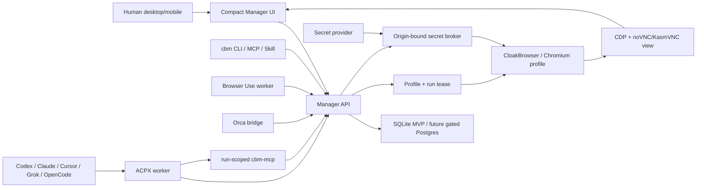

# Architecture Contract

| Field | Value |
| --- | --- |
| Status | Active contract |
| Owner | Martin Hausleitner |
| Source plan | [docs/superpowers/plans/2026-07-27-universal-agent-browser-control-plane-masterplan.md](docs/superpowers/plans/2026-07-27-universal-agent-browser-control-plane-masterplan.md) |
| Related docs | [VISION.md](VISION.md), [VISION_PROJECTS.md](VISION_PROJECTS.md), [SECURITY.md](SECURITY.md), [TESTING.md](TESTING.md) |

## Boundary Summary

CloakBrowser Manager is the source of truth for product state. Adapters execute work. Browser runtimes render and automate profiles. Secret providers resolve credentials without revealing them. Workflow engines may orchestrate after gates, but they do not own product state.

## Systems of Record

| Domain | System of record | Boundary |
| --- | --- | --- |
| Users, groups, agents, permissions | Manager access-control layer | External IdP deferred until SSO gate |
| Projects, profiles, accounts metadata | Manager database | No adapter cache becomes product state |
| Tasks, runs, leases, approvals, outputs | Manager database and artifacts | Typed outputs required for release evidence |
| Browser cookies/storage | Encrypted profile continuity | Not plain config and not copied to model context |
| Secrets and proxy credentials | External provider/broker by reference | Manager stores references, policies, receipts |
| Passkeys and device credentials | Original authenticator/provider | Re-enroll or human handoff; no cloning |
| ACP sessions | ACPX cache | Rebuildable execution cache only |
| Browser Use sessions | Worker-local execution context | Claimed through Manager leases |
| Workflow state | Selected workflow engine store | Calls Manager APIs; does not replace Manager |
| Source, plans, schemas, runbooks | Git | Git does not store runtime secrets or every event |
| Evidence | Redacted artifacts and CI outputs | Public docs cite only safe summaries |

## Runtime Shape

## Architecture Invariants

- A run may operate a browser only through a valid Manager lease.
- Profile lease loss revokes direct browser capabilities and ends or blocks the run honestly.
- The UI exposes availability, not wishful configuration.
- API, CLI, MCP, and skill operations share the same resource envelope and authorization outcome.
- Direct CDP, raw Chromium flags, raw vault reveal, and unbounded shell access are outside the baseline contract.
- Browser view, task outputs, approvals, and evidence must remain correlated by run and profile.

## Planned Evolution

The active plan keeps SQLite for the single-node MVP. Postgres, external IdP, durable workflow engines, alternative streaming stacks, Kubernetes, and broader federation are gated decisions, not implied architecture. Each adoption needs benchmark evidence, rollback path, ownership mapping, security review, and release proof.

## Known Gaps

- Some boundaries are contract-level until CBM-001 through CBM-024 implement and prove them.
- Durable workflow selection is pending; Hatchet and Temporal are pilots/benchmarks until the gate is passed.
- Streaming alternatives are candidates until measured on iPhone, VCVM, fullscreen, reconnect, CPU/RAM, bandwidth, and latency.

## Inspirations

Inspired structurally by [Block Buzz ARCHITECTURE.md](https://github.com/block/buzz/blob/main/ARCHITECTURE.md). This architecture is CloakBrowser Manager-specific and does not adopt Buzz relay, community, Nostr, or signed-event mechanics.
