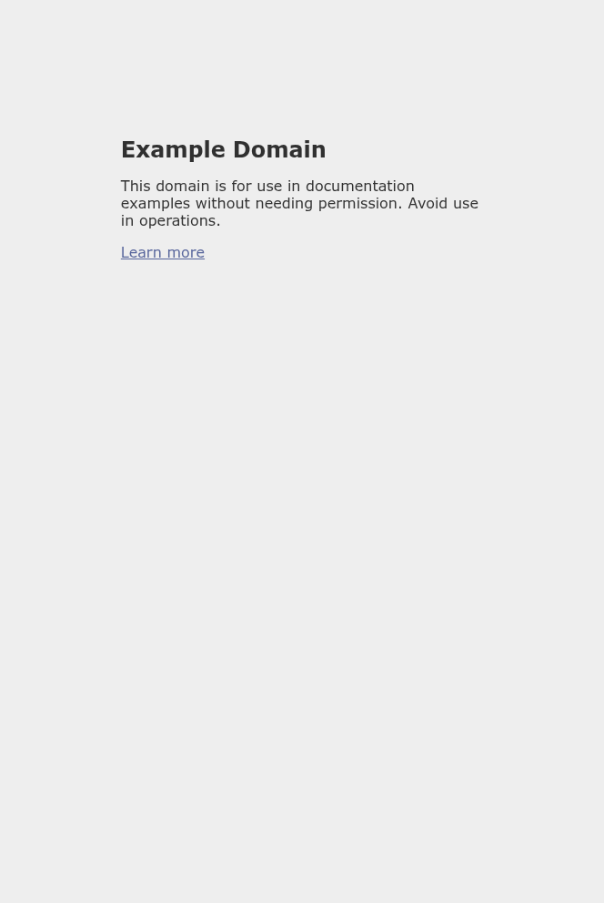

[ L-CLOAK · R040 ] 🟣 cursor-grok · Modell: cursor-grok-4.5 · 🧠 IDR: nein · 🕐 2026-07-24T08:37+02:00
> 🧠 NotebookLM: n/a (kein IDR-Auftrag in dieser Lane; Architektur aus Skyvern README + CloakBrowser-Manager CDP API)

# SKYVERN-HARNESS — CloakBrowser × Skyvern (2026-07-24)

Lane: `cloak-skyvern-harness` (cursor grok-4.5)  
OpenSpec: `openspec validate skyvern-harness --strict` → **PASS**  
Branch: `feat/skyvern-harness`  
PR: https://github.com/Martin-Hausleitner/CloakBrowser-Manager/pull/2  
Proof: `.proof/2026-07-24-skyvern-harness.png`

## Verdict

Skyvern ist als **optionaler AGPL-Harness** an CloakBrowser Manager angedockt. Automation hängt über Manager-CDP an einem laufenden CloakBrowser-Profil (Fingerprint + Per-Session-Proxy bleiben auf der Cloak-Seite). Kein Vendoring von Skyvern-Quellcode in den MIT-Tree.

| Check | Ergebnis |
|---|---|
| OpenSpec `skyvern-harness --strict` | PASS |
| Unit tests `test_skyvern_harness.py` | **6/6** |
| Full backend suite (`AUTH_TOKEN=` clean) | **228 passed** |
| Live CDP proof via `Skyvern.local` + `SkyvernBrowser` | **PASS** → example.com |
| Screenshot non-empty | **17487 bytes**, 664×992 PNG |
| LLM agent `run_task` | **ehrlich blocked/degraded** (keine LLM-Keys) |

## Was integriert wurde

1. **Adapter** `backend/harnesses/skyvern_harness.py`
   - Capability probe (`unavailable` / `degraded` / `ready`)
   - CDP URL builder + Bearer headers
   - Prefer co-located `http://127.0.0.1:{cdp_port}` oder Manager-Proxy `/api/profiles/{id}/cdp`
   - `Skyvern.local()` → Playwright CDP mit Auth-Headers → `SkyvernBrowser` Wrap
   - Agent `run_task` nur wenn LLM konfiguriert, sonst ehrlich `blocked`
2. **API**
   - `GET /api/harnesses/skyvern/capabilities`
   - `POST /api/harnesses/skyvern/bind`
   - `POST /api/harnesses/skyvern/run`
3. **Proof runner** `scripts/skyvern_harness_proof.py`
4. **OpenSpec change** `openspec/changes/skyvern-harness/`

## Lizenz-Hinweis (AGPL)

- **Skyvern** ([Skyvern-AI/skyvern](https://github.com/Skyvern-AI/skyvern)): **GNU Affero General Public License v3.0 (AGPL-3.0)** — bestätigt via upstream `LICENSE` (`/tmp/skyvern`).
- Dieser Manager-GUI-Code bleibt **MIT**.
- Skyvern wird **nicht** in den Repo-Tree vendored; Installation ist optional (`pip install "skyvern[local]"`).
- Wer Skyvern als Netzwerkdienst zusammen mit dem Manager betreibt, muss die AGPL-Pflichten (Corresponding Source für den kombinierten Service) selbst einhalten.
- „1:1 kopieren“ der gesamten Skyvern-Codebasis wäre AGPL-Kontamination des MIT-Trees — bewusst vermieden zugunsten Adapter + optionalem Dependency (Skyvern-Kernfähigkeiten CDP-Attach / Browser-Wrap / optional `run_task` über die public API).

## Kombinations-Architektur

```text
Operator / API
    │
    ▼
CloakBrowser Manager  (/api/harnesses/skyvern/*)
    │  bind profile + auth
    ▼
Skyvern.local()  ──CDP + Bearer──►  Manager CDP Proxy
    │                                    │
    │                                    ▼
    └──────── SkyvernBrowser ──► CloakBrowser profile
                                 (fingerprint, proxy, cookies)
```

Docking-Punkt ist bewusst **CDP**, nicht ein zweiter Chromium-Launch: Skyvern steuert denselben Cloak-Prozess, den noVNC bereits zeigt. Skyvern-Kernfähigkeiten (CDP-Attach, Browser-Wrap, optional `run_task`) werden über den Adapter genutzt — kein 1:1-Vendoring des AGPL-Trees in den MIT-Manager.

## Proof R040 (inline)



Live-Lauf (re-verified 2026-07-24T08:37+02:00, lane cursor-grok-4.5):

- Manager: `http://127.0.0.1:18115` (container `cloakbrowser-manager-vcvm`)
- Profile: `a8b99a1f-bd77-4249-917f-0ad681ea5519` (VCVM Mobile Demo, running)
- Mode: `Skyvern.local+SkyvernBrowser.connect_over_cdp`
- CDP: `http://127.0.0.1:18115/api/profiles/.../cdp` · `headers_applied: true`
- URL: `https://example.com/` · Title: `Example Domain` · PNG **17487** bytes
- Capability status: `degraded` (`skyvern_installed=true`, `llm_configured=false`)
- Harness API on **running** VCVM image: still `404` until image is rebuilt from this branch (proof uses host-side Skyvern adapter → Manager CDP, which is the cloak docking path)
- OpenSpec / unit tests re-checked this session: `validate --strict` PASS, `test_skyvern_harness.py` 6/6, full backend **228 passed**
- Upstream license re-checked via `/tmp/skyvern` clone: **AGPL-3.0**

JSON: `.proof/2026-07-24-skyvern-harness.json`  
VCVM-Spiegel: `~/cloakbrowser-manager-vcvm/.proof/2026-07-24-skyvern-harness.png`

## Limits / ehrlich

- Vollständiger Vision-Agent-`run_task`-Loop braucht LLM-Keys (`OPENAI_*` / Skyvern cloud). Capability meldet dann `run_task: true`; ohne Keys → `blocked`/`degraded`, kein Fake.
- PyPI-`Skyvern.connect_to_browser_over_cdp` ohne Header scheitert an Manager-Auth; der Harness bridged deshalb Skyverns Playwright-Driver **mit** Headers und wrappt `SkyvernBrowser`.
- Laufendes VCVM-Docker-Image ist noch ohne `/api/harnesses/skyvern/*` (vor-PR Build). Adapter + Routes sind im Branch; Skyvern-Runtime bleibt Opt-in (`pip install "skyvern[local]"`), nicht im Core-Image.

## NEXT

- Optional: Compose-Sidecar für Skyvern-Server-Mode
- Optional: Frontend-Toggle „Run with Skyvern“ im Mobile Task Workspace
- Optional: LLM-Keys setzen und echten `run_task`-Agent-Loop durch denselben CDP-Pfad beweisen
- Optional: VCVM-Image aus diesem Branch neu bauen, damit `/api/harnesses/skyvern/*` im Container antwortet
