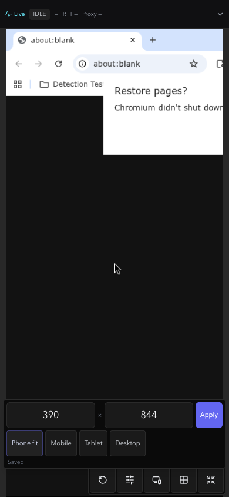
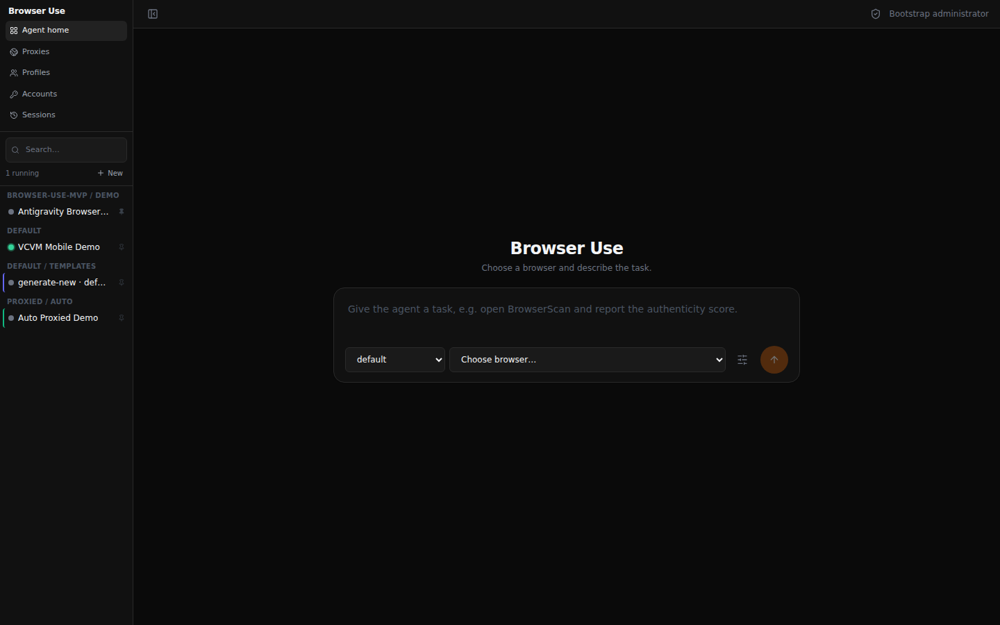
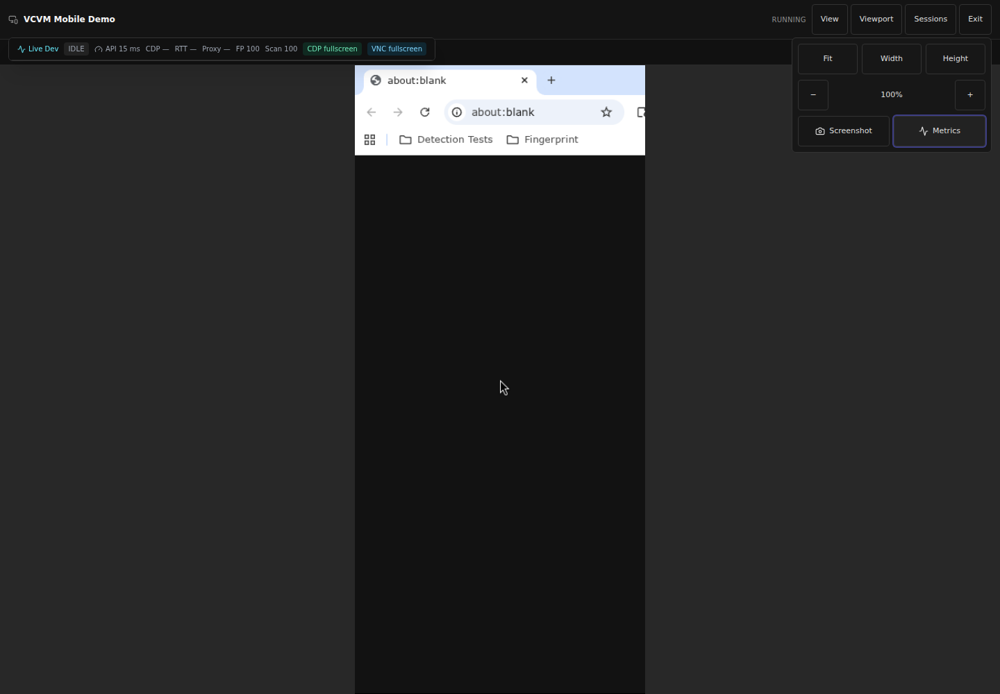

[ Lmgr · R2190 ] 🟣 codex · Modell: GPT-5.5 · 🧠 IDR: ja · 🕐 vor 0 min

> 🧠 NotebookLM: https://notebooklm.google.com/notebook/270598c3-713d-4188-81b8-0f0567c71572

# CloakBrowser Manager — Overnight-Status 31. Juli 2026

## Kurzfazit

Über Nacht wurden mehrere belastbare Funktionsstränge **auf Feature-Branches veröffentlicht**, aber noch nicht auf `main` zusammengeführt. Der stärkste vollständig dokumentierte Nachweis ist der PhoneFit-Fix auf der VCVM: 152 Frontend-Tests, Production-Build, unabhängige Freigabe, Gitleaks und ein realer Browserlauf bei `390 × 844` sind grün. Parallel entstanden veröffentlichte Bausteine für ACPX-Agent-Families, Passkey/OAuth-Benchmarks, sichere Recorder-/Vault-Steuerung sowie eine echte Chromium-MV3-Teststrecke.

Der Gesamtstand ist deshalb **gelb, nicht grün**: `main` und die öffentliche VCVM enthalten den neuen Stand noch nicht. Der macOS-MV3-Lauf erreicht einen echten Chrome-for-Testing-Service-Worker, wird aber weiterhin durch Chrome 150 Local Network Access beim Loopback-Zugriff blockiert. Der Repository-Checkout wurde inzwischen frisch aus Martins Fork wiederhergestellt; der frühere lokale Produkt-Worktree mit nicht gepushten Mac-/Bridge-/OpenSpec-Änderungen fehlt jedoch weiterhin und muss aus den vorhandenen Belegen rekonstruiert werden.

## Aktueller Ampelstand

| Bereich | Status | Belegbarer Stand |
|---|---:|---|
| PhoneFit / Mobile Full View auf VCVM | 🟢 | Veröffentlicht; 152 Tests, Build, Review, Gitleaks und realer `390 × 844`-Lauf grün |
| MV3 DevTools / Real-Chromium-Harness | 🟢 Branch | Veröffentlicht auf eigenem Branch; echter Chromium-, Service-Worker-, CLI-/MCP-Testpfad vorhanden |
| ACPX Agent Family / Auth-Benchmarks | 🟢 Branch | Veröffentlicht; auditiertes Pipeline-Grundgerüst sowie paralleler Passkey-/OAuth-Benchmark |
| Recorder, Vault Discovery, Profile Sharing | 🟢 Branch | Veröffentlicht; Fail-closed-Artefaktgates und lokale/private Betriebsmodi |
| `main` | 🔴 veraltet | Letzter Main-Stand ist vom 24. Juli; die Arbeit vom 30./31. Juli ist dort nicht enthalten |
| Öffentliche VCVM | 🟡 | Bewusst nicht überschrieben, weil Transaction-/Rollback-Gate noch fehlt |
| macOS Extension E2E | 🔴 blockiert | MV3-Service-Worker lädt; Chrome 150 blockiert den Loopback-Bridge-Zugriff über Local Network Access |
| Direkter Tailscale-Pfad | 🟡 | Weiter über `DERP(nue)` statt direkt; höhere Latenz bleibt offen |

## Was über Nacht umgesetzt wurde

### 1. PhoneFit wurde idempotent und real auf der VCVM geprüft

Der Fix verhindert, dass ein bereits laufendes Profil unnötig gestoppt und neu gestartet wird, wenn die angeforderte Framebuffer-Größe bereits der gespeicherten Größe entspricht. Damit verschwindet im häufigen Pfad `390 × 844 → Phone fit` ein echter noVNC-Abbruch.

Verifizierte Ergebnisse:

- 152 Frontend-Tests bestanden;
- Production-Build bestanden;
- unabhängiges Review: `APPROVE`, keine P0–P3-Funde;
- Gitleaks ohne Fund;
- realer VCVM-Lauf mit einem Canvas und ohne horizontalen Overflow;
- Browser-PID und Startzeit blieben vor und nach PhoneFit identisch;
- keine `update`-, `stop`- oder `launch`-Operation beim unveränderten Viewport;
- null Page- und Console-Errors.

Branch und Belege:

- [Branch `feature/phonefit-idempotent`](https://github.com/Martin-Hausleitner/CloakBrowser-Manager/tree/feature/phonefit-idempotent)
- [Implementierung `3a69d2b`](https://github.com/Martin-Hausleitner/CloakBrowser-Manager/commit/3a69d2b5911759db585dc2416fa9c466e59e1f74)
- [VCVM-E2E-Bericht](https://github.com/Martin-Hausleitner/CloakBrowser-Manager/blob/feature/phonefit-idempotent/docs/reports/PHONEFIT-IDEMPOTENT-VCVM-E2E-2026-07-31.md)

### 2. ACPX-Agent-Family und Auth-Benchmark wurden als Branch-Artefakte aufgebaut

Der Agent-Family-Branch bündelt die vorherigen Recorder-, Vault-, Auth- und CI-Bausteine und ergänzt eine auditierte ACPX-Pipeline. Der Auth-Branch enthält parallele Passkey- und OAuth-Benchmarks mit stabilisiertem CI-Vertrag.

- [ACPX Agent Family](https://github.com/Martin-Hausleitner/CloakBrowser-Manager/tree/Martin-Hausleitner/cbm-acpx-agent-family) — Commit [`0454762`](https://github.com/Martin-Hausleitner/CloakBrowser-Manager/commit/0454762)
- [Passkey/OAuth Benchmark](https://github.com/Martin-Hausleitner/CloakBrowser-Manager/tree/Martin-Hausleitner/cbm-auth-passkey-benchmark) — Commits [`f0a2410`](https://github.com/Martin-Hausleitner/CloakBrowser-Manager/commit/f0a2410) und [`c0d4f10`](https://github.com/Martin-Hausleitner/CloakBrowser-Manager/commit/c0d4f10)

### 3. Sichere Recorder-, Vault- und Profilsteuerung wurde veröffentlicht

Der Branch `feature/secure-action-recorder-vault` enthält:

- lokale Recorder-Steuerung über MCP und CLI;
- lokale und Private-Cloud-Betriebsmodi;
- Browser-Use-/ACPX-Pipeline;
- Vault Discovery und sichere Profilfreigabe;
- CI-Artefaktgates, die bei fehlenden Belegen fail-closed reagieren;
- den stabilen Browser-Use-/Antigravity-Masterplan.

Links:

- [Branch `feature/secure-action-recorder-vault`](https://github.com/Martin-Hausleitner/CloakBrowser-Manager/tree/feature/secure-action-recorder-vault)
- [Masterplan `1e1617e`](https://github.com/Martin-Hausleitner/CloakBrowser-Manager/blob/1e1617e447f28887b6d2560614a5abb2e0ba52b8/docs/superpowers/plans/2026-07-30-stable-browser-use-antigravity-masterplan.md)
- [Fail-closed CI-Gates `827c0f0`](https://github.com/Martin-Hausleitner/CloakBrowser-Manager/commit/827c0f0)
- [Vault Discovery / Profile Sharing `36ef087`](https://github.com/Martin-Hausleitner/CloakBrowser-Manager/commit/36ef087)

### 4. Echter Chromium-MV3-Testpfad wurde aufgebaut

Der MV3-Branch ergänzt einen realen Chromium-Testlauf mit entpackter Extension, Service-Worker-Verifikation über CDP, CLI-/MCP-Oberfläche sowie redigierten Artefakten und expliziten Blockern. Damit wurde ein früheres False-Green korrigiert: Ein geladener Service Worker allein gilt nicht mehr als erfolgreicher Steuerungslauf.

- [Branch `Martin-Hausleitner/cbm-mv3-devtools-e2e`](https://github.com/Martin-Hausleitner/CloakBrowser-Manager/tree/Martin-Hausleitner/cbm-mv3-devtools-e2e)
- [Real-Chromium-Suite `42c018f`](https://github.com/Martin-Hausleitner/CloakBrowser-Manager/commit/42c018fd0acae3ff30bc702b30c6b46e36b35ae7)

### 5. Research, Tribunal und OpenSpec schärften den kleinsten sicheren Scope

Die NotebookLM-/IDR-Welle verglich Browser-Harnesses, Extension-Ökosysteme, Vault-/Identity-Optionen, P2P-Sync, Observability, Auth-Benchmarks, Agent-Orchestrierung und UI-Control-Planes. Das Pareto-Ergebnis war kein Big-Bang-Release, sondern zuerst:

1. MV3-Bridge fail-closed reparieren;
2. echten Chromium-E2E-Lauf erzwingen;
3. erst danach Vault-/Recorder-/Harness-Funktionen zusammenführen;
4. Main und VCVM nur über überprüfte Deploy-/Rollback-Gates aktualisieren.

Das lokale OpenSpec `extension-p0-control-e2e` wurde zuvor streng validiert. Da der damalige lokale Worktree nicht mehr vorhanden ist und dieser Stand nicht gepusht war, wird er hier ausdrücklich **nicht** als veröffentlicht gewertet.

## Visueller Stand

### VCVM: aktueller PhoneFit-Nachweis vom 31. Juli

Das laufende Profil bleibt bei `390 × 844` bestehen; PhoneFit speichert die identische Größe ohne Browser-Neustart.

### Browser-Use-orientierter Agent-Home-Stand

Die veröffentlichte Ansicht zeigt die reduzierte linke Navigation, Session-/Projektliste und einen zentralen Task-Composer. Sie ist ein visueller Zwischenstand, kein Beleg dafür, dass alle Harnesses live funktionieren.

### Full View mit Live-Metriken und Viewport-Steuerung

Der Browser ist als große Arbeitsfläche sichtbar; Viewport-, Screenshot- und Metrikfunktionen liegen kompakt im rechten Kontrollbereich.

## Veröffentlichungslandkarte

| Funktionsstrang | Branch | Letzter relevanter Commit | In `main`? |
|---|---|---:|---:|
| PhoneFit idempotent | [`feature/phonefit-idempotent`](https://github.com/Martin-Hausleitner/CloakBrowser-Manager/tree/feature/phonefit-idempotent) | `17e7e79` | Nein |
| MV3 real Chromium | [`Martin-Hausleitner/cbm-mv3-devtools-e2e`](https://github.com/Martin-Hausleitner/CloakBrowser-Manager/tree/Martin-Hausleitner/cbm-mv3-devtools-e2e) | `42c018f` | Nein |
| Secure Recorder / Vault | [`feature/secure-action-recorder-vault`](https://github.com/Martin-Hausleitner/CloakBrowser-Manager/tree/feature/secure-action-recorder-vault) | `1e1617e` | Nein |
| Passkey / OAuth Benchmark | [`Martin-Hausleitner/cbm-auth-passkey-benchmark`](https://github.com/Martin-Hausleitner/CloakBrowser-Manager/tree/Martin-Hausleitner/cbm-auth-passkey-benchmark) | `c0d4f10` | Nein |
| ACPX Agent Family | [`Martin-Hausleitner/cbm-acpx-agent-family`](https://github.com/Martin-Hausleitner/CloakBrowser-Manager/tree/Martin-Hausleitner/cbm-acpx-agent-family) | `0454762` | Nein |
| Produkt-`main` | [`main`](https://github.com/Martin-Hausleitner/CloakBrowser-Manager/tree/main) | `ec924cd` vom 24. Juli | — |

## Test- und Evidenzmatrix

| Testfläche | Ergebnis | Einordnung |
|---|---:|---|
| PhoneFit Frontend | 152 bestanden | Frischer Branch-Beleg vom 31. Juli |
| PhoneFit Production Build | bestanden | Frischer Branch-Beleg |
| PhoneFit Live VCVM | bestanden | Reales Profil, identische PID/Startzeit, keine Fehler |
| PhoneFit Security Scan | bestanden | Gitleaks ohne Fund |
| MV3 Branch-Suite | veröffentlicht | Real-Chromium-Harness vorhanden; vollständiger Release-Pass noch ausstehend |
| VCVM Bridge nach False-Green-Korrektur | 28 fokussierte Tests bestanden | Lokal verifiziert; damaliger Worktree nicht mehr vorhanden, daher noch nicht als Branch-Release gewertet |
| macOS Helper-/Extension-Tests | 14 Python + 7 Extension bestanden | Lokal verifiziert; nicht veröffentlicht |
| macOS Real-Chromium-E2E | blockiert | Service Worker lädt, Loopback-Bridge durch Chrome 150 LNA blockiert |
| Ältere Browser-Use-Worktrees | nicht grün | Audit fand 4 bzw. 24 zuletzt fehlgeschlagene Tests in pytest-Caches; kein frischer Overnight-Pass ableitbar |

## Offene Risiken und Blocker

1. **Nicht auf Main:** Die Arbeit vom 30./31. Juli liegt auf mehreren Feature-Branches. Ein pauschales Merge wäre ohne gemeinsame CI- und Konfliktprüfung riskant.
2. **Öffentliche VCVM veraltet:** Der öffentliche Stand wurde bewusst nicht überschrieben, solange der Transaction-/Rollback-Apply-Pfad nicht grün ist.
3. **macOS Local Network Access:** Chrome 150 lädt die MV3-Extension, lässt deren Loopback-Bridge aber nicht zuverlässig bis zum lokalen Manager durch. Erforderlich ist ein unterstützter Permission-/Onboarding-Pfad oder ein sauberer Native-Messaging-Adapter — keine unsicheren Disable-Flags.
4. **Lokaler Worktree-Verlust:** Der Repository-Checkout ist wiederhergestellt, aber der ursprüngliche lokale Produkt-Worktree und `extension-p0-macos` waren beim Audit nicht mehr vorhanden. Verlorene, nicht gepushte Änderungen müssen rekonstruiert und neu getestet werden.
5. **Tailscale-Latenz:** Manager-Loopback lag laut PhoneFit-Bericht bei p50 5,704 ms / p95 8,787 ms, die öffentliche Tailnet-Route bei p50 269,853 ms / p95 432,817 ms. Der direkte Pfad ist der größte Performance-Hebel.
6. **Harness-Reife:** Browser Use ist am weitesten integriert. ACPX und weitere Browser-Tools benötigen pro Provider einen echten Readiness-/E2E-Nachweis; Fallback- oder reine UI-Anzeigen gelten nicht als Funktionsbeleg.

## Empfohlene nächste Schritte

### P0 — Wiederherstellung und sichere Veröffentlichung

1. Den lokalen Arbeitsstand aus den veröffentlichten Branches frisch rekonstruieren.
2. Die validierte VCVM-Bridge-Korrektur und macOS-LNA-Diagnostik in einem neuen, kleinen Branch neu aufbauen.
3. Real-Chromium-E2E als harte CI-Bedingung verwenden: Service Worker, Session-Bearer, CLI-Operationen und Artefaktstatus müssen gemeinsam grün sein.
4. Die fünf Feature-Branches nicht blind mergen, sondern über eine Integrationsbranch mit Backend-, Frontend-, Extension-, Security- und Deploy-Gates zusammenführen.

### P1 — Live- und Performance-Reife

5. Transaction-/Rollback-Gate für den VCVM-Deploy abschließen und erst danach die öffentliche Version aktualisieren.
6. Den direkten Tailscale-Pfad wiederherstellen und RTT/FPS vor und nach der Änderung messen.
7. ACPX, Antigravity/Grok-CLI, Browser Harness, Unbrowse und Stagehand einzeln als Provider-/Tool-Kombination testen und die Ergebnisse fail-closed speichern.
8. macOS-Loopback entweder über explizites Local-Network-Onboarding oder Native Messaging lösen und auf mindestens zwei Chrome-Versionen benchmarken.

### P2 — UX-Konsolidierung

9. Harness-/Provider-Konfiguration ausschließlich in einen kompakten Einstellungen-Tab verschieben.
10. Chat, Live-Browser, Terminal/ACP/ACPX und manuelle Übernahme auf wenige progressive Controls reduzieren; Mobile-Keyboard- und Full-View-Verhalten separat visuell testen.

## Ehrlichkeitsgrenze

- **Veröffentlicht und belegt:** die oben verlinkten Feature-Branches und der PhoneFit-VCVM-Bericht.
- **Lokal verifiziert, aber nicht veröffentlicht:** VCVM-Bridge-False-Green-Fix, macOS-Hilfstests und LNA-Diagnostik.
- **Nicht erledigt:** Merge auf `main`, öffentliche VCVM-Aktualisierung, vollständiger macOS-MV3-Steuerungslauf und direkter Tailscale-Pfad.
- **Nicht rekonstruierbar aus frischer lokaler Historie:** nicht gepushte Änderungen im verschwundenen ursprünglichen Worktree. Sie werden deshalb nicht als abgeschlossen ausgegeben.

## Repository

- [Martin-Hausleitner/CloakBrowser-Manager](https://github.com/Martin-Hausleitner/CloakBrowser-Manager)
- [CloakHQ-Upstream](https://github.com/CloakHQ/CloakBrowser-Manager) — wurde durch diese Arbeit nicht verändert.
