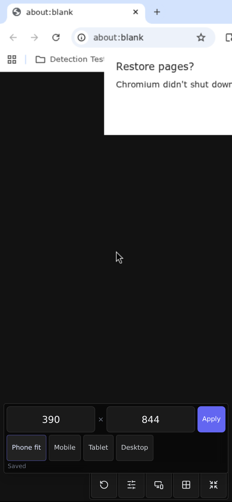

# PhoneFit idempotent — local Vite + Manager proof

Date: 2026-08-02
UI: branch Vite `http://127.0.0.1:5190` (this SHA)
API: Manager `http://127.0.0.1:18115`
Script: `scripts/phonefit_idempotent_retap_proof.py` (re-runnable)

## Outcome: **PASS**

### Profile
```json
{
  "id": "a8b99a1f-bd77-4249-917f-0ad681ea5519",
  "name": "VCVM Mobile Demo",
  "status": "running",
  "screen_width": 390,
  "screen_height": 844,
  "updated_at": "2026-07-30T23:32:55.020224+00:00",
  "vnc_ws_port": 6100
}
```

### Checks (19/19)
- [PASS] profile running at matching 390x844 before re-tap
- [PASS] fullscreen control present/open
- [PASS] viewport panel open
- [PASS] Phone fit available
- [PASS] first Phone fit settled
- [PASS] first Phone fit size 390x844
- [PASS] re-tap page mutate counters installed
- [PASS] re-tap settled
- [PASS] re-tap no restart claim
- [PASS] re-tap size still 390x844
- [PASS] re-tap page counters installed flag (`counterInstalled=true`)
- [PASS] re-tap no update/stop/launch traffic (page 0/0/0 + Playwright 0/0/0)
- [PASS] re-tap single canvas (content)
- [PASS] fullscreen Phone fit re-tap stays idempotent (gate-shaped evidence)
- [PASS] screenshot written
- [PASS] profile still running after re-tap
- [PASS] profile screen size unchanged after re-tap
- [PASS] profile updated_at unchanged after re-tap
- [PASS] profile vnc/cdp endpoints unchanged after re-tap

Machine-readable: `docs/reports/PHONEFIT-IDEMPOTENT-LOCAL-PROOF-2026-08-02.json`

Screenshot: `docs/evidence/phonefit-idempotent-local-retap-2026-08-02.png`
SHA-256: `bae3257260d6a5336a787907e8a59916cc870c543794ee1411bb85d2b9a862ea`



### Gate contract (Slice H)

Durable proof now matches release acceptance evidence shape:

- page mutate counters installed (`__phoneFitMutateInstalled`)
- `trafficChecked=true`
- `trafficOk=true`
- `counterInstalled=true`
- `updateCount=0`, `stopCount=0`, `launchCount=0`
- Playwright dual witness also 0/0/0
- canonical check name: `fullscreen Phone fit re-tap stays idempotent`

### Re-run
```bash
# terminal 1
cd frontend && CLOAK_API_PROXY_TARGET=http://127.0.0.1:18115 npm run dev -- --host 127.0.0.1 --port 5190
# terminal 2
python3 scripts/phonefit_idempotent_retap_proof.py
python3 scripts/test_mobile_ui_gate.py -v
python3 scripts/test_release_acceptance_gate.py -v
```
