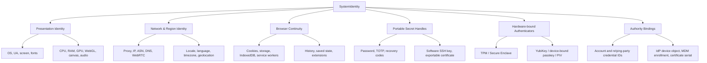
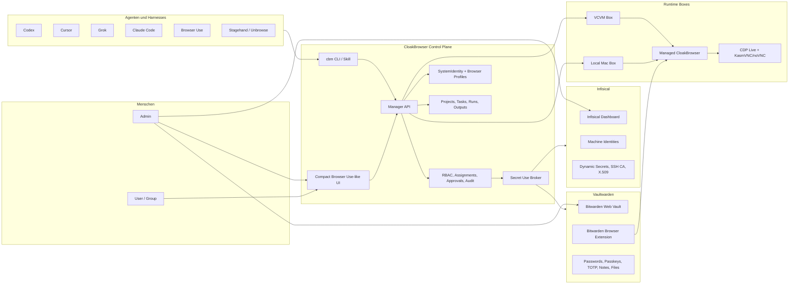
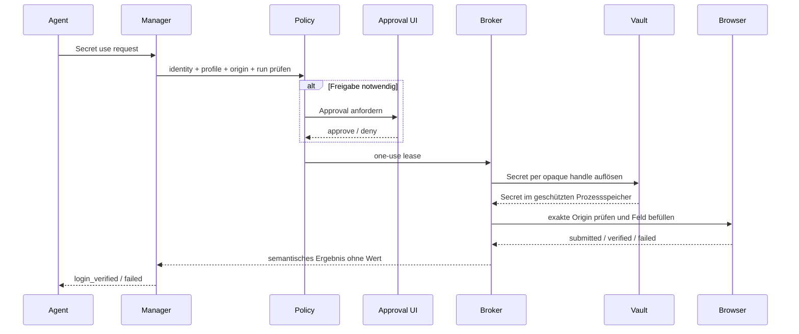

# Finaler Architektur- und Entscheidungsbericht

## CloakBrowser Universal Identity, Secret, Profile & Agent Command Wall

**Stand:** 26. Juli 2026, Europe/Vienna  
**Repository:** [Martin-Hausleitner/CloakBrowser-Manager](https://github.com/Martin-Hausleitner/CloakBrowser-Manager)  
**Arbeitsbranch:** `feature/browser-use-agent-workspace` / lokal `codex/browser-use-output-ui`  
**Geprüfter Produktstand:** `50a9e43f4bd75a01170024cf28040b6c9d0560c5`  
**Planstand:** `5d5d90e3e13c30e5a79df8b77107d55cd80718ae`  
**Zielbetrieb:** VCVM und lokaler Mac, privat über Tailscale/Loopback  
**Status dieses Berichts:** finale Architektur- und Auswahlentscheidung; keine Behauptung, dass alle Zielmodule bereits implementiert sind

---

## 1. Executive Summary

CloakBrowser Manager soll nicht nur Browserprofile verwalten. Das Ziel ist eine universelle Identity- und Browser-Agent-Plattform, in der Menschen und Agenten folgende Ressourcen kontrolliert nutzen können:

- Browser- und System-Fingerprints
- lokale und VCVM-basierte Browser-Runtimes
- Browserprofile, Projekte, Sessions, Aufgaben und Agent-Runs
- Proxys, IP-/Reputationswerte und Anti-Stealth-Zustand
- menschliche Accounts und eingeloggte Browserzustände
- Passwörter, Passkeys, TOTP/HOTP, Recovery-Codes und sichere Notizen
- SSH-Schlüssel, API-Tokens, Client-Zertifikate und dynamische Secrets
- Browser-Erweiterungen und Extension-Policies
- Benutzer, Gruppen, Agenten, Machine Identities und differenzierte Rechte
- Browser Use, Stagehand, Unbrowse, Codex, Cursor, Claude Code, Grok, OpenCode und weitere Harnesses
- VNC/CDP-Liveansichten, Full View, Mobile, PhoneFit und Multi-Session-Monitoring

Die zentrale Entscheidung lautet:

> **CloakBrowser baut keinen eigenen Passwortmanager und keine zweite Secret-UI.**
>
> **Vaultwarden plus unveränderte Bitwarden-Clients übernimmt menschliche Vault-Funktionen. Infisical übernimmt Machine-/Agent-Secrets, Rotation und PKI. CloakBrowser bleibt die kompakte Profil-, Zuordnungs-, Policy- und Live-Browser-Control-Plane.**

Dadurch werden vorhandene, gepflegte Benutzeroberflächen, Browser-Erweiterungen, SDKs und Sicherheitsmodelle wiederverwendet. CloakBrowser baut nur die Teile, die keine der bestehenden Plattformen gemeinsam abdeckt:

1. System-/Browseridentität und Browser-Laufzeit
2. Profil ↔ Account ↔ Secret ↔ Benutzer/Gruppe/Agent-Zuordnung
3. exakte Domain-, Profil-, Laufzeit- und Freigabepolicies
4. universelle CLI/MCP/ACP-Steuerung
5. Live-Browser, Task-Historie, Agent-Outputs und Quality Gates

### Finale Plattformempfehlung

| Verantwortung | Empfohlene Plattform | Warum |
| --- | --- | --- |
| menschliche Passwörter, TOTP, Passkeys, Notizen, Dateien, SSH-Key-Einträge | Vaultwarden + Bitwarden-Web-Vault/Extension | leichtester self-hosted Betrieb, fertige UI, Organisationen, Gruppen, Collections und Browser-Autofill |
| Agenten, Machine Identities, dynamische Secrets, Rotation, SSH-/X.509-Zertifikate | Infisical | moderne API/CLI/SDKs, RBAC, Machine Identities, Audit und PKI |
| Browser-/Systemprofile, Proxys, Runtimes, Aufgaben, Live-Ansicht, Harnesses | CloakBrowser Manager | bereits vorhandene Produktbasis und spezifische Browser-/Agentenlogik |
| Benutzer-/Gruppen-Policy im MVP | vorhandene CloakBrowser-RBAC | bereits implementiert; verhindert einen zusätzlichen schweren IAM-Stack |
| zentrales SSO/Provisioning später | Authentik oder Keycloak | erst ergänzen, wenn mehrere Dienste dauerhaft produktiv betrieben werden |
| optionales Vault-/PKI-Backend | OpenBao | vollständig offene Alternative für fortgeschrittene Secret Engines und PKI |

---

## 2. Live verifizierter aktueller Stand

Am 26. Juli 2026 wurde der VCVM-Stand read-only erneut geprüft.

| Prüfung | Ergebnis |
| --- | --- |
| VCVM-Quellstand | `50a9e43f4bd75a01170024cf28040b6c9d0560c5` |
| Manager-Container | `healthy` |
| laufendes Image | `sha256:385d16307db05a9aecf146fd2331bcff7bcc71aec07cac81a0b998e849c6866a` |
| Browser-Use-Worker | `active` |
| Loopback `/health` | `{"ok":true}` |
| RAM | 62 GiB gesamt, 18 GiB genutzt, 44 GiB verfügbar |
| Root-Datenträger | 2,0 TB, 1,9 TB genutzt, ca. 11 GB frei, 100 % gemeldet |

### Betriebsinterpretation

- CPU/RAM sind aktuell nicht der zentrale Engpass für einen leichten zusätzlichen Dienst.
- Der Root-Datenträger ist der harte Engpass.
- Auf der VCVM laufen bereits viele Datenbanken, Browser-, Workflow-, Monitoring- und Agentendienste.
- Mehrere Dienste verwenden eigene PostgreSQL-Instanzen.
- Ein vollständiger offizieller Bitwarden-, Infisical- und Authentik-Stack darf nicht ungeprüft zusätzlich gestartet werden.
- Vaultwarden ist für das MVP besonders attraktiv, weil es als einzelner Rust-Container betrieben werden kann.
- Infisical muss erst nach sicherer Kapazitätsbereinigung und mit explizitem Datenbank-/Backup-Konzept installiert werden.

---

## 3. Aktueller CloakBrowser-Funktionsstand

### 3.1 Bereits real vorhanden

| Bereich | Vorhandene Implementierung | Belegpfade |
| --- | --- | --- |
| Browserprofile | persistente Fingerprint-, Viewport-, Proxy-, Projekt-, Ordner-, Pin-, Farb-, Harness- und Extension-Felder | `backend/models.py`, `backend/database.py` |
| Browser-Runtime | CloakBrowser-Prozess, persistenter User-Data-Ordner, KasmVNC-Display, CDP-Port | `backend/browser_manager.py` |
| KasmVNC/noVNC | vollständige interaktive Browser-/Desktopansicht | `backend/vnc_manager.py`, `frontend/src/components/ProfileViewer.tsx` |
| CDP-Liveansicht | browserinterner Screencast mit geringerem Overhead | `backend/session_views.py`, `backend/cdp_gateway.py` |
| PhoneFit/Viewport | Breite, Höhe, Zoom und Viewer-Anpassung; Neustartpfad für laufende Profile | Mobile-/Workspace-Komponenten und Tests |
| Projekte | sandboxgebundene Backend-Projekte | `backend/database.py`, `backend/main.py` |
| Task-Sessions | Nachrichten, Events, Workflow-State, Done/Archive/Retention und `row_version` | `backend/models.py`, `backend/database.py` |
| Task-Runs | Queue, Health Gate, Run-Zustände, Cancel/Retry/Override | `backend/worker_runtime.py`, `backend/main.py` |
| typisierte Outputs | Action, Observation, Screenshot, Extracted Data, Link, Metric, Error, Approval, Summary | `backend/models.py` |
| private Screenshots | authentifizierte, typisierte und größenbegrenzte Artefakte | `backend/artifact_store.py`, Task-Output-Routen |
| Browser Use Worker | echter Host-Worker mit Claim, Heartbeat, CDP-Capability und typisierten Outputs | `scripts/browser_use_worker.py` |
| direkte Browser-CLI | Inspect, Navigate, Click, Fill, Text und Screenshot | `scripts/cbm_browser_ctl.py` |
| Agent-Control-CLI | Profile, Start/Stop, Health, Open Links, Tasks und Runs | `scripts/cbm_agent_ctl.py` |
| Automations-Leases | exklusiver Zugriff pro Profil mit Heartbeat und Revoke | `backend/automation_leases.py` |
| Benutzer/Gruppen/Agenten | User, Group, Agent Identity und Sandbox Grants | `backend/access_control.py`, `AccessDashboard.tsx` |
| Berechtigungen | `view`, `interact`, `operate`, `automate` | `backend/access_control.py` |
| Proxy-Inventar | Ingest, redigierte Anzeige, Check und Auto-Profil | `backend/proxy_inventory.py`, `ProxyOverview.tsx` |
| Profile Health | Proxy, Latenz, Risiko, Authentizität, Fingerprint und BrowserScan | `backend/profile_health.py`, `ProfileHealthSummary.tsx` |
| Extension-Katalog | Katalog, Default-Auswahl, Manifestprüfung und Launch-Arg-Zuordnung | `backend/extension_catalog.py`, `backend/extensions.py` |
| Orca-Adapter | allowlistbasierter Terminal-/Agent-Adapter | `backend/orca_adapter.py` |

### 3.2 Nur teilweise oder noch nicht real

| Bereich | Aktueller Zustand | Fehlende Zielarbeit |
| --- | --- | --- |
| universelle CLI | zwei getrennte Skripte, manuell duplizierte HTTP-Logik | gemeinsamer `cbm`-Client und vollständiger Resource-Command-Baum |
| Runtime Boxes | Prozesse existieren, aber kein kanonisches Box-/Runtime-Modell | Box, Runtime, Session, View und Capacity als Ressourcen |
| Projekte im UI/CLI | Backend real, UI teilweise aus Profilen abgeleitet | echte Projektliste, leere Projekte und CRUD im Client |
| Browser-Use-UI-History | Backend-Runs real | Browser-Use-nahe Open/Done/Archived-Task-Liste |
| andere Harnesses | Auswahl/Metadaten | echte Worker/ACP/MCP-Adapter und Heartbeat-basierte Verfügbarkeit |
| Accounts | UI leitet Status aus Tags/Notizen ab | echtes Account-/Credential-Binding-Modell |
| Vault | nicht vorhanden | Vaultwarden-/Infisical-Provideradapter und Secret Broker |
| Passkeys/TOTP | kein Accountmodell | externe Vault-Referenzen und kontrollierte Nutzung |
| Agent Secret Assignment | nicht vorhanden | Machine Identity, Secret Assignment, Approval und Audit |
| Proxy-Secrets | intern als credentialed URL speicherbar | Migration zu Secret-Referenzen |
| Extension-Installation | lokale vorhandene Ordner können geladen werden | Store-Link/Upload/Sync/Version/Trust/CLI-Lifecycle |
| ACP/ACPX | Adapter-Grundlage vorhanden: ACPX `0.12.1`, geprüfte ACP-SDK-Baseline `1.2.1`, Harness-Typ, sichere Command-/Event-Verträge und 29 Tests | aufgelöste SDK-Version im Provisioning sperren, Host-Worker, MCP-Server, Live-E2E je Agent und UI-Verfügbarkeitsstatus |
| MCP | nicht vorhanden | offizieller MCP-Server über gemeinsamen Client |
| Full-View-Parität | verbessert, aber nicht global vereinheitlicht | ein gemeinsames Control-Dock für Mobile/Desktop/Full View |
| Multi-Browser-Grid | Sessions-Auswahl vorhanden | gedrosselte Live-Thumbnails und fokussierter Interaktionsstream |
| echter System-Fingerprint | Browserdarstellung vorhanden | deklaratives SystemIdentity-Bundle und Hardware-Bindings |
| lokaler Mac | nicht als kanonische Box modelliert | lokale Box, sichere Profil-/Secret-Handles und Laufzeitsteuerung |
| Kubernetes | nicht umgesetzt | erst nach Kapazitäts- und Lastmessung gerechtfertigt |

---

## 4. Anforderungskatalog

### 4.1 Menschliche Nutzer

Menschen sollen:

- vorhandene Browserprofile sehen, starten, stoppen, pinnen und ordnen
- Projekte und temporäre/dauerhafte Tasks verwalten
- Live-Browser per CDP oder VNC beobachten und bedienen
- Accounts, Loginstatus, 2FA-Status und zugeordnete Profile sehen
- Secret-Metadaten sehen, wenn sie berechtigt sind
- Secrets in der nativen Vault-Oberfläche bearbeiten und rotieren
- Freigaben für risikoreiche Agentennutzung erteilen oder verweigern
- Benutzer, Gruppen, Agenten und Zugriffsrechte verwalten
- Profile, Proxys, Extensions, Health und Authentizität auditieren

### 4.2 Agenten und Harnesses

Agenten sollen:

- Profile erstellen, ändern, starten und stoppen
- Box-/Runtime-Capabilities prüfen
- Proxys auswählen, prüfen und Profile damit verbinden
- Browseraktionen über Lease-geschützte APIs ausführen
- Aufgaben an Browser Use, Stagehand oder weitere Harnesses übergeben
- Secret-Nutzung anfordern, ohne den Klartext zu erhalten
- exakt für Profil, Domain, Zweck, Run und Zeitfenster autorisiert werden
- typisierte Outputs statt nur Markdown liefern
- Screenshots und Artefakte kontrolliert speichern
- Abbruch, Timeout, Retry und Health-Block korrekt behandeln

### 4.3 Administratoren

Administratoren sollen:

- Benutzer, Gruppen, Agenten und Machine Identities provisionieren
- Secret-Zuordnungen und Approval-Policies verwalten
- Agentenschlüssel und Provider-Zugänge rotieren
- Audit-, Health-, Proxy-, Fingerprint- und Laufzeitdaten prüfen
- Provider-Ausfälle und Credential-Revoke sehen
- Migrationen und Backups kontrolliert durchführen
- keine Secret-Werte über CloakBrowser-Logs oder UI offenlegen

---

## 5. System Identity: mehr als ein Browser-Fingerprint

Ein Systemprofil darf nicht als ein einziger kopierbarer Fingerprint-Blob modelliert werden.

### 5.1 Schichten der Systemidentität



### 5.2 Portabilität und Grenzen

| Identitätsbestandteil | Portabel? | Richtige Behandlung |
| --- | ---: | --- |
| OS-/UA-/Screen-/Font-/CPU-/GPU-Einstellungen | ja, als Emulation | deklaratives Template; neue Profil-ID außer bei expliziter Kontinuität |
| Sprache/Zeitzone/Geo | ja | aus Proxy/Region ableiten und Konsistenz prüfen |
| Proxy-Konfiguration | ja | Endpoint-Metadaten + Secret-Referenz, niemals Klartext-URL |
| Browser-Cookies/Storage | technisch ja | wie Bearer-Credentials behandeln, verschlüsseln, auditieren, begrenzen |
| Extensions und Settings | meist ja | versionierte Allowlist und Vertrauenszustand |
| TOTP-Seed | ja, aber hochsensitiv | externe Vault-Referenz, nie Profilfeld |
| Recovery-Code | kopierbar, einmalig | separater Code-Satz, Verbrauch markieren, danach rotieren |
| Software-SSH-Key | ja, hochsensitiv | SSH-Agent/Vault-Handle, nicht im Profilordner |
| exportierbares `.p12/.pfx` | ja, hochsensitiv | PKI/Vault; möglichst pro Gerät neu ausstellen |
| synchronisierter Passkey | nur im Provider-Vertrauensbereich | Provider-Handle verwenden, nicht Rohmaterial exportieren |
| device-bound Passkey/FIDO-Key | nein | Hardware-Handle und registrierte Credential-ID |
| TPM-/Secure-Enclave-Key | nein | neu registrieren/enrollen, nur Attestation/Handle speichern |
| MDM-/IdP-Gerätevertrauen | nein | autoritative Serverbindung; kein Fingerprint-Ersatz |

### 5.3 Sicherheitswahrheit

Ein Anti-Detect-Browser kann Gerätesignale konsistent darstellen. Er kann keine echte TPM-, Secure-Enclave-, MDM- oder Hardware-Key-Identität kopieren. Das UI muss deshalb klar unterscheiden:

- **emulierte Präsentationsidentität**
- **persistenter Browserzustand**
- **portable Secrets**
- **hardwaregebundene Authenticatoren**
- **serverseitige Authority Bindings**

Ein hoher BrowserScan-Score ist kein Nachweis für eine echte verwaltete Geräteidentität.

---

## 6. Secret- und Authenticator-Typen

| Typ | Beispiel | Ablage | Agentenzugriff |
| --- | --- | --- | --- |
| Passwort | Website-Login | Vaultwarden | origin-bound Fill, kein Reveal |
| TOTP/HOTP | Authenticator-Code | Vaultwarden/Infisical je Ownership | zeitgebundene Verwendung, Seed nie ausgeben |
| Recovery-Codes | einmalige Backup-Codes | Vaultwarden als geschütztes Item oder spezialisiertes Set | ein Code pro Lease, Verbrauch protokollieren |
| synchronisierter Passkey | Provider-synchronisierter FIDO-Credential | Bitwarden/Passkey-Provider | Provider-Interaktion; kein Raw Export |
| device-bound Passkey | YubiKey/TPM/Secure Enclave | Hardware | Benutzerpräsenz oder Remote-Signing, nicht klonen |
| API-Token | SaaS-/Service-Token | Infisical | kurzzeitige Injektion/Proxy, nicht stdout |
| SSH-Key | Software-Key | Vaultwarden SSH-Agent oder Infisical | Agent/Signer-Handle, kein Dateiexport |
| SSH-Zertifikat | kurzlebiges Cert | Infisical/OpenBao CA | dynamisch ausstellen, kurze TTL |
| X.509-Client-Zertifikat | mTLS | Infisical/OpenBao PKI | pro Runtime/Gerät ausstellen |
| Proxy-Credential | Benutzer/Passwort/Token | Infisical | beim Launch serverseitig auflösen |
| Cookie/Session | Browser-Loginzustand | verschlüsselter Profilzustand | kein normaler Secret-API-Export |
| sichere Notiz/Datei | Lizenz, Recovery-Dokument | Vaultwarden | menschliche UI; Agent nur explizit typisiert |

---

## 7. Markt- und Repositoryvergleich

### 7.1 Secret-Plattformen mit UI und SDK

| Rang | Plattform | UI-Wiederverwendung | Benutzer/Gruppen | Agenten/Machines | Passkeys/TOTP | SSH/PKI | Gewicht | Entscheidung |
| ---: | --- | --- | --- | --- | --- | --- | --- | --- |
| 1 | Vaultwarden + Bitwarden Clients | vollständiges vorhandenes Web-Vault und Extension | stark | schwach | stark | SSH-Key-Items, keine CA | niedrig | Human Vault |
| 2 | Infisical | fertiges Dashboard; API/SDK bevorzugt | stark | sehr stark | Secret-Objekte, keine Consumer-Passkey-UX | sehr stark | mittel-hoch | Agent/PKI Vault |
| 3 | Passbolt | echte React-Styleguide-Komponenten + Extension | stark | schwach | TOTP stark, Passkey-Vault schwach | keine CA | mittel | Alternative für integrierte React-UI |
| 4 | Psono | React/MUI Whole-App-Fork | gut | mittel | TOTP/WebAuthn Login | keine CA | mittel | permissive UI-Fork-Alternative |
| 5 | OpenBao | vollständige Operator-UI | sehr stark | sehr stark | TOTP-Engine, keine Consumer-Passkey-UX | sehr stark | mittel, hoher Ops-Aufwand | optionales fortgeschrittenes Backend |
| 6 | 1Password | proprietäre polierte UI, offene SDKs/Connect | sehr stark | stark | sehr stark | SSH-Agent, keine self-hosted Vault-UI | Cloud | optionale kommerzielle Alternative |
| 7 | Keeper | proprietäre UI, offene SDKs/Commander | sehr stark | stark | stark | stark/PAM | Cloud | optionale kommerzielle Alternative |
| 8 | KeePassXC/Strongbox | Desktop-/Mobile-UI, KDBX | keine zentrale Governance | keine | lokal stark | SSH-Agent | sehr niedrig | Import/Export, nicht Control Plane |
| 9 | Padloc | modularer PWA-/Extension-Aufbau | mittel | schwach | eingeschränkt | schwach | niedrig-mittel | gute Architektur, zu wenig gepflegt |
| 10 | TeamPass/sysPass | PHP-Whole-App | gut | API-Key-Niveau | eingeschränkt | schwach | mittel | nicht als neue Basis verwenden |

### 7.2 UI- und Lizenzdetails

#### Vaultwarden und Bitwarden Clients

- [Vaultwarden](https://github.com/dani-garcia/vaultwarden): AGPL-3.0, aktiver Rust-Server, Bitwarden-API-kompatibel.
- [Vaultwarden Web Builds](https://github.com/dani-garcia/bw_web_builds): angepasste Web-Vault-Builds.
- [Bitwarden Clients](https://github.com/bitwarden/clients): Angular/Nx-Monorepo für Web, Browser, Desktop und CLI.
- Die Bitwarden-Clientbibliotheken sind interne Produktbibliotheken, kein stabiler allgemeiner UI-Kit.
- Beste Wiederverwendung: vollständiges Web-Vault und offizielle Browser-Erweiterung unverändert nutzen.
- Bitwarden-Verzeichnisse unter `bitwarden_license` haben zusätzliche kommerzielle Grenzen.
- Eine gebrandete UI-Fork würde GPL-/Lizenz-/Trademark- und Upgrade-Aufwand erzeugen.

#### Infisical

- [Infisical](https://github.com/Infisical/infisical): Hauptrepository MIT mit separat lizenziertem `ee`-Bereich.
- moderne React-/TypeScript-/Vite-/Tailwind-/Radix-/TanStack-Oberfläche.
- breite offizielle SDKs und CLI.
- Interne UI-Komponenten sind nicht als allgemeines stabiles Paket veröffentlicht.
- Beste Wiederverwendung: nativer Dienst + Dashboard + API/SDK, keine UI-Kopie.

#### Passbolt

- [Passbolt API](https://github.com/passbolt/passbolt_api): AGPL-3.0 JSON API.
- [Passbolt Styleguide](https://github.com/passbolt/passbolt_styleguide): echte React-18-Komponenten, Storybook, TOTP-/QR-Helfer und Extension-Unterstützung.
- [Passbolt Browser Extension](https://github.com/passbolt/passbolt_browser_extension): aktiv gepflegte Chromium-/Firefox-/Safari-Extension.
- [Go Passbolt](https://github.com/passbolt/go-passbolt): permissiverer Go-Client.
- Beste Wahl, falls eine stark integrierte, gebrandete React-Vault-UI zwingend ist.
- Nachteile: AGPL und starke Kopplung an Passbolt/OpenPGP-Datenmodelle.

#### Psono

- [Psono Client](https://github.com/psono/psono-client): Apache-2.0, React 17, Redux und Material UI 5.
- Ein Client baut Web, Browser-Erweiterung und Electron.
- Keine separat versionierte Component Library; sinnvoll als Whole-App-Fork.
- Governance-/Audit-/SSO-Funktionen teilweise Enterprise.

#### OpenBao

- [OpenBao](https://github.com/openbao/openbao): MPL-2.0, API/SDK/CLI und eingebettete Operator-UI.
- sehr stark für Identity Groups, Policies, Machine Auth, TOTP Engine, SSH CA, PKI und dynamische Secrets.
- UI ist ein an Vault APIs gekoppeltes Operator-Frontend, keine Endnutzer-Passwortmanager-UI.

#### KeePassXC / Strongbox

- [KeePassXC](https://github.com/keepassxreboot/keepassxc): lokaler/offline KDBX-Tresor, Browser-Erweiterung, TOTP, Passkeys und SSH-Agent.
- [Strongbox](https://github.com/strongbox-password-safe/Strongbox): Apple-native KDBX-/Password-Safe-App.
- kein zentraler User-/Gruppen-/Agenten-RBAC- oder Audit-Server.
- richtig als Import-/Export-/Offline-Backup-Provider, nicht als System of Record.

### 7.3 Browser-/Systemprofilprodukte

| Produkt | Fingerprint/OS | Proxy/Region | Browserzustand | Extensions | Transfer/Clone | echte Systemcredentials |
| --- | --- | --- | --- | --- | --- | --- |
| Multilogin | stark | stark | stark | stark | je Operation unterschiedlich | keine Hardware-/MDM-Identität |
| GoLogin | stark | stark | stark | stark | Config-Export und Cookie-APIs getrennt | keine Hardwareidentität |
| Octo Browser | stark | stark | stark | stark | Clone != Full Export | keine Hardwareidentität |
| AdsPower | stark | stark | stark | stark | kann Credential-Felder kopieren | portable Secrets, keine Attestation |
| Kameleo | stark | stark | sehr stark | stark | umfangreiche lokale Exportdatei | keine Hardwareidentität |
| Browserbase | managed/stark | stark | Contexts | stark | Context-Wiederverwendung | keine Geräteattestation |
| Browser Use Cloud | managed | stark | Profile | eingeschränkt | Profile-/Cookie-Sync | TOTP-Automation, kein Vault |

### 7.4 Erkenntnis aus dem Profilmarkt

Keiner dieser Browseranbieter löst gleichzeitig:

- menschliches Password-/Passkey-Management
- Machine Identities
- dynamische Secrets und PKI
- hardwaregebundene Geräteidentität
- universelle ACP/MCP-Harness-Steuerung
- selbst gehostete Live-Browser-Control-Plane

CloakBrowser muss deshalb ein providerneutrales Identity-Bundle und Zuordnungsmodell bauen, nicht einen weiteren monolithischen Vault.

---

## 8. Finale Zielarchitektur



### 8.1 Verantwortungsgrenzen

#### CloakBrowser Manager besitzt

- Profile und SystemIdentity-Metadaten
- Projects, Tasks, Runs und Outputs
- Browser-Lifecycle und Runtime Boxes
- Proxy-/Health-/Fingerprint-Zuordnung
- Benutzer-/Gruppen-/Agentengrants
- Secret-Referenzen und Nutzungspolicies
- Approvals und korrelierte Audits
- MCP-/ACP-/CLI-Oberfläche
- Live-Viewer und kompakte Observer-UI

#### Vaultwarden besitzt

- menschliche Vault-Items
- Passwörter, TOTP, Passkeys, Recovery-Aufzeichnungen
- sichere Notizen, Anhänge und SSH-Key-Items
- Organisationen, Collections, Gruppen und Event Logs
- Web Vault und Browser Extension

#### Infisical besitzt

- Machine Identities und Provider-Tokens
- Agent-/Workload-Secrets
- dynamische Secrets
- Rotation
- SSH-Zertifikate
- X.509/PKI
- Infrastruktur-Audit

#### Hardware/Authority Provider besitzen

- YubiKey/FIDO private Keys
- TPM-/Secure-Enclave-Keys
- echte Device Attestation
- MDM-/IdP-Geräteregistrierung
- Relying-Party-Passkey-Registrierung

---

## 9. Providerneutrales Datenmodell

### 9.1 SystemIdentity

```json
{
  "id": "identity-123",
  "owner": {"type": "group", "id": "sales"},
  "purpose": "customer-support-account",
  "presentation_profile_ref": "profile-123",
  "network_ref": "proxy-123",
  "locale_policy": "derive-from-proxy",
  "browser_state_ref": "runtime-state-123",
  "extension_policy_ref": "extension-set-123",
  "secret_bindings": ["binding-1", "binding-2"],
  "authenticator_bindings": ["passkey-handle-1", "yubikey-slot-2"],
  "authority_bindings": ["idp-device-1", "certificate-serial-1"],
  "cloneability": "template-only",
  "attestation_level": "browser-consistency",
  "last_validated_at": "2026-07-26T00:00:00Z"
}
```

### 9.2 SecretBinding

```json
{
  "id": "binding-123",
  "provider": "vaultwarden",
  "tenant": "cloak-prod",
  "item_id": "opaque-provider-id",
  "field": "password",
  "version": "42",
  "account_id": "account-123",
  "profile_ids": ["profile-123"],
  "allowed_origins": ["https://accounts.example.com"],
  "policy_id": "login-standard",
  "classification": "password",
  "state": "active"
}
```

### 9.3 SecretAssignment

```json
{
  "id": "assignment-123",
  "subject_type": "agent",
  "subject_id": "browser-use-worker",
  "binding_id": "binding-123",
  "capabilities": ["metadata", "use"],
  "profile_ids": ["profile-123"],
  "origin_constraints": ["https://accounts.example.com"],
  "approval_policy": "human-on-new-origin",
  "maximum_uses": 1,
  "expires_at": "2026-07-26T12:05:00Z"
}
```

### 9.4 Account

```json
{
  "id": "account-123",
  "provider": "example",
  "label": "Support Account",
  "username_masked": "m***@example.com",
  "login_state": "signed_in",
  "two_factor_state": "passkey-and-totp",
  "profile_ids": ["profile-123"],
  "credential_binding_ids": ["binding-123"],
  "last_verified_at": "2026-07-26T00:00:00Z"
}
```

### 9.5 Keine Secret-Duplikation

CloakBrowser speichert nur:

- Provider
- Tenant/Namespace
- opaque Item-ID
- Feldtyp
- Version
- Owner/Subject
- Policy
- erlaubte Origins/Profile
- Status und Audit-Korrelation

CloakBrowser speichert niemals:

- Passwort
- TOTP-Seed
- Recovery-Code-Satz
- Passkey Private Key
- Cookie-/Sessionexport als normales API-Feld
- Proxy-Passwort
- Vault-/Machine-Token
- SSH Private Key
- X.509 Private Key

---

## 10. Benutzer-, Gruppen- und Agentenrechte

### 10.1 Subjekte

- `user`
- `group`
- `agent`
- `worker`
- `service_account`
- `bootstrap_admin` nur als Notfallidentität

### 10.2 Ressourcen

- Sandbox
- Project
- Profile
- SystemIdentity
- Runtime Box
- Runtime/View
- Task/Run/Output
- Proxy
- Account
- SecretBinding
- CredentialUseRequest
- ExtensionPolicy
- Harness

### 10.3 Fähigkeiten

```text
profile.view
profile.manage
runtime.observe
runtime.interact
runtime.operate
browser.automate_mediated
browser.cdp_raw
session.export

secret.metadata
secret.bind
secret.use
secret.rotate
secret.revoke
secret.approve
secret.break_glass

proxy.view
proxy.check
proxy.assign

harness.run
harness.cancel
audit.view
provider.admin
```

### 10.4 Zentrale Sicherheitsregel

`browser.automate_mediated` impliziert weder `secret.use` noch `browser.cdp_raw` oder `session.export`.

Ein Agent kann einen Browser bedienen, ohne Passwörter oder Cookies lesen zu dürfen. Raw CDP muss separat autorisiert werden, weil CDP den Zugriff auf Cookies und Browser Storage ermöglichen kann.

### 10.5 Zuordnungsbeispiele

| Subjekt | Secret | Profil | Origin | Recht | Freigabe |
| --- | --- | --- | --- | --- | --- |
| Gruppe `Support` | Support-Passwort | Support-Profil | `accounts.example.com` | metadata + use | neue Origin durch Admin |
| Agent `browser-use-worker` | Support-Passwort | Support-Profil | exakt eine Origin | use | pro Run |
| Agent `cursor-qa` | kein Passwort | QA-Profil | Testdomains | automate_mediated | keine |
| Admin `Martin` | Vault-Metadaten | alle eigenen Profile | alle genehmigten | bind/rotate/revoke | Step-up |
| Service `proxy-launcher` | Proxy-Credential | zugewiesenes Profil | n/a | use | kurzlebige Machine Identity |

---

## 11. Secret Use Broker

### 11.1 Ziel

Agenten sollen ein Secret verwenden können, ohne es zu sehen.

### 11.2 Ablauf



### 11.3 Harte Regeln

- kein `secret reveal` in CLI/MCP/ACP/API
- keine Secrets auf argv oder in URL-Querystrings
- keine Secrets im Clipboard
- keine Secrets in Task-Messages oder Model-Kontext
- während Injection keine Screenshots, DOM-/Accessibility-Snapshots, HAR-Bodies oder Video
- Origin direkt vor Fill und Submit erneut prüfen
- Redirect auf andere Origin widerruft den Lease
- Lease ist an Principal, Binding, Profil, Origin, Run, Ablauf und Use Count gebunden
- Requestor darf Hochrisikoanfrage nicht selbst genehmigen
- Secret-Wert existiert nur kurz im Broker/Executor-Prozess

---

## 12. UI-/UX-Zielbild

### 12.1 Grundsatz

Die CloakBrowser-Oberfläche bleibt kompakt und Browser-Use-/Orca-orientiert. Vaultwarden und Infisical behalten ihre eigenen Administrationsoberflächen.

### 12.2 CloakBrowser Layout

```text
┌──────────────────────────────────────────────────────────────────────┐
│ Projekt · Harness/Model · Profil · Health · Proxy · Runtime         │
├──────────────────┬────────────────────────┬──────────────────────────┤
│ Projekte/Tasks   │ Chat + Typed Outputs   │ Live Browser             │
│ Open             │ Prompt                 │ CDP Live / VNC           │
│ Done             │ Actions                │ Full View                │
│ Archived         │ Observations           │ PhoneFit / Viewport      │
│                  │ Screenshots/Metrics    │ Clipboard / Sessions     │
│ Profile folders  │ Approval cards         │ Health overlay optional  │
├──────────────────┴────────────────────────┴──────────────────────────┤
│ Context drawer: Accounts · Secrets · Extensions · Audit · Access    │
└──────────────────────────────────────────────────────────────────────┘
```

### 12.3 Nur vier neue Secret-Ansichten

1. **Secret Inventory**
   - Provider, Typ, Besitzer, Status, Version, letzte Rotation
   - niemals Wert oder Roh-Providerpfad

2. **Assignment Matrix**
   - Benutzer/Gruppe/Agent ↔ Secret ↔ Profil ↔ Origin ↔ Capability

3. **Profile Identity Drawer**
   - Accounts, Loginstatus, TOTP-/Passkey-/Hardwarestatus, Zertifikate, Proxy, Extensions

4. **Approval & Audit Drawer**
   - Requestor, Zweck, Profil, exakte Origin, Risiko, Ablauf, approve/deny

### 12.4 Native Vault-UIs

- Vaultwarden läuft auf eigener HTTPS-Origin.
- Infisical läuft auf eigener HTTPS-Origin.
- CloakBrowser öffnet sichere Deep Links.
- Kein iFrame: CSP, Clickjacking-Schutz und Vault-Crypto-State bleiben intakt.
- Keine gebrandete Bitwarden-Fork im MVP.

### 12.5 Mobile und Full View

Alle erlaubten Kontrollfunktionen müssen dieselbe Logik verwenden:

- View/Fit/Zoom
- PhoneFit und editierbarer Viewport
- Sessions/Grid
- Clipboard/Paste
- Screenshot
- Start/Stop
- CDP/VNC-Umschaltung
- Profile/Accounts/Secret-Metadaten
- Approval
- role-aware Controls

Mobile, Desktop und Full View dürfen nicht länger separate Funktionsbäume besitzen.

---

## 13. CLI / Command Wall

### 13.1 Ein gemeinsamer Client

Die bestehenden Skripte werden zu Kompatibilitätsshims über einem gemeinsamen `cbm`-Client.

### 13.2 Kommandobaum

```text
cbm context list|get|use|set|doctor
cbm api schema|version|capabilities

cbm box list|get|doctor
cbm runtime list|get|wait
cbm view open
cbm stream watch

cbm profile list|get|create|apply|delete|assign|start|stop|restart|health
cbm identity list|get|create|apply|validate|clone-template
cbm project list|get|create|update|archive
cbm task list|get|create|update|done|reopen|archive|run|watch
cbm run get|cancel|retry-health|override-health|watch|outputs|artifact

cbm proxy list|get|import|check|assign|disable
cbm account list|get|create|update|bind-profile|status
cbm secret list|inspect|bind|test|use|rotate|revoke
cbm assignment list|create|update|revoke
cbm approval list|request|approve|deny

cbm extension catalog|list|inspect|enable|disable|sync
cbm harness list|get|doctor
cbm access whoami|users|groups|agents|grants

cbm browser inspect|navigate|click|fill|text|screenshot
```

### 13.3 Outputvertrag

- `--output table|json|jsonl|raw`
- stdout nur Ergebnis
- stderr nur Diagnose/Fortschritt
- UTC RFC-3339-Zeitstempel
- stabile Exit-Codes
- additive Felder tolerieren
- Secrets vollständig auslassen
- Raw nur für ausdrücklich angeforderte Nicht-Secret-Artefakte

### 13.4 Skill

Ein einziger `cloakbrowser-command-wall` Skill beschreibt:

- Context Doctor
- sichere Profil-/Box-Auswahl
- Profile/Tasks/Harnesses
- Secret-Nutzungsanfrage
- Browseraktion
- Cleanup/Stop
- Verbote für Raw Secrets, Admin-Token, Proxy-Userinfo, Raw CDP und Shell-Bypass

---

## 14. ACP, MCP und Harnesses

### 14.1 Protokollrollen

- **ACP:** Coding-Agent-/Editor-Sessions, Streaming, Approvals und Session Lifecycle
- **ACPX:** versionierter ACP-Client und Session-Runtime für Codex, Claude, Cursor, Grok Build und OpenCode
- **MCP:** bounded Tools, Resources und Browser-/Manager-Capabilities
- **Manager API:** Autorität für Policy, Zustand, Persistence und Lifecycle
- **JSON-RPC:** nur Wire-Grundlage, kein neues Produktprotokoll

Die verbindliche Entscheidung lautet: ACP ist der Protokollvertrag, [openclaw/acpx](https://github.com/openclaw/acpx) ist die ausführende Adapter- und Session-Schicht. ACPX wird exakt auf `0.12.1` gepinnt und wegen seines Alpha-Status ausschließlich hinter dem CloakBrowser-Kompatibilitätsadapter verwendet. Der Manager bleibt für Rechte, Task-Lifecycle, Audit, Profile und Browser-Leases zuständig; `~/.acpx/sessions` ist nur Ausführungscache.

### 14.2 Sicherheitsvertrag für ACPX

- Prompt ausschließlich über STDIN (`--file -`), niemals im Prozessargument
- JSON-NDJSON ausschließlich mit `--format json --json-strict`
- Nichtinteraktive Permission-Anfragen standardmäßig `fail`; niemals globales `--approve-all`
- MCP-Konfiguration als private `0600`-Datei und nur mit `mcpServers`
- keine Provider-Tokens, Passwörter oder Browser-Credentials in `.acpxrc.json`
- opake Zuordnung `task_session_id → cbm-<sha256>` ohne Kunden-/Projektname
- Ereignisversion, Größe, Typen, Sequenz und Secret-Redaction vor Manager-Ingest prüfen
- unbekannte additive Events als Status behandeln; inkompatible Envelope-Versionen fail-closed ablehnen

### 14.3 Harness-Reihenfolge

1. Browser Use als bestehender Referenzworker
2. Stagehand als zweiter echter Worker
3. Grok Build über natives ACP via ACPX
4. OpenCode über ACP via ACPX
5. Cursor über natives ACP via ACPX
6. Codex und Claude über die gepflegten ACPX-Adapter
7. Unbrowse als kontrollierte Research-/Evidence-Capability
8. Orca als optionaler Environment-/Terminal-Adapter

### 14.4 Ein Harness gilt nur als verfügbar, wenn

- Descriptor registriert ist
- Worker-Heartbeat frisch ist
- ausgewählte Box die Capabilities besitzt
- Benutzer/Agent die erforderlichen Rechte hat
- die konkrete Adapterversion einen echten E2E-Probe bestanden hat

Eine Dropdown-Option ist kein Ausführungsnachweis.

---

## 15. Proxy, Anti-Stealth und Health

### 15.1 Proxy-Modell

Das Proxy-Inventar enthält nur:

- maskierten Host
- Port
- Provider/Pool
- Country/Region/ASN-Klasse
- Auth vorhanden ja/nein
- CredentialBinding-ID
- Health, Latenz, Risiko, Authentizität
- letzter Check und Freshness

### 15.2 Health Gate

Vor Agentenautomation werden geprüft:

- Proxy erreichbar
- Exit-IP konsistent
- Geo/Timezone/Locale konsistent
- DNS/WebRTC konsistent
- Fingerprint-Konsistenz
- BrowserScan-Score
- blockierende Warnungen
- aktive Automations-Leases
- Secret-/Provider-Verfügbarkeit

### 15.3 Anti-Stealth-Loop

Automatische Optimierung darf nur deklarative Profilparameter verändern. Sie darf nicht:

- echte Hardware-Attestation vortäuschen
- fremde Identitäten imitieren
- Sicherheitskontrollen umgehen
- ungeprüft Produktionsprofile mutieren

Jede Optimierung erzeugt:

- Vorher-/Nachher-Snapshot
- gemessene Quellen
- geänderte Felder
- Score-Differenz
- Rollback-Punkt
- Approval für risikoreiche Änderungen

---

## 16. Extensions

### 16.1 Zielmodell

```text
ExtensionPackage
├── ID / Name / Version
├── Quelle / Store URL / Icon
├── Hash / Signatur / Trust State
├── Berechtigungen
├── kompatible Plattformen
└── Installationsartefakt

ExtensionBinding
├── Profile ID
├── Package ID + Version
├── enabled/disabled
├── Policy
└── last verified
```

### 16.2 CLI-first

- Store-Link hinzufügen
- Artefakt hochladen
- manifest/permissions prüfen
- Allowlist/Trust Gate
- an Profil binden
- Runtime neu starten/validieren
- Icon, Source, Version und Berechtigungen im UI beobachten

Menschen kontrollieren visuell; Agenten konfigurieren über CLI/Skill.

---

## 17. Streaming und Performance

### 17.1 Gemessener Iststand

Frühere VCVM-Messungen zeigen:

- Loopback-API typischerweise einstellige bis niedrige zweistellige Millisekunden
- Tailnet/Serve erzeugt zusätzlichen Overhead
- Container-CPU/RAM waren im Idle nicht der Engpass
- VNC ist schwerer als browserinterner CDP-Screencast
- aktuelle VNC-Metriken sind noch unvollständig

### 17.2 Transportentscheidung

- CDP-Live als Default für Beobachtung
- KasmVNC/noVNC für vollständige Interaktion
- Selkies/WebRTC nur als gemessener optionaler Transport
- kein Custom-VNC-OS

### 17.3 Messgrößen

- Runtime-Start
- Time to First Frame
- Input-to-Paint
- FPS
- dropped frames
- reconnect count
- RTT
- Worker claim latency
- Time to First Agent Action
- Run completion latency

### 17.4 Grid

- fokussierte Kachel bekommt Full-Rate-Stream
- andere Kacheln erhalten gedrosselte Thumbnails oder letzte Screenshots
- Profile/Runtimes werden virtualisiert oder begrenzt
- keine parallelen Full-Rate-VNC-Streams für alle Profile

---

## 18. VCVM-Deployment

### 18.1 MVP-Topologie

```text
Tailscale HTTPS / Reverse Proxy
├── CloakBrowser Manager
├── Vaultwarden
├── Infisical (nach Capacity Gate)
└── Monitoring

Host services
├── Browser Use Worker
├── weitere Harness Worker
└── Secret Broker / trusted executor

Persistent storage
├── CloakBrowser data
├── Vaultwarden data
├── Infisical PostgreSQL/backup
└── encrypted off-host backup
```

### 18.2 Vorbedingungen

Vor jeder Installation:

1. Datenträgerinventar ohne Löschung
2. Docker-Images/Build-Cache/Volumes nach Owner und Wiederherstellbarkeit klassifizieren
3. sichere Backup-Ziele prüfen
4. mindestens definierte Reservekapazität herstellen
5. Ports und Origins reservieren
6. Tailscale-/TLS-Routen festlegen
7. Secret-/Bootstrap-Dateien mit `0600` und getrennten Identitäten provisionieren
8. Restore-Test vor produktiver Secret-Migration

### 18.3 Aktueller Blocker

Mit nur ungefähr 11 GB freiem Speicher bei 100-%-Root-Auslastung ist die produktive Installation aktuell nicht freigegeben.

### 18.4 Kubernetes

Kubernetes/Helm wird vorbereitet, aber nicht als erster Deployment-Schritt verwendet.

Kubernetes ist erst sinnvoll, wenn:

- Box-/Worker-Capacity real gemessen wird
- mehrere Nodes existieren
- PostgreSQL/Secrets/Storage-Backups geklärt sind
- Queue und Worker horizontal skalieren müssen
- Network Policies und Workload Identity definiert sind

Ein einzelner überfüllter VCVM-Host wird durch Kubernetes nicht automatisch sicherer oder schneller.

---

## 19. Sicherheitsinvarianten

1. Kein Secret-Wert in CloakBrowser SQLite.
2. Kein Secret-Wert in Git, Reports, Screenshots, Logs oder Task-Outputs.
3. Kein Secret auf argv, URL oder normalem Clipboard.
4. Vaultwarden- und Infisical-Adminoberflächen laufen auf getrennten sicheren Origins.
5. Agenten verwenden Machine Identities, keine persönlichen API-Keys.
6. Jede Secret-Nutzung ist an Principal, Profil, Origin, Zweck, Run und TTL gebunden.
7. Raw CDP und Session Export sind separate Hochrisikorechte.
8. Hardwaregebundene Credentials werden nicht als exportierbare Profile behandelt.
9. Proxy-Credentials werden aus SQLite migriert und nur per Handle aufgelöst.
10. Browserprofile und Cookies gelten selbst als Credential-Material.
11. Capture wird während Credential Injection unterdrückt.
12. Approval und Requestor müssen bei Hochrisiko getrennt sein.
13. Provider-Ausfall führt fail-closed, nicht zu Secret-Fallbacks im Klartext.
14. Vault-/Client-Versionen werden gepinnt und gemeinsam E2E getestet.
15. Backup und Restore werden vor Migration bewiesen.

---

## 20. Umsetzungsfahrplan

Der detaillierte task-by-task Plan befindet sich in:

[Universal CloakBrowser Command Wall & CLI Implementation Plan](../superpowers/plans/2026-07-26-universal-command-wall-cli.md)

Die Reihenfolge wird durch diesen Bericht erweitert und präzisiert.

### Phase 0 — Design und Capacity Gate

- finale Architektur freigeben
- VCVM-Speicher sicher analysieren und Reserve schaffen
- Vaultwarden-/Bitwarden-Client-Versionen auswählen/pinnen
- Infisical CE/EE-Grenzen und benötigte Funktionen fixieren
- Datenklassifikation und Threat Model abnehmen

### Phase 1 — Command-Wall-Vertrag

- OpenAPI snapshotten
- einen gemeinsamen `cbm` Client bauen
- alte CLIs zu Shims machen
- vollständige Profile/Projects/Tasks/Runs/Proxy/Extension-Kommandos
- stabile JSON-/JSONL-/Error-/Exit-Code-Verträge

### Phase 2 — SystemIdentity und Runtime Boxes

- `SystemIdentity`, `Box`, `Runtime`, `Session`, `View` modellieren
- VCVM und lokaler Mac als Boxen
- Profile von laufenden Runtimes trennen
- deklarative Fingerprint-/Network-/Extension-Policies

### Phase 3 — Vaultwarden MVP

- sichere separate Origin
- Bitwarden Web Vault und Extension unverändert
- Organisationen/Collections/Gruppen
- CloakBrowser `Account`, `SecretBinding` und `SecretAssignment`
- Deep Links und Metadaten-Synchronisation
- keine Agenten mit persönlichen Vaultwarden API-Keys

### Phase 4 — Infisical und Secret Broker

- Infisical Machine Identities
- Provideradapter
- Secret Use Request/Lease
- exakte Origin-Prüfung
- Proxy-Credential-Migration
- SSH-/X.509-/dynamische Secrets
- Approval und Audit-Korrelation

### Phase 5 — Harness Registry, MCP und ACP

- Browser Use descriptor-driven
- Stagehand als zweiter Worker
- offizieller MCP-Server
- Grok/OpenCode ACP
- Cursor/Claude/Codex strukturierte Adapter
- truthful runtime availability

### Phase 6 — kompakte UI

- gemeinsame Resource Tree/Task/Browser-Architektur
- Secret Inventory
- Assignment Matrix
- Profile Identity Drawer
- Approval/Audit Drawer
- Mobile/Desktop/Full-View-Parität
- Multi-Session-Grid mit gedrosselten Previews

### Phase 7 — E2E, Performance und Release

- local + VCVM E2E
- Human + Agent + Group Access Matrix
- Vault/Provider-Ausfall
- Origin Redirect/Phishing Test
- Raw-CDP/Session-Export-Abwehr
- Browser Use + zweiter Harness
- Mobile keyboard/fullscreen
- Latenz/FPS/Frames
- Backup/Restore/Rollback
- Screenshots, README und Remote-Readback

---

## 21. Quality Gates

### 21.1 Contract Gates

- OpenAPI Snapshot
- CLI Golden JSON/JSONL
- stabile Error Codes
- additive Fields
- Idempotency
- Resource Versions
- SSE/Event Cursor Resume

### 21.2 Security Gates

- Secret Scan über Git/Reports/Logs
- Datenbank-Diebstahlsimulation enthält keine Klartext-Secrets
- Agent bekommt keinen Vault-Token
- Credential Injection erzeugt keine Screenshots/DOM-Outputs
- falsche Origin und Redirect werden blockiert
- revoked User/Agent verliert aktive Leases/Sockets
- persönliche und Machine Identity strikt getrennt

### 21.3 Browser Gates

- Profile Start/Stop/Restart
- CDP Live und VNC
- PhoneFit/Viewport/Touch/UA-Konsistenz
- BrowserScan/Fingerprint/Proxy Health
- Extensions und Trust State
- Clipboard/Copy/Paste
- Multi-Session-Grid

### 21.4 Harness Gates

- Browser Use real E2E
- Stagehand real E2E
- ACP/MCP Authorization Parity
- Typed Outputs
- Cancel/Timeout/Worker Loss
- Lease Exclusivity
- Runtime bleibt Manager-owned

### 21.5 UI-/Vision-Gates

- Desktop
- iPhone Portrait/Landscape
- geöffnete Mobile-Tastatur
- Full View
- Viewer/Operator/Admin
- keine überlagernden Controls
- keine Secret-Werte
- Screenshot-/Layoutvergleich

### 21.6 Deployment Gates

- Disk Reserve
- Backup und Restore
- Container Health
- Worker Health
- TLS/Tailscale
- Image-/Source-Provenienz
- Rollback
- Remote GitHub Bytes/Hash

---

## 22. Finale Produktentscheidung

### Was gebaut wird

- eine universelle CloakBrowser Command Wall
- ein providerneutrales SystemIdentity-/SecretBinding-Modell
- Vaultwarden-/Bitwarden-Anbindung für Menschen
- Infisical-Anbindung für Agenten, Rotation und PKI
- Benutzer-/Gruppen-/Agenten-Zuordnungen
- Secret Use Broker mit origin-bound JIT-Nutzung
- Runtime Boxes für VCVM und lokalen Mac
- ACP/MCP/Harness-Adapter
- kompakte Browser-Use-/Orca-artige UI
- E2E-/Security-/Performance-/Vision-Gates

### Was nicht gebaut wird

- kein eigener Passwortmanager
- keine eigene Passkey-Kryptografie
- keine eigene TOTP-Engine als System of Record
- kein Custom-VNC-OS
- kein eigenes Agent-RPC-Protokoll
- keine Raw-Secret-Ausgabe an Agenten
- keine Hardware-Key-/TPM-/Secure-Enclave-Kopie
- keine ungeprüfte Kubernetes-Migration auf einem einzelnen vollen Host
- keine vollständige Bitwarden-/Infisical-UI-Kopie

### Warum diese Entscheidung richtig ist

Sie maximiert Wiederverwendung und minimiert selbst gebaute Security-Flächen:

- bewährte Vault-UI statt Eigenbau
- bewährte Browser-Erweiterung statt eigener Autofill-Extension
- Machine Identity und PKI aus bestehender Plattform
- CloakBrowser konzentriert sich auf seine einzigartige Stärke: Profile, Browser-Runtimes, Agenten, Policies und Live-Kontrolle
- Provider bleiben austauschbar
- klare Trennung zwischen Browser-Fingerprint, Browserzustand, Secret und echter Geräteidentität

---

## 23. Offene Entscheidungen vor Implementierung

1. Vaultwarden als Human Vault endgültig freigeben.
2. Infisical als Machine-/PKI-Vault endgültig freigeben.
3. vorhandene CloakBrowser-RBAC im MVP beibehalten oder Authentik sofort einführen.
4. sichere VCVM-Speicherbereinigung/Erweiterung freigeben.
5. getrennte HTTPS-Origins und Backup-Ziele festlegen.
6. festlegen, welche bestehenden Secrets migriert werden dürfen.
7. Passbolt nur als Alternative festhalten oder React-Komponenten gezielt übernehmen.

Empfohlene Entscheidungen:

- Vaultwarden: **ja**
- Infisical: **ja, nach Capacity Gate**
- Authentik: **später**
- Passbolt-Komponenten: **nur bei klarer UI-Lücke und nach AGPL-Prüfung**
- Psono/Padloc/TeamPass/sysPass: **nicht als Kern**
- OpenBao: **optionaler Provideradapter**

---

## 24. Quellenregister

### CloakBrowser und Browser Automation

- [CloakHQ/CloakBrowser-Manager](https://github.com/CloakHQ/CloakBrowser-Manager)
- [browser-use/browser-use](https://github.com/browser-use/browser-use)
- [browser-use/web-ui](https://github.com/browser-use/web-ui)
- [browserbase/stagehand](https://github.com/browserbase/stagehand)
- [microsoft/playwright](https://github.com/microsoft/playwright)
- [vercel-labs/agent-browser](https://github.com/vercel-labs/agent-browser)
- [Chrome DevTools Protocol](https://chromedevtools.github.io/devtools-protocol/)

### Streaming

- [kasmtech/KasmVNC](https://github.com/kasmtech/KasmVNC)
- [novnc/noVNC](https://github.com/novnc/noVNC)
- [selkies-project/selkies](https://github.com/selkies-project/selkies)
- [Xpra-org/xpra](https://github.com/Xpra-org/xpra)

### Vaults und Secret Management

- [dani-garcia/vaultwarden](https://github.com/dani-garcia/vaultwarden)
- [dani-garcia/bw_web_builds](https://github.com/dani-garcia/bw_web_builds)
- [bitwarden/clients](https://github.com/bitwarden/clients)
- [bitwarden/sdk-sm](https://github.com/bitwarden/sdk-sm)
- [Infisical/infisical](https://github.com/Infisical/infisical)
- [openbao/openbao](https://github.com/openbao/openbao)
- [passbolt/passbolt_api](https://github.com/passbolt/passbolt_api)
- [passbolt/passbolt_styleguide](https://github.com/passbolt/passbolt_styleguide)
- [passbolt/passbolt_browser_extension](https://github.com/passbolt/passbolt_browser_extension)
- [psono/psono-server](https://github.com/psono/psono-server)
- [psono/psono-client](https://github.com/psono/psono-client)
- [keepassxreboot/keepassxc](https://github.com/keepassxreboot/keepassxc)
- [strongbox-password-safe/Strongbox](https://github.com/strongbox-password-safe/Strongbox)
- [padloc/padloc](https://github.com/padloc/padloc)
- [nilsteampassnet/TeamPass](https://github.com/nilsteampassnet/TeamPass)
- [nuxsmin/sysPass](https://github.com/nuxsmin/sysPass)

### Agentenprotokolle und Harnesses

- [agentclientprotocol/agent-client-protocol](https://github.com/agentclientprotocol/agent-client-protocol)
- [Model Context Protocol](https://github.com/modelcontextprotocol/modelcontextprotocol)
- [MCP Python SDK](https://github.com/modelcontextprotocol/python-sdk)
- [openai/codex](https://github.com/openai/codex)
- [xai-org/grok-build](https://github.com/xai-org/grok-build)
- [opencode-ai/opencode](https://github.com/opencode-ai/opencode)
- [anthropics/claude-code](https://github.com/anthropics/claude-code)
- [stablyai/orca](https://github.com/stablyai/orca)

### Standards und Sicherheitsgrenzen

- [RFC 6238 — TOTP](https://www.rfc-editor.org/info/rfc6238/)
- [FIDO Alliance Passkeys](https://fidoalliance.org/passkeys/)
- [W3C WebAuthn](https://www.w3.org/TR/webauthn-3/)
- [OWASP Secrets Management Cheat Sheet](https://cheatsheetseries.owasp.org/cheatsheets/Secrets_Management_Cheat_Sheet.html)
- [CDP Storage Domain](https://chromedevtools.github.io/devtools-protocol/tot/Storage/)
- [Apple Managed Device Attestation](https://support.apple.com/guide/deployment/managed-device-attestation-dep28afbde6a/web)
- [Microsoft Entra Device Identity](https://learn.microsoft.com/en-us/entra/identity/devices/overview)

---

## 25. Abschluss

Der aktuelle CloakBrowser-Stand ist eine tragfähige Browser- und Agent-Control-Plane, aber noch kein universeller Identity-/Secret-Manager. Die fehlende Schicht soll nicht durch eine neue selbst entwickelte Vault-Anwendung geschlossen werden.

Die belastbarste und leichteste Architektur ist:

> **Vaultwarden + Bitwarden Clients für menschliche Vault-Funktionen**  
> **Infisical für Machine Identities, Agent-Secrets, Rotation und PKI**  
> **CloakBrowser Manager für SystemIdentity, Profile, Proxys, Runtimes, Zuordnungen, Policies, Harnesses und Live-Browser**

Vor produktiver Installation ist die VCVM-Speicherkapazität sicher zu bereinigen oder zu erweitern. Danach kann die Umsetzung entlang des versionierten Command-Wall-Plans testgetrieben beginnen.
