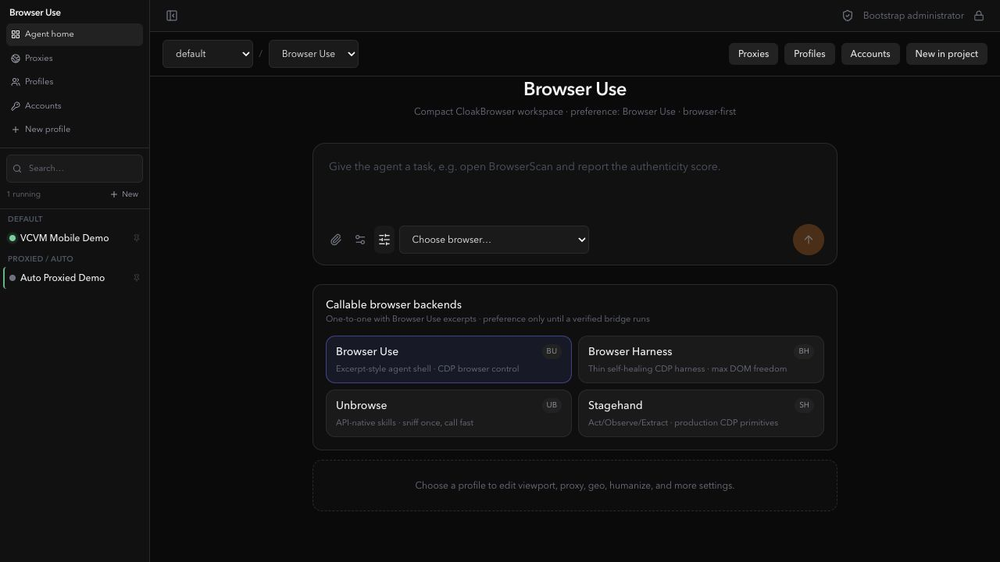
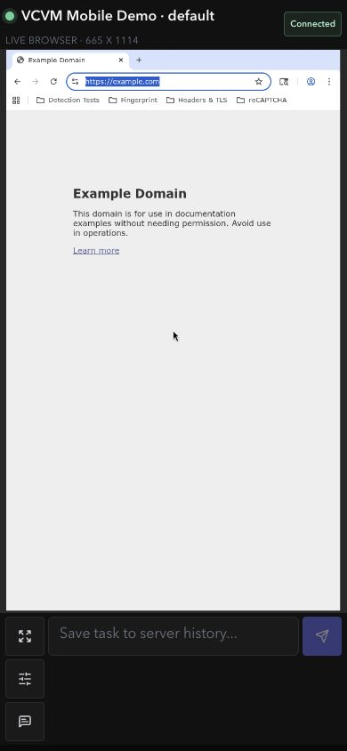
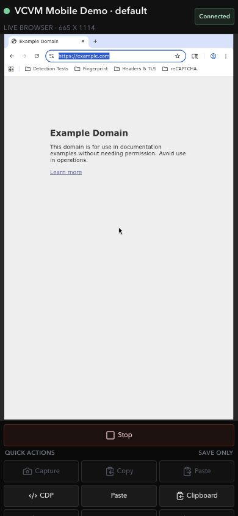
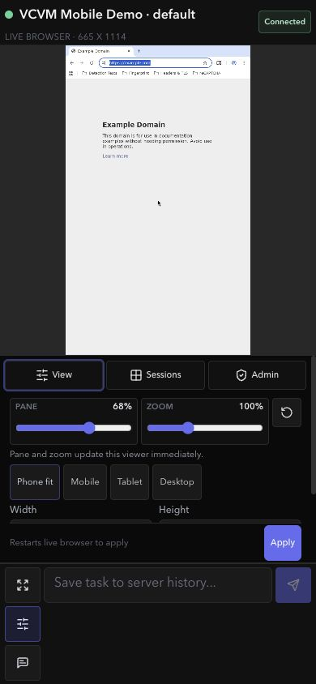

# VCVM-Iststand: CloakBrowser Manager, Browser-Use-Workspace und aktuelle UI

**Stand:** 25. Juli 2026, Europe/Vienna
**Entwicklung:** ausschließlich VCVM-Checkout `/home/coder/vk-repos/CloakBrowser-Manager-browser-use`
**Branch:** `feature/browser-use-agent-workspace`
**Geprüfter Code-Stand:** `4dfaa69ff65ba9a1220a145a7fb6765c9ae4113a`
**Remote:** ausschließlich der Fork `Martin-Hausleitner/CloakBrowser-Manager`
**Main/Upstream:** nicht verändert

## Kurzfazit

Der CloakBrowser Manager läuft auf der VCVM und ist jetzt über eine private Tailscale-URL erreichbar. Die aktuelle UI besitzt bereits eine kompakte Browser-Use-ähnliche Desktop-Startseite sowie einen Mobile-Split-Screen mit Live-Browser, Chatfeld, Werkzeug-Dock, Phone-Fit-/Viewport-Presets, Pane-Ratio und Zoom.

Die technische Grundlage für echte Browser-Use-Ausführung ist deutlich weiter als die sichtbare UI: Projekte, temporäre Tasks, Runs, typisierte Outputs, private Screenshots, Retention, exklusive Automations-Leases, sichere Run-Capabilities, Worker-Authentifizierung und atomare Claims sind implementiert und geprüft.

Noch nicht fertig ist der eigentliche Browser-Use-Sidecar/Adapter. Deshalb sind in der Live-UI die Agent-Ausführung und die Codex-Aktionen Capture/Copy/Paste bewusst deaktiviert. Fullscreen-Parität, physisches iPhone-E2E, Anti-Stealth-Loop, Proxy-Checker-UI, Extension-CLI, CMUX/RCP-Livechat und Performance-Overlay bleiben offene Zielarbeit.

## Echte Test-URLs

### Live-UI auf der VCVM

[**CloakBrowser Manager über Tailscale öffnen**](http://vcvm.tail6a40cd.ts.net:18115/)

- Tailnet-intern, nicht öffentliches Internet
- UI: HTTP 200 verifiziert
- Health: `/health` HTTP 200 verifiziert
- Tailscale Serve leitet auf den VCVM-Loopback-Container `127.0.0.1:18115` weiter
- Ohne bestehende Sitzung erscheint zuerst der Login-Screen

### GitHub

- [Fork-Repository](https://github.com/Martin-Hausleitner/CloakBrowser-Manager)
- [Feature-Branch](https://github.com/Martin-Hausleitner/CloakBrowser-Manager/tree/feature/browser-use-agent-workspace)
- [Geprüfter Task-7-Code-Stand](https://github.com/Martin-Hausleitner/CloakBrowser-Manager/commit/4dfaa69ff65ba9a1220a145a7fb6765c9ae4113a)

## Aktuelle UI – sichtbar geprüft

### Desktop: Browser-Use-ähnliche Agent-Startseite

Bereits sichtbar:

- schmale Profil-/Session-Seitenleiste
- Projektwahl
- Harness-Auswahl
- zentraler Task-Composer
- vorhandene Profile und laufender Status
- Profile pinnen
- Browser Use, Browser Harness, Unbrowse, Stagehand, Codex, Antigravity, Claude Code und OpenCode als auswählbare UI-Präferenzen
- Accounts-, Profile- und Proxy-Bereiche

Wichtig: Die Harness-Karten sind derzeit Auswahl und Konfiguration, noch keine vollständig laufenden Adapter.

### Mobile 390 × 844: Live-Browser und kompakter Composer

Browserseitig geprüft:

- `VCVM Mobile Demo` ausgewählt
- Verbindung `Connected`
- Live-Browser oben
- Taskfeld unten
- drei kleine Dock-Aktionen für Vollbild, Werkzeuge und Chat
- Browser-Viewport im Profil aktuell `665 × 1114`
- Example.com im Remote-Browser sichtbar

### Mobile-Werkzeuge

Vorhanden:

- Browser stoppen
- Capture, Copy, Paste als Codex-Computer-Use-Aktionen
- CDP-Link
- Remote-Paste
- Clipboard-Sync
- View, Sessions und Admin

Capture/Copy/Paste sind bewusst deaktiviert, solange kein verifizierter Codex-/Harness-Host am Run hängt.

### Mobile-Viewport-Steuerung

Live geprüft:

- Browser-Pane-Ratio
- visueller Zoom
- Reset
- Phone fit
- Mobile
- Tablet
- Desktop
- editierbare Breite/Höhe
- Apply
- sofortige Viewer-Anpassung für Pane und Zoom

## Vergleich mit dem gelieferten Browser-Use-Screenshot

Der Screenshot zeigt als Ziel:

- extrem schmale linke Navigation mit Agent Sessions, Remote Browsers, Jobs, Analytics und Settings
- Projektwahl in einer einzigen oberen Leiste
- eine einzige Harness-/Modellzeile
- einen zentralen, sehr ruhigen Task-Composer
- History ohne zusätzliche Kartenflächen
- kaum sichtbare Sekundäraktionen

Die aktuelle CloakBrowser-UI nähert sich diesem Aufbau an, ist aber noch nicht deckungsgleich.

### Bereits ähnlich

- dunkles reduziertes Layout
- schmale Sidebar
- zentrale Task-Eingabe
- Projekt- und Harness-Auswahl
- Session-/Profilübersicht
- wenige primäre Aktionen

### Noch zu vereinfachen

- Harness-Karten unter dem Composer nehmen auf Desktop noch zu viel Platz ein
- einige Proxy/Profile/Account-Aktionen erscheinen doppelt
- Profile brauchen kompaktere Ordner, Farben und einklappbare Gruppen
- History/temporäre Chats müssen näher an Browser Use rücken
- Fullscreen muss dieselben View-, Phone-Fit-, Sessions- und Admin-Werkzeuge erhalten
- Analytics/Settings sollen nur auf Abruf erscheinen
- Desktop und Mobile brauchen dieselbe Funktionslogik, nicht zwei auseinanderlaufende Oberflächen

## Was technisch umgesetzt wurde

### Workspace, Projekte und Tasks

- Projekte und projektgebundene Task-Historie
- temporäre und dauerhafte Tasks
- Done-/Archiv-Lifecycle
- sichere Migrationen und konkurrierende Updates

Wichtige Commits: `407fad1`, `9ddc113`, `bafb635`, `fca233d`

### Health-, Origin- und Identitäts-Gates

- immutable Origin-Policy
- Health-Snapshots vor Ausführung
- Proxy-/Fingerprint-/BrowserScan-Felder als Grundlage
- Block-/Warning-/Override-Lifecycle

Wichtige Commits: `a0a4f1c`, `6feb671`, `96139ce`, `d4cbba1`

### Runs und typisierte Outputs

- persistente Browser-Agent-Runs
- Browser-Use als Harness-Typ
- Outputs jenseits von reinem Markdown
- Validierung unbekannter Felder und riskanter Texte
- atomare Run-Zustände

Wichtige Commits: `967bda8`, `01ae4e5`, `5089a4f`

### Exklusive Browser-Automation und CDP

- ein aktiver Automations-Lease pro Profil
- direkte und Worker-gebundene Leases
- sichere CDP-Discovery
- Socket-Revoke bei Access-Verlust, Ablauf und Close
- Run-Capability nur für exakte CDP-Version/List-HTTP-Routen und Browser/Page-WebSockets

Wichtige Commits: `f03bbc8`, `c920ade`, `4a326e1`

### Screenshots, private Artefakte und Retention

- private Artefaktwurzel mit restriktiven Rechten
- echte PNG-/JPEG-Strukturprüfung
- serverseitig abgeleitete Metadaten
- autorisierte Abrufe
- transaktionales Archiv/Reopen
- Retention-Reparatur, Retry und Purge-Schutz
- gestreamte Screenshot-Aufnahme mit harter Größenbegrenzung

Wichtige Commits: `5091bc0`, `3766c44`, `413d78d`, `9ad804e`

### Browser-Use-Worker-API

- dedizierte Worker-Identität statt Admin-/Agent-Token
- atomarer FIFO-Claim
- Heartbeat und Lease-Ablauf
- Run-gebundene Capability-Tokens
- Token-Persistenzschutz für `cbm_run_`, `cbm_worker_` und `cbm_lease_`
- sichere Credential- und Worker-ID-Rotation
- Health-Block löst Claim, Capability, Run-Lease und Socket
- Override/Retry requeued ohne stale Worker-State
- kontinuierlicher Eligibility-Timer zählt nur, wenn das Profil wirklich lease-frei ist

Wichtige Commits: `f0a999e`, `d7d7ec8`, `ac07427`, `9ad804e`, `4dfaa69`

## Verifikation und Gates

### Backend

- **692 Tests bestanden**
- 1 bekannte Starlette/httpx-Deprecation-Warnung
- Python-Compile bestanden
- Dependency-Check: 49 Pakete kompatibel
- `git diff --check` bestanden
- Gitleaks: keine Leaks im finalen Fix-Commit

### Unabhängige Reviews

- Spezifikationsreview: **APPROVED**
- Security-/Qualitätsreview: **APPROVED**
- gefundene Race-Conditions wurden vor Freigabe reproduziert, testgetrieben behoben und erneut geprüft

### UI/Runtime

- Container `cloakbrowser-manager-vcvm`: healthy
- Desktop-Agent-Home sichtbar geprüft
- Mobile `390 × 844` sichtbar geprüft
- Live-Browser-Verbindung sichtbar als `Connected`
- Werkzeugpanel sichtbar geprüft
- Viewport-/Phone-Fit-/Zoom-Panel sichtbar geprüft
- Tailnet-URL und Health-Endpunkt von einem zweiten Rechner geprüft

## Ehrliche Lücken zum Zielbild

| Bereich | Aktueller Stand | Für „fertig“ noch nötig |
| --- | --- | --- |
| Browser-Use-Harness | API-/Run-Grundlage fertig | echter Sidecar steuert den Browser E2E |
| Andere Harnesses | Auswahl in UI | Stagehand, Unbrowse, Codex, Cursor, Antigravity, Claude, OpenCode über gemeinsamen Adapter/ACP |
| Fullscreen | Browser-Vollbild vorhanden | alle View-/PhoneFit-/Session-/Admin-Einstellungen im Full View |
| PhoneFit | Viewer-Preset funktioniert | echten VM-Browser-Viewport, UA, Touch und Mobile-Identität konsistent anwenden |
| Mobile | kompakter Split-Screen live | physisches iPhone Safari, Tastatur, Rotation, Safe Areas und Touch E2E |
| Grid | Sessions-Schalter vorhanden | mehrere echte Browser gleichzeitig performant rendern und bedienen |
| Projekte/History | Backend und Projektwahl vorhanden | Browser-Use-nahe temporäre Chat-History, Done/Archive im finalen UI |
| Profile | Liste, Status, Pins vorhanden | Farben, Ordner, einklappbare Gruppen, Extension-/Account-Zusammenfassung |
| Proxy | Bereiche und Health-Felder vorhanden | VCVM-Proxychecker, IP-Score, Ping und Detail-UI verbinden |
| Anti-Stealth | Datenmodell-/Gate-Grundlage | BrowserScan-/Checker-Läufe, Gesamtscore und kontrollierte Optimierungsschleife |
| Performance | Live-Stream funktioniert | Messbericht für Latenz/FPS/Frames, Produktionsstream und optionales Overlay |
| Extensions | Ziel definiert | CLI-first Installation per Store-Link/Upload, Suche, Icons, Herkunft und KI-Auswahl |
| User/Gruppen | Access-Control-Grundlage | vollständige kompakte Gruppen-/Grant-UI |
| CMUX/RCP | Ziel definiert | Livechat mit gewählter Harness inklusive Cursor |
| Lokaler Mac | nicht umgesetzt | ausgewähltes VCVM-Profil sicher lokal starten und Identität konsistent halten |
| Deployment | UI-Container live | Task-7-Backend-Stand neu bauen/deployen und danach E2E prüfen |

## Nächste priorisierte Umsetzung

1. Browser-Use-Sidecar als echten Worker an die neue interne API anbinden.
2. Ein echter Browser-Use-Run: Claim → Capability → CDP → Aktion → Screenshot/Output → Complete.
3. Fullscreen-Werkzeugdock auf dieselben Controls wie Mobile bringen.
4. PhoneFit an VM-Viewport, Touch, UA und konsistente Profilidentität binden.
5. Desktop-UI weiter auf den gelieferten Browser-Use-Aufbau reduzieren.
6. Gemeinsame Harness-Schnittstelle für Browser Use, Stagehand, Unbrowse, Codex/Cursor und weitere ACP-Clients.
7. Proxychecker und Anti-Stealth-Scores serverseitig anbinden.
8. Latenz/FPS/Frames reproduzierbar messen und optional im Dev-Overlay anzeigen.
9. CLI-first Extension- und Profilverwaltung auf Basis vorhandener Open-Source-Komponenten.
10. Physisches iPhone-, Desktop-, Tailnet- und Multi-Browser-E2E mit visuellen Quality Gates.

## Betriebsgrenzen

- Der Live-UI-Container läuft auf der VCVM, wurde aber noch nicht aus dem finalen Task-7-Commit `4dfaa69` neu gebaut. Der neue Backend-Stand ist im Feature-Branch vollständig getestet, aber noch nicht produktiv im Container aktiviert.
- Der VCVM-Datenträger wurde zuletzt mit rund 90,8 % Belegung gemeldet. Vor größeren Browser-Images und Sidecars ist eine sichere, nicht-destruktive Kapazitätsprüfung nötig.
- Kein Push ging an `CloakHQ`, `Fintaro-Agent` oder einen fremden Upstream.
- Main bleibt unverändert, bis Browser-Use-Sidecar, UI und echte E2E-Gates abgeschlossen sind.
