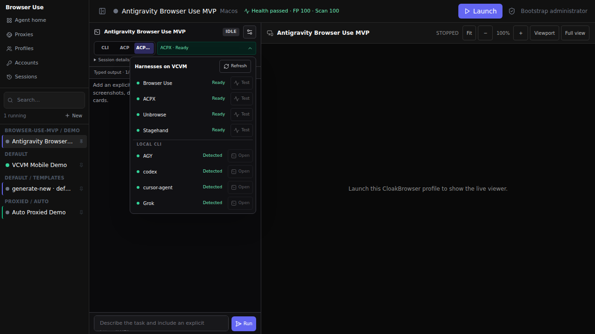
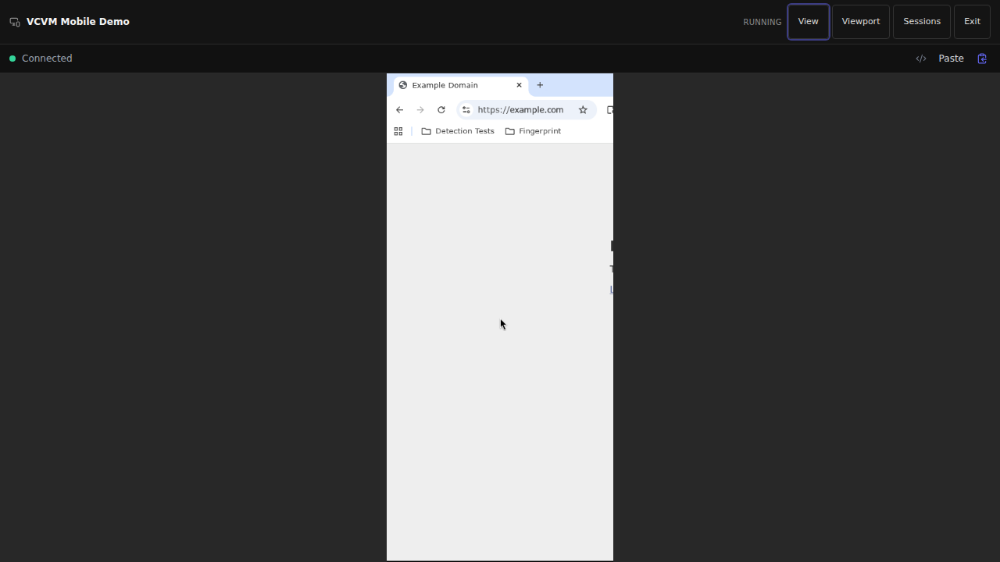
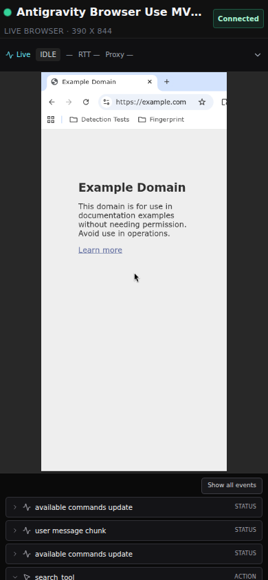

# VCVM Harness Switch — E2E status, 2026-07-29

## Result

The compact VCVM workspace now detects Browser Use, Unbrowse, Stagehand, ACPX and the locally installed Orca CLI adapters from one disclosure menu. One shared `Refresh` action replaces redundant per-row checks; each managed harness has one real `Test` action, while detected local CLIs have one `Open` action that starts the mirrored terminal. The operator can switch harnesses without remounting the browser and can cancel a managed run into immediate full-view takeover.

Live UI: <https://vcvm.tail6a40cd.ts.net/>

Source branch: `feature/browser-use-agent-workspace`

## Verified green paths

All successful runs below used the same running VCVM profile and completed without a health override.

| Harness | Run | Result | Typed output |
| --- | --- | --- | --- |
| Browser Use | `f23ff442-9502-4c68-8feb-24365927804b` | `succeeded` | action, observations, screenshot, summary |
| Unbrowse | `cdfe4c99-9f63-4337-b144-12e4a460569b` | `succeeded` | action, status, observation, summary |
| Stagehand | `00896df6-ea32-4e0e-b2ed-cf9aa59faae2` | `succeeded` | action, status, observation, summary |

## Final deployed verification

Commit `70ceccd` was built and deployed as container image
`sha256:fbbf4e5885415f104f698fdd906c9598b5b7397a7a26b565ca47a452a4715932`.
The container was healthy before the following visible UI runs were accepted:

| Harness | Profile | Run | Result |
| --- | --- | --- | --- |
| Browser Use | VCVM Mobile Demo | `189c9044-a96a-4246-b0d1-b85ea63fd53f` | `succeeded`, title `Example Domain`, screenshot output |
| Unbrowse | VCVM Mobile Demo | `2a046987-f6d3-44c3-bc6f-ccfed1f0d88f` | `succeeded`, managed-profile attach and title observation |
| Stagehand | VCVM Mobile Demo | `d46b420e-50c1-4c09-8b37-0288c805430f` | `succeeded`, managed-profile attach and title observation |
| ACPX / Grok Build | Antigravity Browser Use MVP | `691bab01-7fea-44cf-b5ac-5db6e5b34f25` | `succeeded` through the `cloakbrowser` MCP, title `Example Domain` |

The Browser Use and ACPX labels remained `Ready` while their workers were busy.
Run heartbeats now refresh the matching harness-presence record, so a healthy
single worker no longer becomes falsely `stale` merely because it is executing
a long task instead of polling for the next one.

Manual takeover was also exercised on Browser Use run
`ed90b3d4-f147-483c-bc5d-c5486cd6aa76`: the UI cancelled the active run and
opened the live browser full view while leaving the browser profile running.

The health snapshot for the direct-egress profile is now truthful and versioned as `run-health.v2`:

- `fingerprint_consistency_score=100`
- `browser_scan_score=100`
- `measured_authenticity_score=100`
- `measured_authenticity_source=browser_signals`
- `proxy_configured=false`
- `proxychecker=skipped`
- `health_decision.allowed=true`
- no override

For a proxied profile, the policy still requires a measured Proxy-Checker authenticity source. Browser scores cannot substitute for proxy provenance.

## Fixes delivered

- `09db5ba` — refresh the profile measurement before a one-click harness test; use measured browser signals for direct-egress profiles and measured Proxy-Checker data for proxied profiles.
- `924c28a` — keep private ACP thought chunks out of public typed outputs.
- `efed94c` — stop background adapter preflight before executing a real claimed run.
- `82e3e85` — replace a Manager-rejected adapter fragment with a bounded generic status instead of failing the whole run or weakening validation.
- `a8d570f` — isolate ACP subprocess groups, terminate descendant processes and allow a 90-second authenticated adapter startup.
- `70ceccd` — keep harness presence fresh from active run heartbeats, remove redundant row-level readiness buttons, label local CLIs truthfully as detected, and open them directly in the embedded terminal.

## Automated verification

- Backend: `872 passed`
- Frontend: `233 passed`
- Frontend production build: passed
- Health-policy regression suite: `51 passed`
- Workspace regression suite: `46 passed`
- ACPX worker/runner/E2E regression suite after hardening: `93 passed`
- Independent scoped code review: no findings
- Container: healthy, image digest `sha256:fbbf4e5885415f104f698fdd906c9598b5b7397a7a26b565ca47a452a4715932`

## ACPX / Grok Build result

The earlier MCP-backed `sessions ensure` timeout is no longer the current release result. Two later visible UI runs reached the real `cloakbrowser` MCP and succeeded, including final deployed run `691bab01-7fea-44cf-b5ac-5db6e5b34f25`.

The root-cause investigation showed that Grok's ACP startup is variable and that the old sterile preflight did not prove the live MCP boundary. The UI therefore retains the real per-harness `Test` action as the operator-visible source of truth. AGY was also opened from the new local-CLI action with the selected profile and control skill injected; the operator can remain in that terminal for any account or login interaction.

## Remaining monitoring gate

Track repeated fresh Grok MCP-backed starts and keep the bounded startup timeout. A future readiness contract should probe the same live MCP boundary rather than treating an empty-MCP adapter preflight as full execution proof. This is a reliability-hardening item, not a blocker for the verified release above.
