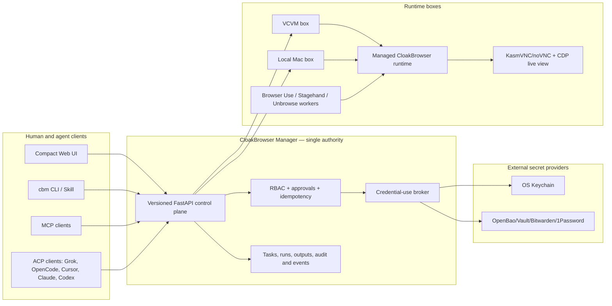
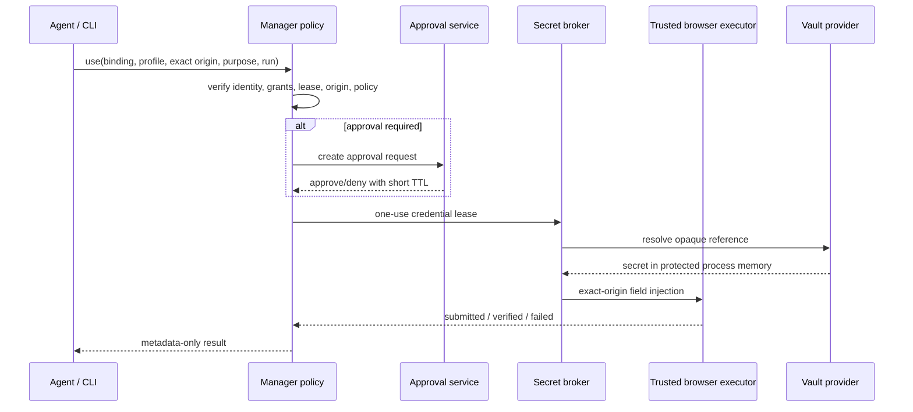

# Universal CloakBrowser Command Wall & CLI Implementation Plan

> **For agentic workers:** REQUIRED SUB-SKILL: Use superpowers:subagent-driven-development (recommended) or superpowers:executing-plans to implement this plan task-by-task. Steps use checkbox (`- [ ]`) syntax for tracking.

**Goal:** Build one universal, agent-friendly `cbm` command wall that safely manages browser profiles, runtime boxes, projects/tasks, proxies, accounts, credential bindings, extensions, views, and harness runs on the local Mac or VCVM without duplicating browser, vault, ACP, MCP, VNC, or automation technology.

**Architecture:** CloakBrowser Manager remains the only policy and lifecycle authority. A shared typed Python client powers the `cbm` CLI, compatibility scripts, skills, an MCP server, and ACP/vendor adapters; all of them call the same authenticated Manager API and reuse the existing profile, task-run, lease, Browser Use, Playwright/CDP, KasmVNC/noVNC, and RBAC foundations. Secrets are stored outside the Manager in a vault and are used through short-lived, origin-bound broker operations; agents receive references and outcomes, never passwords, cookies, TOTP seeds, proxy credentials, or vault tokens.

**Tech Stack:** Python 3.12, FastAPI, Pydantic v2, SQLite initially, existing `urllib`/`httpx` boundaries, Playwright/CDP, CloakBrowser, Browser Use worker, KasmVNC/noVNC, official MCP Python SDK, official ACP SDK/schema, external secret provider (local OS Keychain first; OpenBao/Vault or Bitwarden Secrets Manager on VCVM), pytest, Vitest/React, Tailscale HTTPS/tunnel.

---

## 1. Executive decision

The correct implementation is **not another browser manager, another password manager, or another proprietary agent protocol**. The repository already contains most of the control-plane primitives. The missing work is to normalize them into one durable contract and close the security and feature gaps.

### Adopt

1. Extend the existing FastAPI Manager API as the canonical authority.
2. Turn `scripts/cbm_agent_ctl.py` and `scripts/cbm_browser_ctl.py` into compatibility shims over one shared `cbm` client package.
3. Use ACP for coding-agent/session interoperability.
4. Use MCP for bounded tools/resources exposed to harnesses.
5. Use Playwright and the existing automation-lease gateway for deterministic browser control.
6. Keep Browser Use as the first real asynchronous harness worker.
7. Keep KasmVNC/noVNC for complete interactive viewing and CDP screencast for low-latency browser-only viewing.
8. Store only credential references and account metadata in the Manager; delegate secret storage and resolution to an external broker/provider.
9. Add a first-class `Box`/`Runtime` model instead of treating a profile, process, task session, and Orca terminal as the same kind of “session”.
10. Generate and snapshot OpenAPI/JSON Schema contracts, but keep the public CLI intentionally curated.

### Do not build

- No custom VNC operating system.
- No new browser automation engine, locator engine, CDP client, browser daemon, trace viewer, or HAR implementation.
- No home-grown password database or reversible encryption column in SQLite.
- No CLI command that prints passwords, cookies, OTP seeds, proxy passwords, or browser storage.
- No proprietary JSON-over-stdio protocol; use ACP/MCP/JSON-RPC standards.
- No direct shell-command execution endpoint.
- No per-harness browser lifecycle or per-harness locking.
- No one-command-per-OpenAPI-operation generated CLI.
- No claim that a harness is available merely because its name appears in a dropdown.

## 2. Strict current-state inventory

Audit basis: branch `codex/browser-use-output-ui`, commit `50a9e43f4bd75a01170024cf28040b6c9d0560c5`, 26 July 2026.

| Area | Current implementation | Truthful status | Primary evidence |
| --- | --- | --- | --- |
| Profiles | Persistent fingerprint, viewport, proxy, project/folder, pin/color, harness preference, notes, tags, user-data directory | Real | `backend/models.py`, `backend/database.py`, `backend/browser_manager.py` |
| Browser “boxes” | One Manager container launches multiple browser/VNC/CDP processes; no first-class box/runtime resource | Partial | `backend/browser_manager.py`, `docker-compose.vcvm.yml` |
| Projects | Sandbox-scoped backend CRUD | Real backend; missing CLI/UI client coverage | `backend/main.py`, `backend/database.py`; no project methods in `frontend/src/lib/api.ts` |
| Task/chat sessions | Persistent messages, events, workflow state, Done/Archive/retention, optimistic `row_version` | Real backend | `backend/models.py`, `backend/database.py`, `/api/task-sessions` routes |
| Runs and typed outputs | Queued/running/terminal runs, health gates, output kinds, screenshots, cancel/retry/override | Real | `backend/worker_runtime.py`, task-run routes and tests |
| Browser Use | Dedicated host worker claims real runs and uses existing profile CDP; typed action/observation/screenshot/summary proven | Real | `scripts/browser_use_worker.py`, `docs/BROWSER_USE_WORKER.md` |
| Direct browser control | Inspect, navigate, click, fill, text, screenshot with exclusive lease | Real | `scripts/cbm_browser_ctl.py` |
| Orca | Allowlisted terminal adapter and Manager routes | Real adapter; runtime availability is fail-closed and operationally fragile | `backend/orca_adapter.py`, Orca routes, VCVM reports |
| Other harnesses | Codex, Antigravity, Claude Code, OpenCode, Browser Harness, Unbrowse, Stagehand listed as profile preferences | Mostly metadata, not executable adapters | `backend/models.py`, `frontend/src/lib/harnessOptions.ts` |
| ACP | No server/client/adapter present | Missing | repository-wide symbol audit |
| MCP | No Manager MCP server present | Missing | repository-wide symbol audit |
| Proxies | Inventory, ingest, checker, auto-profile, redacted API | Real, but secret storage unsafe | `backend/proxy_inventory.py`, proxy routes; credentialed URLs stored in SQLite |
| Accounts/login state | UI derives state from tags/notes; Bitwarden/Keypad marked planned | Mock/observer only | `frontend/src/components/AccountsOverview.tsx` |
| User authentication | Bootstrap token, named users, scrypt hashes, signed sessions, agent/worker/run/lease credentials | Real | `backend/access_control.py`, access routes |
| RBAC | Users, groups, agent identities, sandbox grants: view/interact/operate/automate | Real | `backend/access_control.py`, `backend/database.py`, `AccessDashboard.tsx` |
| Extensions | Config catalog, default selection, manifest inspection, launch-arg injection when local asset exists | Partly real; no install/update/remove lifecycle | `backend/extension_catalog.py`, `backend/extensions.py` |
| Streaming | KasmVNC/noVNC full interaction; CDP screencast; metrics | Real, metrics incomplete for VNC | `backend/vnc_manager.py`, `backend/session_views.py`, `ProfileViewer.tsx` |
| Existing agent CLI | Profiles, health, sessions/open links, Browser Use task/run basics | Real but incomplete and manually duplicated | `scripts/cbm_agent_ctl.py` |

### Existing security strengths to preserve

- Agent keys, worker keys, run capabilities, and automation leases are stored as hashes/digests.
- Browser automation is exclusive per profile through a short-lived heartbeat lease.
- Inaccessible sandbox resources return indistinguishable not-found responses.
- Task outputs and screenshots use bounded, typed ingestion.
- Logs and API responses already contain several redaction defenses.
- Worker-internal routes are separated from public agent routes.

### P0 gaps

1. `profiles.proxy` and `proxy_inventory.proxy_url` can contain plaintext proxy credentials in SQLite and backups.
2. Raw CDP access effectively permits cookie/session export; the current `automate` permission is too broad for a credential-aware system.
3. Account and 2FA UI is derived metadata, not a true account/credential model.
4. The current CLI lacks projects, task lifecycle, proxy management, access administration, credential bindings, box/runtime resources, events, and most extension operations.
5. Harness availability is static metadata instead of runtime-discovered capability.
6. The two CLIs duplicate transport/auth/output logic.
7. There is no global idempotency contract, resource version contract, or resumable event stream.
8. The bootstrap admin bearer and session-signing responsibilities must be separated.

## 3. Existing GitHub repositories and reuse decision

Repository activity below was read from the official GitHub repository metadata on 26 July 2026. Stars are intentionally omitted from the architecture decision because popularity is not a compatibility or security contract.

### Core manager, automation, and UI

| Repository | License / state | Reuse boundary | Decision |
| --- | --- | --- | --- |
| [CloakHQ/CloakBrowser-Manager](https://github.com/CloakHQ/CloakBrowser-Manager) | Project-specific license, active | Existing Manager/profile/runtime foundation | Keep as product base; work only in Martin’s fork until upstream acceptance |
| [browser-use/browser-use](https://github.com/browser-use/browser-use) | MIT, active | Autonomous browser agent and current worker dependency | Keep as first asynchronous harness; pin and qualify every upgrade |
| [browser-use/web-ui](https://github.com/browser-use/web-ui) | MIT, active | UX/reference patterns only | Reuse interaction patterns, not branding or cloud assumptions |
| [microsoft/playwright](https://github.com/microsoft/playwright) | Apache-2.0, active | Deterministic browser actions, persistent contexts, screenshots/traces | Keep as direct action foundation |
| [vercel-labs/agent-browser](https://github.com/vercel-labs/agent-browser) | Apache-2.0, active/pre-1.0 | Agent-friendly browser CLI, snapshots, refs, policies, JSON output | Evaluate as optional adapter/backend; do not replace working Manager lifecycle initially |
| [browserbase/stagehand](https://github.com/browserbase/stagehand) | MIT, active | Hybrid `act`/`observe`/`extract` harness | Implement as second worker after Browser Use registry exists |
| [microsoft/magentic-ui](https://github.com/microsoft/magentic-ui) | MIT, active/experimental | Agent-browser UI and human-in-loop reference | UX/approval-flow reference only |
| [daijro/camoufox](https://github.com/daijro/camoufox) | MPL-2.0, active | Firefox anti-detect engine | Research provider plugin; do not mix into Chromium profile contract in P0 |
| [browserless/browserless](https://github.com/browserless/browserless) | Source-available/project license, active | Remote browser infrastructure patterns | Provider comparison only; licensing review before use |

### Streaming and remote views

| Repository | License / state | Reuse boundary | Decision |
| --- | --- | --- | --- |
| [kasmtech/KasmVNC](https://github.com/kasmtech/KasmVNC) | GPL-2.0, active | Full interactive desktop/session stream | Keep; tune and benchmark |
| [novnc/noVNC](https://github.com/novnc/noVNC) | Open source, active | Browser VNC client already used in frontend | Keep; upgrade deliberately with regression tests |
| [selkies-project/selkies](https://github.com/selkies-project/selkies) | Apache-2.0, active successor | Low-latency WebRTC/streaming alternative | Benchmark as optional transport, not a rewrite |
| [GoogleCloudPlatform/selkies-vdi](https://github.com/GoogleCloudPlatform/selkies-vdi) | Apache-2.0, archived | Historical Selkies implementation | Do not adopt; use successor project only |
| [Xpra-org/xpra](https://github.com/Xpra-org/xpra) | GPL-2.0+, active | X11 application streaming | Keep as fallback benchmark only |
| [ChromeDevTools/devtools-protocol](https://github.com/ChromeDevTools/devtools-protocol) | BSD-3-Clause, active | Protocol definitions for Chromium control/observer | Use through Playwright and narrow gateways; do not expose unrestricted raw domains |

### Agent/session and tool protocols

| Repository | License / state | Reuse boundary | Decision |
| --- | --- | --- | --- |
| [agentclientprotocol/agent-client-protocol](https://github.com/agentclientprotocol/agent-client-protocol) | Apache-2.0, active | Editor/client ↔ coding-agent sessions, streaming, approvals | Adopt northbound for harness chat/session adapters |
| [modelcontextprotocol/modelcontextprotocol](https://github.com/modelcontextprotocol/modelcontextprotocol) | MIT spec, active | Tool/resource/prompt protocol | Adopt southbound capability layer |
| [modelcontextprotocol/python-sdk](https://github.com/modelcontextprotocol/python-sdk) | MIT, active | Official Python MCP implementation | Use for `cbm-mcp`; do not implement protocol framing |
| [json-rpc/json-rpc](https://www.jsonrpc.org/specification) | Open specification, stable | Wire primitive underneath ACP/MCP | Do not expose a new custom JSON-RPC method universe |
| [OpenAPITools/openapi-generator](https://github.com/OpenAPITools/openapi-generator) | Apache-2.0, active | Offline SDK generation | Use for compatibility SDKs, not command design |
| [microsoft/kiota](https://github.com/microsoft/kiota) | MIT, active | Focused OpenAPI client generation | Evaluate if multi-language client demand justifies it |
| [fastapi/typer](https://github.com/fastapi/typer) | MIT, active | Typed CLI framework | Do not add initially; preserve stdlib `argparse` until CLI contract stabilizes |

### Coding harnesses and environment adapters

| Repository / product | License / state | Reuse boundary | Decision |
| --- | --- | --- | --- |
| [openai/codex](https://github.com/openai/codex) | Apache-2.0, active | MCP, structured session/event patterns, local agent runtime | Adapter through documented stable surfaces; experimental app-server is not the product contract |
| [xai-org/grok-build](https://github.com/xai-org/grok-build) | Apache-2.0, active | Native ACP agent and structured headless mode | Preferred first ACP proof because ACP is native |
| [opencode-ai/opencode](https://github.com/opencode-ai/opencode) | MIT, active | `opencode acp`, MCP, sessions | Implement ACP adapter after Grok proof |
| [anthropics/claude-code](https://github.com/anthropics/claude-code) | Distribution/plugins/issues; core proprietary | `stream-json`, sessions, MCP, permissions | Use documented subprocess protocol only |
| Cursor CLI | Proprietary/beta | `stream-json`, session IDs, MCP discovery | Keep a version-pinned adapter that synthesizes terminal errors when stream ends incomplete |
| [stablyai/orca](https://github.com/stablyai/orca) | MIT, active | Remote environment/worktree/terminal agent host | Optional environment adapter; never a second Manager authority |

### Secret management

| Repository / provider | License / state | Reuse boundary | Decision |
| --- | --- | --- | --- |
| macOS Keychain / Windows Credential Locker / Linux Secret Service | OS platform APIs | Single-user local secret storage | Default local provider |
| [openbao/openbao](https://github.com/openbao/openbao) | MPL-2.0, active | Self-hosted Vault-compatible secrets, policies, leases, audit | Recommended VCVM/server provider when operational complexity is acceptable |
| [hashicorp/vault](https://github.com/hashicorp/vault) | BSL/project license, active | Reference security model and optional deployment | Valid provider; licensing/operations decision required |
| [bitwarden/sdk-sm](https://github.com/bitwarden/sdk-sm) | Bitwarden SDK license, active | Machine-account/project-scoped secrets | Strong alternative if Bitwarden is already operational |
| [1Password/connect](https://github.com/1Password/connect) | 1Password project license | Team vault bridge | Optional provider for existing 1Password users |
| [getsops/sops](https://github.com/getsops/sops) | MPL-2.0, active | Encrypted static bootstrap/config | Use for deployment bootstrap only, not runtime secret requests |
| [FiloSottile/age](https://github.com/FiloSottile/age) | BSD-3-Clause, active | Encryption primitive/offline bundles | Use behind SOPS or disaster-recovery tooling, not as the online broker |

## 4. Canonical architecture



### Authority rules

1. The Manager owns desired state, policy, lifecycle, audit, leases, and links.
2. Boxes own process execution and advertise capabilities; boxes never accept arbitrary shell strings from clients.
3. Harness workers receive one short-lived run capability and attach to a Manager-owned runtime.
4. The UI, CLI, MCP server, ACP adapter, extension, and skills never bypass Manager authorization.
5. A profile is durable identity/configuration; a runtime is one active process incarnation; a task is durable conversation/history; a run is one execution attempt.
6. Views are authorized projections. `cdp-live` and `vnc` are human views; `automation-cdp` is a separate, elevated control capability.

## 5. Resource model

| Resource | Durable? | Purpose | Sensitive boundary |
| --- | --- | --- | --- |
| `Context` | Local CLI only | Connection URL, token provider/file, TLS/tunnel, defaults | Token reference only; mode-0600/keychain |
| `Box` | Yes | Trusted execution placement and capacity | No host command/path disclosure to ordinary callers |
| `Profile` | Yes | Desired browser identity, viewport, proxy/account/extension bindings | No embedded passwords or provider tokens |
| `Runtime` | Ephemeral record | Running profile generation on one box | Internal ports hidden behind Manager |
| `Session` | TTL-bound | Human/agent attachment to runtime/task/run | Session IDs are not bearer secrets |
| `View` | TTL-bound | VNC, CDP-live, observer, automation projection | Automation view requires separate lease/capability |
| `Project` | Yes | Sandbox-scoped organization and retention | Existing sandbox ownership retained |
| `Task` | Yes | Conversation/work item, currently `task_sessions` | Prompts and outputs redacted/typed |
| `Run` | Yes | One bounded harness attempt | Worker/run capabilities never public |
| `Output` / `Artifact` | Yes | Ordered typed result and private binary payload | Authenticated, no-store, size/type bounded |
| `Proxy` | Yes | Redacted endpoint metadata and health | Credential reference only |
| `Account` | Yes | Website/account label, login/2FA state, profile bindings | No password/cookie/TOTP value |
| `CredentialBinding` | Yes | Opaque provider reference + exact policy | Provider locator hidden from unauthorized users |
| `CredentialUseRequest` | Short-lived | Origin-bound request/approval/result | Never returns plaintext |
| `ExtensionPackage` | Yes | Catalog/version/source/trust metadata | Package provenance and permissions visible |
| `ExtensionBinding` | Yes | Desired enabled extension set per profile | Install performed by trusted box agent |
| `Harness` | Yes descriptor | Supported capabilities, config schema, worker health | Availability comes from healthy registration |
| `Operation` | Yes until retention | Async mutation status | No raw subprocess output |
| `Event` | Retained | Authorized state change with global cursor | Redacted payload only |

## 6. Stable CLI contract

### Command tree

```text
cbm context list|get|use|set|doctor
cbm api schema|version|capabilities

cbm box list|get|doctor
cbm runtime list|get|wait
cbm view open
cbm stream watch

cbm profile list|get|create|apply|delete|assign|start|stop|restart|health
cbm project list|get|create|update|archive
cbm task list|get|create|update|done|reopen|archive|messages|events|run|watch
cbm run get|cancel|retry-health|override-health|watch|outputs|artifact

cbm proxy list|get|import|check|assign|disable|rotate-binding
cbm account list|get|create|update|bind-profile|unbind-profile|status
cbm credential list|inspect|bind|test|use|rotate|revoke
cbm approval list|request|approve|deny
cbm credential-lease list|revoke

cbm extension catalog|list|inspect|enable|disable|sync
cbm harness list|get|doctor
cbm access whoami|sandboxes|users|groups|agents|grants

cbm browser inspect|navigate|click|fill|text|screenshot
```

### Global flags

```text
--context NAME
--output table|json|jsonl|raw
--field JSON_POINTER
--request-id VALUE
--idempotency-key VALUE
--if-version INTEGER
--wait
--timeout DURATION
--no-color
```

### Output rules

- stdout contains only the requested result.
- stderr contains progress and diagnostics.
- `json` emits one complete document.
- `jsonl` emits one bounded event per line.
- `raw` is allowed only for explicitly requested artifacts and never for secrets.
- Timestamps use UTC RFC 3339.
- IDs are opaque.
- Additive unknown fields are tolerated.
- Secret values are omitted, not weakly masked.
- Exit classes are stable: `0` success, `2` usage, `3` auth, `4` not found, `5` conflict/policy, `6` timeout, `7` unavailable, `8` lifecycle/internal.

### Resource envelope

```json
{
  "api_version": "cloakbrowser.io/v1",
  "kind": "Profile",
  "metadata": {
    "id": "profile-1",
    "resource_version": 7,
    "request_id": "req_123",
    "created_at": "2026-07-26T12:00:00Z",
    "updated_at": "2026-07-26T12:05:00Z"
  },
  "spec": {},
  "status": {},
  "links": []
}
```

### Error envelope

```json
{
  "api_version": "cloakbrowser.io/v1",
  "kind": "Error",
  "error": {
    "code": "automation_busy",
    "message": "Profile already has an active automation lease",
    "retryable": true,
    "details": {}
  },
  "request_id": "req_123"
}
```

## 7. Credential and password design

### Product rule

The requested outcome—profiles and login data can be managed by agents—is supported as **bind, use, change, rotate, revoke, and verify**, not as “print the password”. A generic reveal command would turn every harness, log, screenshot, clipboard manager, prompt, shell history, and task output into a secret exfiltration path.

### Allowed commands

```text
cbm credential list
cbm credential inspect <binding-id>
cbm credential bind --provider keychain --ref <opaque-provider-ref> \
  --sandbox sales --profile profile-1 \
  --origin https://accounts.example.com --policy login-standard
cbm credential test <binding-id>
cbm credential use <binding-id> --profile profile-1 \
  --origin https://accounts.example.com --purpose "restore account session" \
  --run-id run-123
cbm credential rotate <binding-id>
cbm credential revoke <binding-id>
```

### Forbidden commands and paths

- No `credential get --value`.
- No `credential reveal` in CLI, MCP, ACP, UI API, or task output.
- No password on argv, environment, URL, JSON body accepted by the normal CLI.
- No clipboard-based credential injection.
- No credential values inside screenshots, DOM snapshots, accessibility trees, video, HAR, traces, logs, or exception text.
- No raw-CDP permission implied by `credential.use`.

### Separate capabilities

```text
credential.metadata
credential.bind
credential.use
credential.rotate
credential.revoke
credential.approve
credential.break_glass
browser.observe
browser.interact
browser.operate
browser.automate_mediated
browser.cdp_raw
session.export
provider.admin
```

`browser.automate_mediated` does not imply `credential.use`. Neither implies `browser.cdp_raw` or `session.export`.

### Credential-use lifecycle



### Provider rollout

1. Local Mac: OS Keychain provider.
2. VCVM: OpenBao/Vault or Bitwarden Secrets Manager provider.
3. SOPS/age: deployment bootstrap and disaster recovery only.
4. 1Password Connect: optional if already operational.

### Proxy migration

1. Parse each existing proxy URL inside one offline migration transaction.
2. Write endpoint metadata to `proxy_inventory` and credentials to the selected provider.
3. Store only `credential_binding_id` in the Manager.
4. Verify provider retrieval and checker connectivity.
5. Atomically switch the active record.
6. Redact old plaintext columns in the live database only after verified backup and rollback proof.
7. Keep encrypted backup retention explicit and time-bounded.

## 8. API compatibility and events

### Compatibility strategy

- Freeze current `/api/...` routes as v1 compatibility routes.
- Snapshot FastAPI OpenAPI JSON in `docs/contracts/openapi-v1.json`.
- Add `operation_id` values and schema tests.
- Add normalized `/api/v2/...` only for resources that do not exist today: boxes, runtimes, sessions/views, accounts, credential bindings/use requests, operations, and global events.
- Keep `/internal/...` worker routes private and inaccessible to ordinary agent keys.
- Preserve current flat open-link fields for the Chrome extension while adding canonical `views[]`.

### Idempotency and versioning

1. Every create and side-effecting POST accepts `Idempotency-Key`.
2. Scope the key by principal + method + canonical route.
3. Same key and same request hash returns the first result.
4. Same key and different hash returns `409 idempotency_conflict`.
5. Every mutable resource carries monotonically increasing `resource_version`.
6. Updates require `If-Match` or CLI `--if-version`.
7. Start/stop/close/cancel are desired-state idempotent operations.
8. Async work returns an `Operation` and supports `--wait`.

### Global event stream

```text
GET /api/v2/events?after=<cursor>&resource_kind=Run&resource_id=<id>
GET /api/v2/events/stream
GET /api/v2/runs/{id}/events/stream
```

SSE uses `Last-Event-ID`; CLI falls back to cursor polling. VNC/CDP remain WebSocket streams. Event payloads are redacted and state change + event insert commit atomically.

## 9. Harness architecture

### Descriptor

```json
{
  "id": "browser-use",
  "version": "0.13.6",
  "execution_mode": "worker",
  "capabilities": ["navigate", "observe", "act", "extract", "screenshot"],
  "output_kinds": ["action", "observation", "screenshot", "summary", "error"],
  "required_views": ["automation-cdp"],
  "health": "ready",
  "capacity": {"running": 0, "maximum": 1}
}
```

### Execution rule

All asynchronous harnesses implement the existing lifecycle:

```text
claim -> health snapshot -> automation lease -> run capability -> execute
      -> typed outputs/artifacts -> complete/fail/cancel -> revoke capability/lease
```

Browser Use remains the reference. Stagehand is the second proof. Unbrowse integrates as an evidence/research capability, not as an unrestricted shell. Codex/Cursor/Claude/OpenCode/Grok connect through ACP or structured subprocess adapters and call the same `cbm`/MCP surface.

### Truthful availability

The UI and CLI show a harness only as executable when:

1. A descriptor is registered.
2. A compatible worker has sent a fresh heartbeat.
3. Required runtime/view capabilities are present on the selected box.
4. The caller has the required permissions.
5. A real E2E probe for that exact adapter version is green.

## 10. Detailed implementation tasks

### Task 1: Freeze the current API and CLI behavior

**Files:**
- Create: `docs/contracts/openapi-v1.json`
- Create: `docs/contracts/cli-v1.md`
- Create: `backend/tests/test_openapi_contract.py`
- Create: `scripts/test_cbm_cli_contract.py`
- Modify: `backend/main.py`

- [ ] **Step 1: Add deterministic OpenAPI operation IDs**

Add `operation_id="profiles_list"`, `operation_id="profiles_create"`, and equivalent stable IDs to every public route decorator in `backend/main.py`; internal worker routes use the `internal_` prefix.

- [ ] **Step 2: Add a failing OpenAPI snapshot test**

```python
def test_public_openapi_contract_matches_snapshot():
    current = json.loads(json.dumps(main.app.openapi(), sort_keys=True))
    expected = json.loads((ROOT / "docs/contracts/openapi-v1.json").read_text())
    assert current == expected
```

- [ ] **Step 3: Record the CLI v1 contract**

Document current commands, auth precedence, JSON shapes, exit behavior, and deprecated aliases in `docs/contracts/cli-v1.md`.

- [ ] **Step 4: Generate the first snapshot and verify it**

Run:

```bash
python -m pytest backend/tests/test_openapi_contract.py scripts/test_cbm_cli_contract.py -q
```

Expected: all contract tests pass and no secret-like sample value exists in the snapshot.

- [ ] **Step 5: Commit**

```bash
git add backend/main.py backend/tests/test_openapi_contract.py scripts/test_cbm_cli_contract.py docs/contracts
git commit -m "test(api): freeze public command contracts"
```

### Task 2: Create the shared `cbm` client and CLI core

**Files:**
- Create: `cbm_cli/__init__.py`
- Create: `cbm_cli/__main__.py`
- Create: `cbm_cli/config.py`
- Create: `cbm_cli/client.py`
- Create: `cbm_cli/errors.py`
- Create: `cbm_cli/output.py`
- Create: `cbm_cli/commands.py`
- Create: `scripts/test_cbm_cli_core.py`
- Modify: `pyproject.toml`

- [ ] **Step 1: Write failing context and auth tests**

```python
def test_non_loopback_http_is_rejected():
    with pytest.raises(ConfigError, match="HTTPS"):
        Context(base_url="http://vcvm.example.test", token_file="/tmp/key")

def test_loopback_http_is_allowed():
    context = Context(base_url="http://127.0.0.1:18115", token_file="/tmp/key")
    assert context.base_url.endswith(":18115")
```

- [ ] **Step 2: Implement safe context resolution**

`Context` supports explicit CLI flag, `CBM_CONTEXT`, and `~/.config/cloakbrowser/contexts.json`. Token sources are mode-0600 regular files or a credential helper; argv and query-string tokens are rejected.

- [ ] **Step 3: Implement one HTTP client**

```python
class ManagerClient:
    def request(self, method: str, path: str, *, body=None, query=None,
                idempotency_key=None, if_version=None, timeout=60): ...
```

The client sets request IDs, applies bearer auth, validates paths, redacts errors, and maps HTTP failures to stable CLI error classes.

- [ ] **Step 4: Implement renderers**

`table`, `json`, `jsonl`, and `raw` renderers keep stdout clean and send progress to stderr. `raw` rejects resources classified as secrets.

- [ ] **Step 5: Register the console script**

```toml
[project]
name = "cloakbrowser-manager-cli"
version = "0.1.0"
requires-python = ">=3.12"

[project.scripts]
cbm = "cbm_cli.__main__:main"
```

- [ ] **Step 6: Verify**

Run:

```bash
PYTHONPATH=. python -m pytest scripts/test_cbm_cli_core.py -q
python -m cbm_cli --help
```

Expected: tests pass; help lists context/api/profile/project/task/run groups.

- [ ] **Step 7: Commit**

```bash
git add cbm_cli pyproject.toml scripts/test_cbm_cli_core.py
git commit -m "feat(cli): add shared command wall core"
```

### Task 3: Port current profile, task, run, proxy, and extension commands

**Files:**
- Create: `cbm_cli/resources/profiles.py`
- Create: `cbm_cli/resources/projects.py`
- Create: `cbm_cli/resources/tasks.py`
- Create: `cbm_cli/resources/runs.py`
- Create: `cbm_cli/resources/proxies.py`
- Create: `cbm_cli/resources/extensions.py`
- Create: `scripts/test_cbm_resource_commands.py`
- Modify: `scripts/cbm_agent_ctl.py`

- [ ] **Step 1: Write request-shape tests for every resource command**

Cover list/get/create/update/lifecycle commands and assert method, path, query, body, idempotency header, and version header.

- [ ] **Step 2: Implement curated resource commands**

Port existing CLI behavior first, then add project list/create/update, task list/update/done/reopen/archive/messages/events, run retry/override/artifact, proxy list/import/check/assign, and extension catalog/defaults/templates/inventory.

- [ ] **Step 3: Keep the old agent CLI as a shim**

`scripts/cbm_agent_ctl.py` imports `cbm_cli.__main__.main` and translates only old aliases; it contains no HTTP implementation after this task.

- [ ] **Step 4: Verify compatibility**

Run:

```bash
PYTHONPATH=. python -m pytest scripts/test_cbm_agent_ctl.py scripts/test_cbm_resource_commands.py -q
```

Expected: old tests and new command-shape tests pass.

- [ ] **Step 5: Commit**

```bash
git add cbm_cli/resources scripts/cbm_agent_ctl.py scripts/test_cbm_resource_commands.py
git commit -m "feat(cli): unify manager resource commands"
```

### Task 4: Wrap direct browser control without duplicating CDP logic

**Files:**
- Create: `cbm_cli/resources/browser.py`
- Create: `scripts/test_cbm_browser_command_adapter.py`
- Modify: `scripts/cbm_browser_ctl.py`

- [ ] **Step 1: Lock current lease behavior with compatibility tests**

Verify acquire → heartbeat → action → release for success, action failure, cancellation, timeout, and lease lifecycle failure.

- [ ] **Step 2: Extract the existing action implementation into importable functions**

The new CLI command handlers call the same validated selector, URL, text, screenshot, and lease functions. No second CDP client is added.

- [ ] **Step 3: Make `cbm_browser_ctl.py` a compatibility shim**

Old command syntax remains supported for one deprecation cycle.

- [ ] **Step 4: Verify**

Run:

```bash
PYTHONPATH=. python -m pytest scripts/test_cbm_browser_ctl.py scripts/test_cbm_browser_command_adapter.py -q
```

Expected: all existing redaction and lifecycle tests pass.

- [ ] **Step 5: Commit**

```bash
git add cbm_cli/resources/browser.py scripts/cbm_browser_ctl.py scripts/test_cbm_browser_command_adapter.py
git commit -m "refactor(cli): share direct browser control"
```

### Task 5: Add boxes, runtimes, sessions, and views

**Files:**
- Create: `backend/runtime_boxes.py`
- Create: `backend/runtime_registry.py`
- Create: `backend/tests/test_runtime_boxes.py`
- Create: `backend/tests/test_runtime_api.py`
- Modify: `backend/models.py`
- Modify: `backend/database.py`
- Modify: `backend/main.py`
- Modify: `backend/browser_manager.py`
- Modify: `backend/session_links.py`

- [ ] **Step 1: Add models**

```python
class BoxResponse(BaseModel):
    id: str
    display_name: str
    state: Literal["ready", "degraded", "offline"]
    capabilities: list[str]
    capacity_total: int
    capacity_used: int

class RuntimeResponse(BaseModel):
    id: str
    profile_id: str
    box_id: str
    generation: int
    state: Literal["starting", "running", "stopping", "stopped", "failed"]
    views: list["ViewResponse"]
```

- [ ] **Step 2: Back the first box with current runtime state**

Register `vcvm` or `local` from deployment config. `BrowserManager.running` populates runtime status; no new per-profile container is created.

- [ ] **Step 3: Add normalized routes**

```text
GET /api/v2/boxes
GET /api/v2/boxes/{id}
GET /api/v2/runtimes
GET /api/v2/runtimes/{id}
POST /api/v2/profiles/{id}/start
POST /api/v2/profiles/{id}/stop
POST /api/v2/sessions
DELETE /api/v2/sessions/{id}
GET /api/v2/sessions/{id}/views
```

- [ ] **Step 4: Add compatibility mapping**

Existing launch/stop/status/open-links routes call the same service layer and preserve their current response shapes.

- [ ] **Step 5: Verify one-runtime-per-profile and link authorization**

Run:

```bash
python -m pytest backend/tests/test_runtime_boxes.py backend/tests/test_runtime_api.py backend/tests/test_browser_manager.py backend/tests/test_session_links.py -q
```

Expected: one active runtime per profile; views contain no upstream credentials or unproxied ports.

- [ ] **Step 6: Commit**

```bash
git add backend/runtime_boxes.py backend/runtime_registry.py backend/models.py backend/database.py backend/main.py backend/browser_manager.py backend/session_links.py backend/tests/test_runtime_boxes.py backend/tests/test_runtime_api.py
git commit -m "feat(runtime): model boxes runtimes and views"
```

### Task 6: Add general idempotency, resource versions, operations, and events

**Files:**
- Create: `backend/idempotency.py`
- Create: `backend/resource_events.py`
- Create: `backend/operations.py`
- Create: `backend/tests/test_idempotency.py`
- Create: `backend/tests/test_resource_events.py`
- Create: `backend/tests/test_operations.py`
- Modify: `backend/database.py`
- Modify: `backend/main.py`
- Modify: `backend/models.py`

- [ ] **Step 1: Add migration tables**

```sql
CREATE TABLE request_idempotency (
  principal_key TEXT NOT NULL,
  method TEXT NOT NULL,
  route_key TEXT NOT NULL,
  idempotency_key TEXT NOT NULL,
  request_hash TEXT NOT NULL,
  response_status INTEGER NOT NULL,
  response_json TEXT NOT NULL,
  created_at TEXT NOT NULL,
  PRIMARY KEY (principal_key, method, route_key, idempotency_key)
);

CREATE TABLE resource_events (
  cursor INTEGER PRIMARY KEY AUTOINCREMENT,
  sandbox_id TEXT NOT NULL,
  resource_kind TEXT NOT NULL,
  resource_id TEXT NOT NULL,
  resource_version INTEGER NOT NULL,
  event_type TEXT NOT NULL,
  actor_json TEXT NOT NULL,
  request_id TEXT NOT NULL,
  payload_json TEXT NOT NULL,
  occurred_at TEXT NOT NULL
);
```

- [ ] **Step 2: Write concurrency tests**

Two identical creates with the same key return one resource. Reusing the key with different payload returns 409. Two updates with the same version yield one success and one deterministic conflict.

- [ ] **Step 3: Implement state-change + event transaction helpers**

No database transaction is held across network or browser work.

- [ ] **Step 4: Add SSE and polling routes**

Support `Last-Event-ID`, cursor filters, bounded payloads, and `410 cursor_expired`.

- [ ] **Step 5: Verify**

Run:

```bash
python -m pytest backend/tests/test_idempotency.py backend/tests/test_resource_events.py backend/tests/test_operations.py backend/tests/test_task_lifecycle_api.py -q
```

Expected: ordering, deduplication, conflict, reconnect, and redaction tests pass.

- [ ] **Step 6: Commit**

```bash
git add backend/idempotency.py backend/resource_events.py backend/operations.py backend/database.py backend/main.py backend/models.py backend/tests/test_idempotency.py backend/tests/test_resource_events.py backend/tests/test_operations.py
git commit -m "feat(api): add idempotent operations and events"
```

### Task 7: Introduce account metadata and credential references

**Files:**
- Create: `backend/accounts.py`
- Create: `backend/credential_bindings.py`
- Create: `backend/tests/test_accounts_api.py`
- Create: `backend/tests/test_credential_bindings_api.py`
- Modify: `backend/database.py`
- Modify: `backend/models.py`
- Modify: `backend/main.py`
- Modify: `frontend/src/components/AccountsOverview.tsx`
- Modify: `frontend/src/lib/api.ts`

- [ ] **Step 1: Add reference-only tables**

```sql
CREATE TABLE accounts (
  id TEXT PRIMARY KEY,
  sandbox_id TEXT NOT NULL,
  provider TEXT NOT NULL,
  label TEXT NOT NULL,
  username_masked TEXT,
  login_state TEXT NOT NULL,
  two_factor_state TEXT NOT NULL,
  created_at TEXT NOT NULL,
  updated_at TEXT NOT NULL
);

CREATE TABLE credential_bindings (
  id TEXT PRIMARY KEY,
  sandbox_id TEXT NOT NULL,
  account_id TEXT,
  provider_type TEXT NOT NULL,
  provider_locator_ciphertext TEXT NOT NULL,
  allowed_origins_json TEXT NOT NULL,
  policy_id TEXT NOT NULL,
  secret_version TEXT,
  state TEXT NOT NULL,
  created_at TEXT NOT NULL,
  updated_at TEXT NOT NULL
);
```

The locator is not a secret value, but it can reveal vault structure; encrypt it with an application key from the provider bootstrap, not with a key stored in the same database.

- [ ] **Step 2: Add account/profile binding routes**

Metadata-only CRUD, profile bind/unbind, login-state updates, and authorization by sandbox.

- [ ] **Step 3: Add credential-binding routes**

List/inspect/bind/test/rotate/revoke return provider type, masked label, policy, allowed origins, state, version, timestamps; never provider tokens or secret values.

- [ ] **Step 4: Replace derived account UI data**

`AccountsOverview` consumes real account metadata and clearly shows “unknown” when no verified state exists.

- [ ] **Step 5: Verify absence of secret fields**

Run:

```bash
python -m pytest backend/tests/test_accounts_api.py backend/tests/test_credential_bindings_api.py -q
cd frontend && npm test -- AccountsOverview
```

Expected: APIs never serialize `password`, `secret`, `cookie`, `totp`, `otp_seed`, `provider_token`, or raw locator.

- [ ] **Step 6: Commit**

```bash
git add backend/accounts.py backend/credential_bindings.py backend/database.py backend/models.py backend/main.py backend/tests/test_accounts_api.py backend/tests/test_credential_bindings_api.py frontend/src/components/AccountsOverview.tsx frontend/src/lib/api.ts
git commit -m "feat(accounts): add vault-backed credential references"
```

### Task 8: Build the secret broker and migrate proxy credentials

**Files:**
- Create: `backend/secret_broker/__init__.py`
- Create: `backend/secret_broker/base.py`
- Create: `backend/secret_broker/keychain.py`
- Create: `backend/secret_broker/openbao.py`
- Create: `backend/secret_broker/policy.py`
- Create: `backend/secret_broker/leases.py`
- Create: `backend/tests/test_secret_broker.py`
- Create: `backend/tests/test_proxy_secret_migration.py`
- Create: `scripts/migrate_proxy_credentials.py`
- Modify: `backend/proxy_inventory.py`
- Modify: `backend/browser_manager.py`
- Modify: `backend/database.py`

- [ ] **Step 1: Define a non-serializable secret type**

```python
class SecretValue:
    __slots__ = ("_value",)
    def __repr__(self) -> str:
        return "SecretValue([redacted])"
    def __str__(self) -> str:
        raise TypeError("SecretValue cannot be rendered")
```

Only the trusted broker/executor can read `_value`, and it never returns through Pydantic/API models.

- [ ] **Step 2: Implement provider interfaces**

```python
class SecretProvider(Protocol):
    def test(self, locator: str) -> ProviderStatus: ...
    def resolve_for_use(self, locator: str, *, lease: CredentialLease) -> SecretValue: ...
    def rotate(self, locator: str) -> SecretVersion: ...
    def revoke(self, locator: str) -> None: ...
```

- [ ] **Step 3: Implement short-lived credential-use leases**

Bind principal, binding ID, profile ID, exact HTTPS origin, run ID, approval ID, use count, and expiry. Persist only token digest/accessor.

- [ ] **Step 4: Implement transactional proxy migration**

The script supports `--dry-run`, explicit provider, explicit backup path, per-row verification, and rollback manifest. It never prints proxy URLs or credentials.

- [ ] **Step 5: Launch through private resolution**

`BrowserManager.launch()` receives a resolved proxy object through an in-process trusted boundary. It does not read a credentialed URL from the profile row.

- [ ] **Step 6: Verify theft and log boundaries**

Run:

```bash
python -m pytest backend/tests/test_secret_broker.py backend/tests/test_proxy_secret_migration.py backend/tests/test_proxy_inventory.py backend/tests/test_browser_manager.py -q
```

Expected: a copied SQLite database contains no proxy password; logs, errors, API payloads, and migration output contain no secret values.

- [ ] **Step 7: Commit**

```bash
git add backend/secret_broker backend/proxy_inventory.py backend/browser_manager.py backend/database.py backend/tests/test_secret_broker.py backend/tests/test_proxy_secret_migration.py scripts/migrate_proxy_credentials.py
git commit -m "feat(secrets): broker proxy credentials by reference"
```

### Task 9: Add mediated login and approval flow

**Files:**
- Create: `backend/credential_use.py`
- Create: `backend/approvals.py`
- Create: `backend/tests/test_credential_use_api.py`
- Create: `backend/tests/test_approval_api.py`
- Create: `scripts/credential_executor.py`
- Modify: `backend/access_control.py`
- Modify: `backend/models.py`
- Modify: `backend/main.py`
- Modify: `backend/cdp_gateway.py`

- [ ] **Step 1: Split capabilities**

Add mediated automation, raw CDP, credential use, approval, and session export permissions without weakening existing sandbox grants. Existing `automate` maps to mediated automation only during migration unless an explicit legacy raw-CDP grant is present.

- [ ] **Step 2: Add use-request states**

```text
requested -> awaiting_approval -> approved -> resolving -> injecting
          -> submitted -> verified | failed | denied | expired | revoked
```

- [ ] **Step 3: Enforce exact-origin injection**

The trusted executor verifies top-frame HTTPS origin immediately before fill and again before submit. Cross-origin redirect invalidates the lease.

- [ ] **Step 4: Suppress capture during injection**

Disable screenshot, DOM/accessibility capture, video, HAR body capture, and clipboard sync during secret handling. Re-enable only after the secret field is cleared and policy permits capture.

- [ ] **Step 5: Add approval separation**

Requestors cannot approve their own high-risk request. Approval tokens bind requestor, binding, profile, origin, action, run, expiry, and maximum use count.

- [ ] **Step 6: Verify hostile scenarios**

Test phishing redirect, nested iframe, compromised extension, screenshot attempt, raw-CDP cookie export, expired approval, revoked agent, cancelled run, and profile disconnect.

Run:

```bash
python -m pytest backend/tests/test_credential_use_api.py backend/tests/test_approval_api.py backend/tests/test_cdp_automation_leases_api.py -q
```

Expected: all secret-use paths fail closed and no test value appears in captured output.

- [ ] **Step 7: Commit**

```bash
git add backend/credential_use.py backend/approvals.py backend/access_control.py backend/models.py backend/main.py backend/cdp_gateway.py backend/tests/test_credential_use_api.py backend/tests/test_approval_api.py scripts/credential_executor.py
git commit -m "feat(auth): add mediated credential use approvals"
```

### Task 10: Add truthful harness registry and second worker

**Files:**
- Create: `backend/harness_registry.py`
- Create: `backend/tests/test_harness_registry.py`
- Create: `scripts/stagehand_worker.py`
- Create: `scripts/test_stagehand_worker.py`
- Modify: `backend/worker_runtime.py`
- Modify: `backend/main.py`
- Modify: `scripts/browser_use_worker.py`
- Modify: `frontend/src/lib/harnessOptions.ts`

- [ ] **Step 1: Add descriptor registration and heartbeat**

Workers register ID, version, capabilities, output kinds, required views, capacity, and health expiry. Registration never grants extra resource permission.

- [ ] **Step 2: Drive Browser Use from a descriptor**

Remove the single hard-coded availability assumption while preserving Browser Use claim semantics and tests.

- [ ] **Step 3: Implement Stagehand as the second proof**

Map `observe` → observation output, `act` → action output, `extract` → extracted-data output, screenshot → private artifact, and terminal result → summary/error.

- [ ] **Step 4: Make UI options runtime-aware**

Unavailable harnesses remain visible as preferences only when editing a profile; run controls show only healthy executable adapters.

- [ ] **Step 5: Verify shared lease and typed outputs**

Run:

```bash
python -m pytest backend/tests/test_harness_registry.py scripts/test_browser_use_worker.py scripts/test_stagehand_worker.py -q
cd frontend && npm test -- harnessOptions AgentBrowserWorkspace
```

Expected: Browser Use and Stagehand compete for the same profile automation lease and emit the canonical output envelope.

- [ ] **Step 6: Commit**

```bash
git add backend/harness_registry.py backend/worker_runtime.py backend/main.py backend/tests/test_harness_registry.py scripts/browser_use_worker.py scripts/stagehand_worker.py scripts/test_stagehand_worker.py frontend/src/lib/harnessOptions.ts
git commit -m "feat(harness): register executable browser workers"
```

### Task 11: Add official MCP server over the shared client

**Files:**
- Create: `integrations/mcp/__init__.py`
- Create: `integrations/mcp/server.py`
- Create: `integrations/mcp/tools.py`
- Create: `integrations/mcp/resources.py`
- Create: `integrations/mcp/redaction.py`
- Create: `integrations/mcp/tests/test_mcp_contract.py`
- Modify: `backend/requirements.txt`

- [ ] **Step 1: Pin the official MCP Python SDK**

Add one exact compatible version after official changelog review; record it in the dependency report and lock used for VCVM provisioning.

- [ ] **Step 2: Expose bounded tools**

```text
profiles_list, profile_get, profile_start, profile_stop, profile_health
task_create, task_update, task_run, run_get, run_cancel, run_outputs
view_open, browser_navigate, browser_click, browser_fill, browser_screenshot
credential_use_request, approval_status
```

No tool returns a bearer, lease, cookie, password, provider locator, raw CDP socket, or filesystem path.

- [ ] **Step 3: Expose resources**

Profiles, tasks, runs, typed outputs, approved screenshots, and API schemas use authorization-scoped MCP resources.

- [ ] **Step 4: Verify equivalence**

The same agent identity receives the same allow/deny result through REST CLI and MCP. Secret-like injected errors remain redacted.

Run:

```bash
python -m pytest integrations/mcp/tests/test_mcp_contract.py backend/tests/test_access_control.py -q
```

Expected: tool schemas are bounded and contract tests pass.

- [ ] **Step 5: Commit**

```bash
git add integrations/mcp backend/requirements.txt
git commit -m "feat(mcp): expose bounded browser manager tools"
```

### Task 12: Add ACPX-backed ACP harness adapters

**Files:**
- Create: `scripts/acpx_runner.py`
- Create: `scripts/test_acpx_runner.py`
- Create: `scripts/acpx_worker.py`
- Create: `scripts/test_acpx_worker.py`
- Create: `deploy/systemd/cloakbrowser-acpx-worker.service.template`
- Modify: `backend/models.py`
- Modify: `backend/tests/test_models.py`

- [x] **Step 1: Pin ACPX and record the reviewed ACP SDK baseline**

Use ACPX `0.12.1`. Its package currently declares `@agentclientprotocol/sdk` as `^1.2.1`, so `1.2.1` is the reviewed contract baseline rather than an enforced exact SDK pin. ACP is canonical; ACPX is a replaceable runtime adapter. The production provisioner must lock and verify the resolved dependency graph before enabling the worker.

- [x] **Step 2: Add the fail-closed command and event adapter**

`scripts/acpx_runner.py` now validates the worktree, allowed agent, private permission/MCP files, opaque session name, exact runtime version, strict NDJSON event envelope, event size, typed-output mapping, and secret redaction. Prompts never enter argv.

- [x] **Step 3: Register `acpx` as a Manager harness type**

Profiles and Task Runs can select `acpx`; this is a contract registration, not yet a live availability claim.

- [x] **Step 4: Implement the host worker run lifecycle**

Claim only `harness=acpx`, map one Manager Task Session to one opaque ACPX named session, stream typed outputs, heartbeat, propagate cancel through `acpx <agent> cancel -s <name>`, and clean the private run capability. The Manager remains the source of truth; ACPX session storage is only a runtime cache.

- [ ] **Step 4b: Close ACPX sessions on archive/retention expiry**

Add the Manager-to-worker lifecycle signal and call `sessions close` only after the durable task is archived or expires. Do not close after every run because follow-up prompts must resume the same named ACP session.

- [x] **Step 5: Connect bounded browser tools through MCP**

Pass a mode-`0600` `--mcp-config` that exposes only `cbm-mcp`. Do not place bearer tokens in the config. The worker supplies a short-lived run capability through a private mode-`0600` file. `cbm-mcp` uses the official MCP Python SDK and exposes only inspect, exact-origin navigate, click, fill-without-echo, and bounded visible-text read for the Manager-granted profile.

- [ ] **Step 6: Normalize events**

```text
session.started, message.delta, tool.started, tool.completed,
approval.requested, artifact.created, progress.updated,
result.completed, result.failed
```

- [ ] **Step 7: Prove native ACP with Grok Build**

Use the ACPX `grok-build` adapter, negotiate capabilities, create/resume a session, invoke the `cbm` MCP tools, stream typed results, and cancel cleanly.

- [ ] **Step 8: Prove OpenCode, Cursor, Codex, and Claude adapters**

Use ACPX built-ins (`opencode`, `cursor`, `codex`, `claude`); do not scrape terminal UIs. Each adapter must pass the same authorization, cancellation, resume, and output-contract suite.

- [ ] **Step 9: Keep custom/vendor adapters behind ACPX**

Use ACPX `--agent` only for an ACP server with an explicit descriptor, version pin, executable allowlist, and contract tests. Do not introduce a second proprietary session protocol.

- [ ] **Step 10: Verify incomplete and hostile streams**

Test unknown additive fields, truncated stream, nonzero exit without terminal event, oversized event, secret-like stderr, cancellation, resume, and adapter version mismatch.

Run:

```bash
python -m pytest scripts/test_acpx_runner.py scripts/test_acpx_worker.py scripts/test_cbm_mcp.py scripts/test_acpx_deployment.py backend/tests/test_models.py backend/tests/test_run_claims.py -q
```

Expected: every adapter emits one terminal canonical event and preserves authorization boundaries.

- [ ] **Step 11: Commit**

```bash
git add scripts/acpx_runner.py scripts/test_acpx_runner.py scripts/acpx_worker.py scripts/test_acpx_worker.py deploy/systemd/cloakbrowser-acpx-worker.service.template backend/models.py backend/tests/test_models.py
git commit -m "feat(acp): add pinned acpx harness adapter"
```

### Task 13: Publish one cross-harness skill

**Files:**
- Create: `.agents/skills/cloakbrowser-command-wall/SKILL.md`
- Create: `.agents/skills/cloakbrowser-command-wall/references/commands.md`
- Create: `.agents/skills/cloakbrowser-command-wall/references/security.md`
- Create: `.agents/skills/cloakbrowser-command-wall/scripts/doctor.sh`
- Create: `scripts/test_command_wall_skill.py`

- [ ] **Step 1: Define discovery and safety flow**

Every agent runs `cbm context doctor`, `cbm api capabilities`, `cbm access whoami`, and `cbm harness doctor` before mutation.

- [ ] **Step 2: Document safe workflows**

Profile create/start/view, project/task/run, proxy check/assign, extension inspect, account metadata, credential-use request, browser action, and cleanup each use the same CLI.

- [ ] **Step 3: Ban direct secret and runtime bypasses**

The skill explicitly forbids printing key files, using bootstrap admin by default, embedding proxy userinfo, opening raw CDP without grant, shelling into boxes, and storing credentials in task messages.

- [ ] **Step 4: Validate the skill**

Run:

```bash
python -m pytest scripts/test_command_wall_skill.py -q
```

Expected: referenced commands exist, prohibited patterns are absent, and examples use placeholder IDs only.

- [ ] **Step 5: Commit**

```bash
git add .agents/skills/cloakbrowser-command-wall scripts/test_command_wall_skill.py
git commit -m "docs(skill): add universal browser command wall"
```

### Task 14: Add compact Command Wall observer and approval UI

**Files:**
- Create: `frontend/src/components/command/CommandWall.tsx`
- Create: `frontend/src/components/command/ResourceTree.tsx`
- Create: `frontend/src/components/command/EventTimeline.tsx`
- Create: `frontend/src/components/command/ApprovalDrawer.tsx`
- Create: `frontend/src/components/command/CommandPalette.tsx`
- Create: `frontend/src/components/command/CommandWall.test.tsx`
- Modify: `frontend/src/lib/api.ts`
- Modify: `frontend/src/App.tsx`

- [ ] **Step 1: Build one compact resource tree**

Left column: project → task → profile, with Open/Done/Archived filters and pinned profiles. It reads the same canonical API resources as the CLI.

- [ ] **Step 2: Keep the browser view persistent**

The right pane continues to render one selected runtime/view while resource selection and chat/history change. Fullscreen reuses the same view instance and control model.

- [ ] **Step 3: Add command palette, not a raw shell**

The palette exposes only discovered Manager commands with previews, required permission, idempotency behavior, and confirmation/approval state.

- [ ] **Step 4: Add credential approval UI**

Show masked account, exact origin, profile, requester, purpose, expiry, risk tier, and approve/deny action. Never show the credential value or provider token.

- [ ] **Step 5: Verify role and viewport parity**

Run:

```bash
cd frontend
npm test -- CommandWall App AgentBrowserWorkspace MobileSplitScreen
npm run build
```

Expected: viewer/operator/admin matrices pass on desktop, mobile, and full view; keyboard viewport does not cover the composer or approval action.

- [ ] **Step 6: Commit**

```bash
git add frontend/src/components/command frontend/src/lib/api.ts frontend/src/App.tsx
git commit -m "feat(ui): add compact command wall observer"
```

### Task 15: VCVM deployment, migration, and end-to-end acceptance

**Files:**
- Create: `scripts/command_wall_e2e.py`
- Create: `scripts/test_command_wall_e2e.py`
- Create: `docs/COMMAND-WALL-OPERATIONS.md`
- Create: `docs/reports/COMMAND-WALL-E2E-2026-07-26.md`
- Modify: `docker-compose.vcvm.yml`
- Modify: `scripts/deploy_vcvm.sh`
- Modify: `scripts/release_acceptance_gate.py`

- [ ] **Step 1: Add deployment preflight**

Verify disk capacity, Manager health, box registration, worker health, TLS/Tailscale route, vault provider, credential broker socket, mode-0600 bootstrap files, database migration dry run, and rollback manifest.

- [ ] **Step 2: Deploy without secret material in compose**

Use file/credential-helper references and host-only broker identity. Do not place provider tokens in Compose argv, inline environment, Git, reports, or container inspection output.

- [ ] **Step 3: Run local and VCVM CLI E2E**

```text
doctor -> create project -> create profile -> assign proxy binding
-> start runtime -> open CDP-live/VNC view -> create task
-> run Browser Use -> watch typed outputs -> screenshot retrieval
-> request credential use on an exact test origin -> approve -> verified login
-> run direct browser action -> stop runtime -> archive task
```

- [ ] **Step 4: Run cross-adapter parity E2E**

Execute one bounded task through CLI, MCP, Grok ACP, and Browser Use worker using the same scoped identity. Compare authorization, resource IDs, events, typed outputs, and audit correlation.

- [ ] **Step 5: Run failure E2E**

Worker loss, vault outage, profile busy, origin redirect, revoked agent, expired lease, stale version, duplicate idempotency key, event reconnect, VNC reconnect, CDP observer disconnect, and failed migration rollback must all be proven.

- [ ] **Step 6: Run full quality gates**

```bash
python -m pytest -q
PYTHONPATH=. python -m pytest scripts -q
cd frontend && npm test && npm run build
git diff --check
```

Expected: all tests pass; no credential-like values are present in generated reports or Git diff.

- [ ] **Step 7: Validate visually before sharing URL**

Use Agent Browser or Codex Computer Use on desktop, iPhone-sized viewport with keyboard open, and full view. Capture redacted screenshots showing resource tree, live browser, typed outputs, approval drawer, and restored session after reload.

- [ ] **Step 8: Commit and push only to Martin’s fork**

```bash
git add scripts/command_wall_e2e.py scripts/test_command_wall_e2e.py docs/COMMAND-WALL-OPERATIONS.md docs/reports/COMMAND-WALL-E2E-2026-07-26.md docker-compose.vcvm.yml scripts/deploy_vcvm.sh scripts/release_acceptance_gate.py
git commit -m "test(e2e): verify universal browser command wall"
git push fork HEAD:feature/browser-use-agent-workspace
```

## 11. End-to-end acceptance matrix

| Scenario | CLI | REST | MCP | ACP | UI | Required result |
| --- | ---: | ---: | ---: | ---: | ---: | --- |
| Identity and grants | ✓ | ✓ | ✓ | ✓ | ✓ | Same effective permissions everywhere |
| Profile CRUD | ✓ | ✓ | ✓ | via tool | ✓ | Versioned/idempotent |
| Box/runtime start-stop | ✓ | ✓ | ✓ | via tool | ✓ | One runtime per profile initially |
| VNC/CDP view | link/open | ✓ | resource | via tool | ✓ | No upstream credential leakage |
| Project/task lifecycle | ✓ | ✓ | ✓ | native mapping | ✓ | Open/Done/Archive/restore |
| Browser Use run | ✓ | ✓ | ✓ | via tool | ✓ | Typed outputs and artifact |
| Stagehand run | ✓ | ✓ | ✓ | via tool | ✓ | Same lease/output contract |
| Direct browser action | ✓ | ✓ | ✓ | via tool | ✓ | Exclusive lease and redaction |
| Proxy check/assign | ✓ | ✓ | ✓ | via tool | ✓ | Credential reference only |
| Account metadata | ✓ | ✓ | resource | via tool | ✓ | No secret material |
| Credential use | request only | request only | request only | request only | approve/observe | Exact origin, short lease, value hidden |
| Raw CDP/session export | elevated | elevated | not default | not default | approval | Separate capability and audit |
| Extension inventory | ✓ | ✓ | resource | via tool | ✓ | Source, version, trust, icon/store link |
| Events/watch | JSONL | SSE/poll | notifications | stream | timeline | Resume without loss/duplication |
| Local Mac context | ✓ | ✓ | ✓ | ✓ | ✓ | TLS/loopback rules pass |
| VCVM context | ✓ | ✓ | ✓ | ✓ | ✓ | Tailscale/tunnel, healthy box/workers |

## 12. Performance and scaling rules

1. Do not add Kubernetes to the first Command Wall release. One Manager + one VCVM box + bounded host workers is the proven topology.
2. Add box/worker capacity and queue metrics before horizontal orchestration.
3. Keep SQLite while measured write contention stays below the defined threshold; move to PostgreSQL only after event/idempotency load testing shows sustained lock pressure.
4. Use CDP-live for low-latency observation and KasmVNC/noVNC for full interaction.
5. Only the focused grid tile receives a full-rate live stream; other tiles use recent screenshots or throttled previews.
6. Keep browser-network operations outside database transactions.
7. Use bounded SSE/JSONL streams with backpressure and reconnection cursors.
8. Record runtime start latency, first-frame time, input-to-paint latency, FPS, dropped frames, worker claim latency, first agent action, and completion latency.

## 13. Rollout order and stop conditions

### Release A — safe unified CLI

Tasks 1–4. Stop condition: old and new CLIs return equivalent results, all existing tests pass, no behavior regression.

### Release B — canonical resources and correctness

Tasks 5–6. Stop condition: boxes/runtimes/views/events are real, idempotency and version conflicts are proven under concurrency.

### Release C — account and credential safety

Tasks 7–9. Stop condition: Manager database/backups contain no proxy password; exact-origin mediated login works; raw CDP and session export are separately controlled.

### Release D — universal harnesses

Tasks 10–13. Stop condition: Browser Use plus Stagehand run through the same lease/output contract; Grok ACP and MCP parity pass.

### Release E — compact UI and VCVM proof

Tasks 14–15. Stop condition: desktop/mobile/full-view parity, live URL, screenshots, full E2E and rollback report verified.

## 14. Risks and mitigations

| Risk | Mitigation |
| --- | --- |
| Terminology collision between profile/browser session/task session/Orca session | Freeze glossary; add `Runtime`, `Session`, `View`; preserve compatibility aliases |
| False harness availability | Require descriptor + heartbeat + box capability + permission + versioned E2E probe |
| Proxy secret migration loses connectivity | Dry run, provider test, explicit encrypted backup, per-row cutover, rollback manifest |
| Raw CDP exports authenticated sessions | Separate `browser.cdp_raw` and `session.export`; mediated browser API by default |
| Secret appears in screenshot/DOM/output | Tainted secret type, capture suppression, semantic-only events, secret scan fixtures |
| SQLite lock pressure | Short transactions, load tests, explicit PostgreSQL threshold |
| ACP/MCP version drift | Pin official SDK/schema, capability negotiation, contract fixtures, additive-field tolerance |
| Vendor JSON stream truncates | Synthesize canonical terminal error from exit/stderr/incomplete stream |
| Orca runtime is unavailable | Keep Orca optional and fail-closed; CLI/MCP/ACP control plane does not depend on Orca |
| Remote topology grows too early | Context is connection config, Box is execution placement; no federation/Kubernetes in first release |
| UI becomes bloated | Command palette + contextual drawers; no raw terminal, no duplicated settings trees |

## 15. Definition of done

- [ ] One `cbm` CLI covers the complete public control plane.
- [ ] Old CLI scripts are compatibility shims, not duplicate clients.
- [ ] Current REST/UI/extension behavior remains compatible.
- [ ] Projects, task lifecycle, proxies, accounts, credential bindings, extensions, access, boxes, runtimes, views, harnesses, and events are represented.
- [ ] No plaintext proxy/login credential remains in Manager SQLite or reports.
- [ ] Credential values cannot be returned by REST, CLI, MCP, ACP, or UI.
- [ ] Browser Use and one second harness execute real E2E against the same Manager-owned profile.
- [ ] MCP and ACP use official implementations and pass authorization parity.
- [ ] Local Mac and VCVM contexts pass start → view → automate → watch → stop.
- [ ] Desktop, mobile keyboard-open, and full-view UI pass visual and interaction gates.
- [ ] VNC/CDP latency and FPS are measured rather than guessed.
- [ ] Secret scan, backend tests, script tests, frontend tests, build, deployment gate, visual E2E, rollback test, commit, fork push, and remote readback all pass.

## 16. Self-review result

### Specification coverage

- Profiles readable/changeable: Tasks 2–5.
- Runtime boxes readable/changeable: Task 5.
- Projects/tasks/sessions/runs: Tasks 3, 6, 14.
- Proxies and anti-stealth foundation: Tasks 3 and 8.
- Login/account data: Tasks 7–9 with reference-only secret safety.
- Extensions: Tasks 3 and 15, using existing catalog/inspection foundation.
- Universal harnesses: Tasks 10–13.
- Existing GitHub repository reuse: Section 3.
- Local Mac and VCVM: Tasks 5 and 15.
- UI/Command Wall: Task 14.
- Full E2E: Task 15 and acceptance matrix.

### Deliberate exclusions

- Password reveal through CLI is excluded because it conflicts with the required universal-agent threat model.
- Custom VNC OS is excluded because KasmVNC/noVNC and CDP-live already cover the two required viewing modes.
- Kubernetes is deferred until one-box capacity measurements justify it.
- Major visual redesign begins only after this architecture is accepted; the plan specifies behavior and boundaries first.
