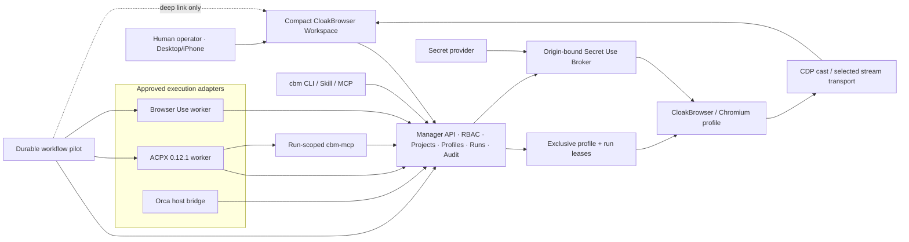

# Universal Agent Browser Control Plane Implementation Plan

> **For agentic workers:** REQUIRED SUB-SKILL: Use superpowers:subagent-driven-development (recommended) or superpowers:executing-plans to implement this plan task-by-task. Steps use checkbox (`- [ ]`) syntax for tracking.

**Goal:** Deliver a compact, mobile-first CloakBrowser control plane where any approved ACP/ACPX, Browser Use, Orca, Codex, Claude, Cursor, Grok Build, or OpenCode harness can operate one explicitly leased browser profile while humans observe runs, sessions, health, approvals, and typed evidence.

**Architecture:** CloakBrowser Manager remains the source of truth for users, groups, projects, profiles, accounts, tasks, leases, health, outputs, approvals, and audit. ACPX is a pinned agent-session adapter, Browser Use is a bounded browser worker, and a durable workflow engine is admitted only through a benchmark gate and remains an orchestration layer rather than a second control plane. Secrets remain provider-owned and are consumed through short-lived origin-bound capabilities; browser continuity stays in encrypted profile storage.

**Tech Stack:** Python/FastAPI, SQLite for the single-node Manager MVP, React 19/Vite/TypeScript, CloakBrowser/Chromium, CDP, noVNC baseline, Browser Use 0.13.x, ACP/ACPX 0.12.1, official MCP Python SDK, Docker Compose/VCVM/Tailscale, GitHub Actions, optional Hatchet/Temporal pilot backed by tool-owned Postgres.

---

## 1. Inputs and non-negotiable outcomes

This plan incorporates:

- the active goal in `/Users/mh/.codex/attachments/94a1d7cf-b586-4b08-9726-1ccd58244df3/goal-objective.md`;
- the 84-message Hatchet/Trigger/ACPX/identity transcript in `/Users/mh/Downloads/Hatchet-Beats-Trigger.dev-in-Workflow-Efficiency.json`;
- the complete 188,480-byte engineer discussion in `/Users/mh/.codex/attachments/20b476b6-e4ad-447e-bd1d-f91c972e64c8/pasted-text.txt`;
- the existing profile-health, workspace, ACPX, command-wall, identity/secret, Orca, extension, and VCVM reports in this fork;
- current live VCVM evidence: Orca recovered to `ready`, Hatchet `:8080`, Temporal `:8233`, ACPX Replay `:4173`, Manager `:18115`, Browser Use worker present, and the shared VCVM root volume below the safe deploy reserve.

The implementation must prevent the recurring failures described by the engineers:

1. a feature exists in code/tests but disappears from the real UI;
2. a new manager loses worktrees, mode, ownership, remaining work, or stop criteria;
3. an agent deploys when local hot reload was required;
4. concurrent worktrees overwrite or strand features and exhaust disk;
5. a visual verifier checks the wrong panel and declares a false result;
6. credentials, cookies, proxy secrets, or screenshots leak into model context/logs;
7. a run says `running` without a valid worker lease, first action, or correlated artifact;
8. mobile keyboard/fullscreen/viewpoint transitions hide core browser controls;
9. profile, proxy, locale, fingerprint, and outbound network claims disagree;
10. orchestration, governance, identity, secrets, and browser ownership overlap across tools.

## 2. Final ownership decisions

| Domain | System of record | Explicit boundary |
|---|---|---|
| Profiles, projects, sessions, tasks, runs, leases, typed outputs | CloakBrowser Manager | No workflow engine or ACPX cache becomes product state |
| Single-node MVP state | SQLite under Manager migrations | Move to Postgres only after multi-writer/HA gate CBM-021 |
| Skills, prompts, schemas, workflows, runbooks, acceptance manifests | Git | Git is not the runtime chat/event database |
| Operational chats, events, approvals, audit | Manager database and immutable artifacts | Export summaries/receipts to Git; do not commit every token stream |
| Agent sessions | ACPX local cache | Rebuildable; not backup or authority |
| Durable orchestration pilot | Selected engine's own Postgres | It stores workflow state only and calls Manager APIs with scoped identities |
| Human secrets | Optional Vaultwarden/Bitwarden provider | Never copied into profile rows |
| Agent/machine secrets | Provider selected by CBM-016 benchmark | Only secret references, leases, and receipts enter Manager |
| Browser cookies/storage | Encrypted profile continuity | Exclusive profile lease; never treated as plain configuration |
| Device-bound passkeys/TPM/Secure Enclave | Original authenticator/authority | Re-enrol or request human/session handoff; never clone |
| Users/groups/agent permissions | Existing Manager access-control layer for MVP | External IdP is deferred until CBM-018 proves SSO/multi-tenant need |
| Governance/tickets | GitHub issues + Manager projects for MVP | Paperclip is evaluated, not adopted as a second policy source |
| Browser live view | Current noVNC/CDP baseline | Selection of Xpra/KasmVNC/Selkies requires CBM-015 measurements |

## 3. Target system



## 4. Product UI contract

Desktop `>=1200px`:

```text
Projects / Chats / Sessions | Task conversation + typed outputs | Live browser + compact overlay
```

Tablet `900-1199px`:

```text
Collapsible context rail | Agent/output pane | Browser pane
```

Mobile `<900px` or coarse pointer:

```text
Browser-dominant split | fixed keyboard-safe composer | tools/sessions sheet
```

Fullscreen browser overlay contains only:

```text
Reset/Fit · View/Zoom · Viewport/Phone Fit · Sessions/Grid · Screenshot · Exit
```

The normal workspace must not embed full Hatchet, Temporal, ACPX, vault, or IdP dashboards. It shows the current run state and deep-links to specialist UIs.

## 5. Software decision gates

No transcript recommendation is a production decision until its ticket passes.

| Candidate class | Current disposition | Required proof |
|---|---|---|
| Hatchet | Pilot | Real API workflow, graph/replay screenshot, cancellation, retry, RAM/CPU/disk, license/OSS boundary |
| Temporal | Benchmark control | Same workflow and screenshot; compare ops cost and graph usefulness |
| Trigger.dev, Restate, Inngest, Prefect, Windmill, Kestra, Dagster, Airflow, Argo, Dapr | Research/benchmark set | Primary-source license/features plus one reproducible subset benchmark |
| ACPX | Adopt behind adapter, exact pin | Process cleanup, per-agent readiness, MCP origin enforcement, VCVM E2E |
| Paperclip | Defer | Must add governance value without duplicating Manager RBAC/projects/tickets |
| ZITADEL/Keycloak/authentik/Ory | Defer | Required only by verified multi-tenant SSO/device-flow gap |
| Infisical/OpenBao/Bitwarden SM/Conjur | Secret-provider bakeoff | Non-reveal injection, machine identity, groups, audit, backup, license boundary |
| Vaultwarden | Optional human vault | Must not become agent machine-identity source |
| Xpra/KasmVNC/Selkies | Streaming bakeoff | iPhone touch/keyboard, RTT, FPS, bandwidth, reconnect, CPU/RAM |
| Kubernetes/Helm | Deferred gate | Single-node SLO, backup/restore, capacity, and worker statelessness first |

## 6. Ticket execution waves

- **Wave 0A — reproducible proof foundation:** CBM-021.
- **Wave 0B — truth and safety:** CBM-001 through CBM-006; CBM-003 starts only after CBM-021 owns the CI workflow.
- **Wave 1 — real browser MVP:** CBM-007 through CBM-013.
- **Wave 2 — secrets, identity, and streaming:** CBM-014 through CBM-018.
- **Wave 3 — durable graphs and federation:** CBM-019 through CBM-023.
- **Wave 4 — atomic release and evidence:** CBM-022, then CBM-024.

Only tickets with disjoint file ownership run concurrently. Integration and full-suite gates remain leader-owned.

### GitHub ticket index

| Plan ticket | GitHub issue | Plan ticket | GitHub issue |
|---|---:|---|---:|
| CBM-001 | [#3](https://github.com/Martin-Hausleitner/CloakBrowser-Manager/issues/3) | CBM-013 | [#15](https://github.com/Martin-Hausleitner/CloakBrowser-Manager/issues/15) |
| CBM-002 | [#4](https://github.com/Martin-Hausleitner/CloakBrowser-Manager/issues/4) | CBM-014 | [#16](https://github.com/Martin-Hausleitner/CloakBrowser-Manager/issues/16) |
| CBM-003 | [#5](https://github.com/Martin-Hausleitner/CloakBrowser-Manager/issues/5) | CBM-015 | [#17](https://github.com/Martin-Hausleitner/CloakBrowser-Manager/issues/17) |
| CBM-004 | [#6](https://github.com/Martin-Hausleitner/CloakBrowser-Manager/issues/6) | CBM-016 | [#18](https://github.com/Martin-Hausleitner/CloakBrowser-Manager/issues/18) |
| CBM-005 | [#7](https://github.com/Martin-Hausleitner/CloakBrowser-Manager/issues/7) | CBM-017 | [#19](https://github.com/Martin-Hausleitner/CloakBrowser-Manager/issues/19) |
| CBM-006 | [#8](https://github.com/Martin-Hausleitner/CloakBrowser-Manager/issues/8) | CBM-018 | [#20](https://github.com/Martin-Hausleitner/CloakBrowser-Manager/issues/20) |
| CBM-007 | [#9](https://github.com/Martin-Hausleitner/CloakBrowser-Manager/issues/9) | CBM-019 | [#21](https://github.com/Martin-Hausleitner/CloakBrowser-Manager/issues/21) |
| CBM-008 | [#10](https://github.com/Martin-Hausleitner/CloakBrowser-Manager/issues/10) | CBM-020 | [#22](https://github.com/Martin-Hausleitner/CloakBrowser-Manager/issues/22) |
| CBM-009 | [#11](https://github.com/Martin-Hausleitner/CloakBrowser-Manager/issues/11) | CBM-021 | [#23](https://github.com/Martin-Hausleitner/CloakBrowser-Manager/issues/23) |
| CBM-010 | [#12](https://github.com/Martin-Hausleitner/CloakBrowser-Manager/issues/12) | CBM-022 | [#24](https://github.com/Martin-Hausleitner/CloakBrowser-Manager/issues/24) |
| CBM-011 | [#13](https://github.com/Martin-Hausleitner/CloakBrowser-Manager/issues/13) | CBM-023 | [#25](https://github.com/Martin-Hausleitner/CloakBrowser-Manager/issues/25) |
| CBM-012 | [#14](https://github.com/Martin-Hausleitner/CloakBrowser-Manager/issues/14) | CBM-024 | [#26](https://github.com/Martin-Hausleitner/CloakBrowser-Manager/issues/26) |

---

## CBM-001 — Canonical project-state and handoff receipt

**Priority:** P0
**Files:** Create `backend/project_state.py`, `backend/tests/test_project_state.py`, `docs/contracts/project-state-v1.json`; modify `scripts/cbm_agent_ctl.py`, `README.md`.

- [ ] Write tests proving a handoff records repository, branch, worktree, execution mode (`hot_reload|staging|vcvm_release`), owner, active ticket, completed receipts, unmerged files, next step, forbidden actions, and stop condition.
- [ ] Add a versioned `ProjectStateV1` Pydantic model that rejects missing mode, worktree, owner, or stop condition and rejects unknown fields.
- [ ] Add `cbm project state show|record` with JSON-only stdout and atomic file replacement under `.cbm/state/project-state-v1.json`.
- [ ] Add a redaction scan that rejects tokens, cookies, authorization headers, passwords, and raw proxy URLs.
- [ ] Run `pytest backend/tests/test_project_state.py -q` and expect all tests to pass.
- [ ] Commit as `feat(state): Add canonical manager handoff receipts`.

**Acceptance:** A fresh manager can identify the exact worktree, run mode, active ticket, next safe action, and forbidden deploy action without conversation history.

## CBM-002 — Worktree ownership, merge radar, and disk budget

**Priority:** P0
**Files:** Create `scripts/cbm_worktree_audit.py`, `scripts/test_cbm_worktree_audit.py`; modify `scripts/cbm_agent_ctl.py`, `docs/VCVM-DEPLOYMENT.md`.

- [ ] Test detection of clean, dirty, unpushed, unmerged, stale, overlapping, and oversized worktrees from synthetic Git fixtures.
- [ ] Emit read-only JSON receipts containing paths, branches, commits, changed modules, last activity, estimated size, and merge status.
- [ ] Never delete automatically; emit a deletion candidate only when clean, merged, and outside the configured retention window.
- [ ] Add VCVM capacity thresholds: warn below 16 GiB, block release below 8 GiB, block new worktrees below 12 GiB.
- [ ] Run `pytest scripts/test_cbm_worktree_audit.py -q`.
- [ ] Commit as `feat(git): Add worktree ownership and capacity audit`.

**Acceptance:** The report identifies every recent worktree with unmerged changes and cannot remove user data.

## CBM-003 — Feature-presence acceptance manifest

**Priority:** P0
**Depends on:** CBM-021.
**Files:** Create `acceptance/features.yaml`, `scripts/verify_feature_manifest.py`, `scripts/test_verify_feature_manifest.py`; modify the CBM-021-owned `.github/workflows/ci.yml` and `README.md`.

- [ ] Define each critical feature with route, role, required API, UI locator, mobile locator, screenshot state, and forbidden feature flag.
- [ ] Seed entries for projects, pinned profiles, proxy overview, Phone Fit, fullscreen viewport controls, sessions, typed outputs, ACPX selector, extension catalog, access dashboard, and screenshot action.
- [ ] Fail CI when the API exists but the UI locator is absent, a production feature is hidden behind an undeclared env flag, or the documented route returns 404 in the smoke stack.
- [ ] Store screenshots as CI artifacts rather than committing per-run images.
- [ ] Run `python scripts/verify_feature_manifest.py --static` and the smoke command documented in the script.
- [ ] Commit as `test(acceptance): Guard visible product capabilities`.

**Acceptance:** A previously shipped feature cannot disappear from navigation/fullscreen/mobile without a failing gate.

## CBM-004 — UI mental-map graph and panel identity

**Priority:** P0
**Files:** Create `frontend/src/lib/uiFlowRegistry.ts`, `frontend/src/lib/uiFlowRegistry.test.ts`, `docs/ui-flows/README.md`; modify `frontend/src/App.tsx`, `frontend/src/components/workspace/AgentBrowserWorkspace.tsx`, `frontend/src/components/mobile/MobileSplitScreen.tsx`, `frontend/src/components/ProfileViewer.tsx`, `frontend/src/components/ProxyOverview.tsx`, `frontend/src/components/AccessDashboard.tsx`, and their existing tests.

- [ ] Define stable `data-ui-state` identities for workspace, project rail, task chat, browser viewer, fullscreen viewer, sessions sheet, proxy health, extension catalog, and access drawer.
- [ ] Encode transitions as `{from, action, to, expectedVisible}` records and validate unique states/actions.
- [ ] Add a browser-verification helper that refuses a verdict unless the expected state identity is visible.
- [ ] Add tests for the exact navigation path to profile, task, fullscreen, sessions, proxy, and admin states.
- [ ] Run `npm test -- --run src/lib/uiFlowRegistry.test.ts` and the relevant workspace tests.
- [ ] Commit as `feat(ui): Add verifiable workspace state graph`.

**Acceptance:** A verifier cannot confuse two visually similar panels or validate the wrong route.

## CBM-005 — ACPX control-process lifecycle hardening

**Priority:** P0
**Files:** Modify `scripts/acpx_worker.py`, `scripts/acpx_runner.py`, `scripts/test_acpx_worker.py`, `scripts/test_acpx_runner.py`.

- [ ] Add a failing test that cancels `_run_control()` while a child process is alive and proves the child is terminated and reaped.
- [ ] Catch `asyncio.CancelledError`, terminate, wait with a bounded grace period, kill if needed, and re-raise cancellation.
- [ ] Classify missing/unexecutable ACPX as `adapter_unavailable`, exact pin drift as `version_mismatch`, and unknown protocol/control failure as `protocol_error`.
- [ ] Use stable per-agent preflight session names derived from `preflight:<agent>` so cleanup converges.
- [ ] Retry session close once; keep readiness false when cleanup cannot be proven and persist only the redacted reason.
- [ ] Run `pytest scripts/test_acpx_runner.py scripts/test_acpx_worker.py -q`.
- [ ] Commit as `fix(acpx): Reap cancelled control processes`.

**Acceptance:** No cancelled preflight leaves an ACPX subprocess or accumulating random doctor sessions.

## CBM-006 — ACPX readiness, migration, and API release gate

**Priority:** P0
**Files:** Modify `backend/database.py`, `backend/models.py`, `backend/worker_runtime.py`, `backend/main.py`, their ACPX tests, `frontend/src/lib/api.ts`, and `frontend/src/lib/api.test.ts`.

- [ ] Preserve the serialized SQLite profile-column migration and test concurrent initialization.
- [ ] Test invalid `ready/reason_code`, unknown agent, extra fields, invalid/internal tokens, unauthenticated public reads, inactive workers, newest active result, stale results, and unavailable defaults.
- [ ] Assert the composite preflight primary key, cascade foreign key, and lookup index.
- [ ] Narrow the frontend response harness to literal `"acpx"` and cover ready/failed/stale/unavailable states.
- [ ] Run the full backend in an isolated test environment plus all frontend tests/build.
- [ ] Commit as `feat(acpx): Publish truthful per-agent readiness`.

**Acceptance:** The UI enables an ACPX run only when both a fresh worker presence and the selected agent's fresh preflight are true.

## CBM-007 — Universal CLI/MCP resource contract

**Priority:** P0
**Depends on:** CBM-001 and CBM-006.
**Files:** Follow `docs/superpowers/plans/2026-07-26-universal-command-wall-cli.md`; modify `scripts/cbm_agent_ctl.py`, `scripts/cbm_mcp.py`, `scripts/cbm_browser_ctl.py`, `backend/main.py`, `backend/models.py`, `backend/session_views.py`, `scripts/test_cbm_agent_ctl.py`, `scripts/test_cbm_mcp.py`, `scripts/test_cbm_browser_ctl.py`, `backend/tests/test_agent_control_plane.py`, `backend/tests/test_origin_policy.py`; create `skills/cloakbrowser-control/SKILL.md`, `docs/contracts/control-plane-resource-v1.json`, and `docs/contracts/orca-web-resource-v1.json`.

- [ ] Unify profiles, projects, tasks, runs, outputs, sessions, views, proxies, extensions, accounts, secret references, approvals, and operations under one versioned envelope.
- [ ] Require idempotency keys for mutations and optimistic row versions for edits.
- [ ] Keep direct CDP, raw vault reveal, raw proxy credentials, and free-form Chromium flags outside the contract.
- [ ] Publish the same bounded operations through CLI, MCP, and cross-harness skill.
- [ ] Add explicit resources and operations for Orca-Web chat/session control, VCVM profiles, Box/runtime profiles, and local-Mac profile launch; each target reports capability/availability instead of silently falling back.
- [ ] Run `pytest scripts/test_cbm_agent_ctl.py scripts/test_cbm_mcp.py scripts/test_cbm_browser_ctl.py backend/tests/test_agent_control_plane.py backend/tests/test_origin_policy.py -q`.
- [ ] Commit as `feat(cli): Unify agent control-plane resources`.

**Acceptance:** Codex, Claude, Cursor, Grok Build, OpenCode, Browser Use, and Orca can use the same Manager resource semantics.

## CBM-008 — Real Browser Use VCVM happy-path and cancellation proof

**Priority:** P0
**Files:** Modify `scripts/browser_use_worker.py`, `scripts/deploy_vcvm.sh`, `docs/BROWSER_USE_WORKER.md`; create `scripts/vcvm_browser_use_acceptance.py` and tests.

- [ ] Fail if Manager commit, worker commit, migration set, Browser Use version, or worker presence differ from the acceptance manifest.
- [ ] Create one isolated demo profile and navigate only to an allowed test origin.
- [ ] Correlate run ID, worker lease, profile ID, CDP target, first action, ordered typed outputs, screenshot hash, viewport, current URL, and terminal status.
- [ ] Run a second harmless task, cancel it after claim, and prove no post-cancel outputs/actions and that the browser remains running.
- [ ] Reject health overrides as trusted success; label any override run `degraded`.
- [ ] Commit as `test(e2e): Prove Browser Use on VCVM`.

**Acceptance:** One run succeeds with correlated evidence and one run cancels without post-cancel activity.

## CBM-009 — Profile capability binding and launch-if-stopped

**Priority:** P0
**Depends on:** CBM-006 and CBM-007.
**Files:** Modify `backend/models.py`, `backend/database.py`, `backend/worker_runtime.py`, `backend/browser_manager.py`, `backend/main.py`, `scripts/browser_use_worker.py`, `scripts/acpx_worker.py`, `backend/tests/test_models.py`, `backend/tests/test_task_runs_api.py`, `backend/tests/test_run_claims.py`, `backend/tests/test_browser_manager.py`, `backend/tests/test_cdp_automation_leases_api.py`, `scripts/test_browser_use_worker.py`, and `scripts/test_acpx_worker.py`.

- [ ] Bind each run to explicit `{profile_id, harness, agent?, allowed_origins, viewport_revision}`.
- [ ] Reject incompatible profile/harness combinations unless the profile declares the universal capability.
- [ ] Make `launch_if_stopped` actually launch, wait for CDP readiness, and record launch evidence before capability issuance.
- [ ] Reject stale CDP targets and require the Manager-owned profile path/process identity.
- [ ] Test concurrent runs cannot lease the same profile.
- [ ] Run `pytest backend/tests/test_models.py backend/tests/test_task_runs_api.py backend/tests/test_run_claims.py backend/tests/test_browser_manager.py backend/tests/test_cdp_automation_leases_api.py scripts/test_browser_use_worker.py scripts/test_acpx_worker.py -q`.
- [ ] Commit as `fix(runs): Bind capabilities to the selected profile`.

**Acceptance:** The worker cannot act on a default, cached, or wrong profile.

## CBM-010 — One compact Browser Use/Orca adaptive workspace

**Priority:** P1
**Depends on:** CBM-004, CBM-006, and CBM-009.
**Files:** Modify `frontend/src/App.tsx`, `BrowserUseHome.tsx`, `AgentBrowserWorkspace.tsx`, `ProfileList.tsx`, `AgentOutputTimeline.tsx`, and tests.

- [ ] Merge Browser Use composer behavior into `AgentBrowserWorkspace` and remove the standalone route only after route compatibility tests pass.
- [ ] Use one three-pane desktop workspace and one mobile split implementation.
- [ ] Fold Profiles, Projects, Accounts, Proxies, Extensions, and Access into compact rail/admin sections rather than primary full-page cards.
- [ ] Keep typed status/action/observation/screenshot/extracted-data/link/metric/error/approval/summary outputs persistent after reload.
- [ ] Preserve deep links for existing URLs.
- [ ] Commit as `ref(ui): Converge on one browser-first workspace`.

**Acceptance:** The normal operator flow needs no duplicate home/profile/proxy pages and the live browser remains the dominant surface.

## CBM-011 — Fullscreen, Phone Fit, viewport, and keyboard parity

**Priority:** P1
**Files:** Modify shared browser controls, `MobileSplitScreen.tsx`, `AgentBrowserWorkspace.tsx`, `ProfileViewer.tsx`, styles, and tests.

- [ ] Share one view-state model for fit, zoom, viewport preset/custom values, Phone Fit, reset, fullscreen, screenshot, copy/paste, sessions, and exit.
- [ ] Apply viewport changes live to the Manager/CDP profile and display pending/applied revision.
- [ ] Preserve baseline device height while the iOS visual viewport shrinks for the keyboard.
- [ ] Keep 44px coarse-pointer targets and 16px mobile inputs while desktop buttons remain visually compact.
- [ ] Test iPhone portrait/landscape, keyboard open, desktop fullscreen, Escape/focus restoration, and no overlap/overflow.
- [ ] Commit as `fix(viewer): Unify fullscreen and mobile viewport controls`.

**Acceptance:** Every essential mobile view control is available in desktop fullscreen and vice versa.

## CBM-012 — Fixed sessions, projects, chats, folders, pins, and grid

**Priority:** P1
**Depends on:** CBM-009 and CBM-010.
**Files:** Modify `backend/models.py`, `backend/database.py`, `backend/main.py`, `backend/session_views.py`, `backend/tests/test_projects_api.py`, `backend/tests/test_task_sessions_api.py`, `backend/tests/test_session_views.py`, `frontend/src/components/workspace/AgentBrowserWorkspace.tsx`, `frontend/src/components/ProfileList.tsx`, `frontend/src/lib/profileOrganization.ts`, and their tests; create `frontend/src/components/workspace/SessionGrid.tsx` and `frontend/src/components/workspace/SessionGrid.test.tsx`.

- [ ] Persist fixed browser sessions separately from temporary project chats.
- [ ] Support archive/done without deleting evidence.
- [ ] Render projects, folders, pinned/color profiles, status, health, and harness as compact grouped rows.
- [ ] Build a sessions overlay that switches viewers without implicitly starting/stopping profiles.
- [ ] Start grid as rows/status; enable thumbnails only under the stream budget from CBM-015.
- [ ] Run `pytest backend/tests/test_projects_api.py backend/tests/test_task_sessions_api.py backend/tests/test_session_views.py -q` and `npm test -- --run src/components/workspace/AgentBrowserWorkspace.test.tsx src/components/ProfileList.test.tsx src/lib/profileOrganization.test.ts src/components/workspace/SessionGrid.test.tsx`.
- [ ] Commit as `feat(workspace): Add fixed sessions and compact grid`.

**Acceptance:** Operators can return to stable sessions and mark temporary chats done without losing run history.

## CBM-013 — Defensive proxy, network, and fingerprint consistency gate

**Priority:** P1
**Depends on:** CBM-009.
**Files:** Modify `backend/profile_health.py`, `backend/models.py`, `backend/main.py`, `backend/tests/test_profile_health.py`, `backend/tests/test_profile_health_api.py`, `backend/tests/test_proxy_inventory.py`, `backend/tests/test_proxy_inventory_api.py`, `frontend/src/components/ProxyOverview.tsx`, `frontend/src/components/LiveDevPanel.tsx`, `frontend/src/components/ProfileHealthSummary.tsx`, and their existing tests.

- [ ] Keep checks defensive: connectivity, masked IP, country/timezone/locale consistency, DNS/WebRTC leak warnings, browser-visible network identity, latency, and source freshness.
- [ ] Never implement bypass/evasion optimization or promise undetectability.
- [ ] Separate measured, inferred, unavailable, stale, overridden, and failed sources.
- [ ] Require explicit operator approval before changing a profile based on external check results.
- [ ] Show normal users one compact status strip; expose details only in the dev/admin overlay.
- [ ] Run `pytest backend/tests/test_profile_health.py backend/tests/test_profile_health_api.py backend/tests/test_proxy_inventory.py backend/tests/test_proxy_inventory_api.py -q` and `npm test -- --run src/components/ProfileHealthSummary.test.tsx`.
- [ ] Commit as `feat(health): Correlate profile and network posture`.

**Acceptance:** The UI explains inconsistencies without exposing raw proxy credentials or claiming a false authenticity percentage.

## CBM-014 — Trusted extension artifact pipeline

**Priority:** P1
**Files:** Extend `backend/extension_catalog.py`, extension APIs/CLI, catalog UI, tests, and docs.

- [ ] Add immutable version, SHA-256 digest, source/store URL, icon artifact, signer/provenance, review state, and profile usage.
- [ ] Reject symlink escapes, digest drift, unknown IDs, mutable unpacked paths, and raw `--load-extension` arguments.
- [ ] Keep installation/configuration CLI/agent-owned; UI remains read-only.
- [ ] Add rollback to the previous reviewed artifact version.
- [ ] Commit as `feat(extensions): Pin trusted extension artifacts`.

**Acceptance:** Every displayed extension is traceable to a reviewed immutable artifact.

## CBM-015 — Streaming bakeoff and live-performance SLO

**Priority:** P1
**Files:** Create `benchmarks/streaming/`, benchmark scripts/config, report, and optional transport adapters after selection.

- [ ] Compare current noVNC, CDP screencast, KasmVNC, Xpra, and Selkies on the same profile/viewport.
- [ ] Measure input-to-browser, browser-to-frame, end-to-end RTT, median/p95 FPS, bandwidth, CPU, RAM, reconnect, keyboard, clipboard, zoom, rotation, and iPhone touch behavior.
- [ ] Use one interactive stream at a time and low-rate previews for grid.
- [ ] Select a primary and fallback transport only after measured evidence.
- [ ] Store real desktop/iPhone screenshots and machine-readable results.
- [ ] Commit as `perf(streaming): Benchmark live browser transports`.

**Acceptance:** The selected transport meets documented desktop/mobile SLOs and has a rollback path to noVNC.

## CBM-016 — Secret-provider and non-reveal broker bakeoff

**Priority:** P1
**Depends on:** CBM-007.
**Files:** Create `backend/secret_broker/__init__.py`, `backend/secret_broker/protocol.py`, `backend/secret_broker/local_provider.py`, `backend/secret_broker/service.py`, `backend/tests/test_secret_broker.py`, `docs/reports/SECRET-PROVIDER-BAKEOFF.md`; modify `backend/models.py`, `backend/database.py`, `backend/access_control.py`, `backend/main.py`, `backend/tests/test_access_control.py`, and `backend/tests/test_database.py`.

- [ ] Compare Infisical, OpenBao, Bitwarden Secrets Manager, Conjur, and an age/sops local provider using primary-source license/feature evidence.
- [ ] Define provider-neutral secret handles; never store provider ciphertext or plaintext in profile rows.
- [ ] Implement one-use, origin-bound, profile-bound, run-bound leases with TTL, audit receipt, and screenshot suppression during injection.
- [ ] Keep read/reveal separate from use; default agents receive `use`, not `reveal`.
- [ ] Prove backup/restore and provider-unavailable fail-closed behavior.
- [ ] Run `pytest backend/tests/test_secret_broker.py backend/tests/test_access_control.py backend/tests/test_database.py -q` plus a repository secret scan over generated evidence.
- [ ] Commit as `feat(secrets): Add origin-bound secret-use broker`.

**Acceptance:** A login succeeds while the agent output, prompts, logs, screenshots, and Manager database contain no raw secret.

## CBM-017 — Users, groups, agents, accounts, and approvals

**Priority:** P1
**Depends on:** CBM-016.
**Files:** Modify `backend/models.py`, `backend/database.py`, `backend/access_control.py`, `backend/main.py`, `backend/tests/test_access_control.py`, `backend/tests/test_auth.py`, `scripts/cbm_agent_ctl.py`, `scripts/cbm_mcp.py`, `scripts/test_cbm_agent_ctl.py`, `scripts/test_cbm_mcp.py`, `frontend/src/components/AccessDashboard.tsx`, `frontend/src/components/AccessDashboard.test.tsx`, `frontend/src/lib/accessPermissions.ts`, and `frontend/src/lib/accessPermissions.test.ts`.

- [ ] Model human users, groups, machine identities, agents, profiles, accounts, secret references, and capabilities separately.
- [ ] Add assignment matrix for view/operate/automate/use-secret/reveal-secret/admin.
- [ ] Require approval for reveal, payments, account creation, refunds, production deploy, and device-bound authenticator handoff.
- [ ] Keep admin UI in a drawer and scoped users limited to granted resources.
- [ ] Run `pytest backend/tests/test_access_control.py backend/tests/test_auth.py scripts/test_cbm_agent_ctl.py scripts/test_cbm_mcp.py -q` and `npm test -- --run src/components/AccessDashboard.test.tsx src/lib/accessPermissions.test.ts`.
- [ ] Commit as `feat(access): Add agent and secret assignments`.

**Acceptance:** An agent can use only explicitly assigned profiles/secrets/origins and cannot self-escalate.

## CBM-018 — OIDC, device-code, TOTP, and passkey capability matrix

**Priority:** P1
**Depends on:** CBM-016 and CBM-017.
**Files:** Create `backend/auth_capabilities.py`, `backend/tests/test_auth_capabilities.py`, `frontend/src/components/workspace/AuthHandoff.tsx`, `frontend/src/components/workspace/AuthHandoff.test.tsx`, `docs/reports/AUTH-CAPABILITY-MATRIX.md`; modify `backend/models.py`, `backend/main.py`, `backend/tests/test_auth.py`, `frontend/src/lib/api.ts`, and `frontend/src/lib/api.test.ts`.

- [ ] Test password, arbitrary free-text credentials, OIDC redirect, device-code, TOTP, synced/software passkey, and device-bound passkey scenarios.
- [ ] Use WebAuthn virtual authenticators only for authorized test credentials and compatible software/synced scenarios.
- [ ] Detect hardware/device-bound flows and route to a human/session handoff without copying keys.
- [ ] Record current URL/origin and approval receipt without storing credential values.
- [ ] Compare existing Manager RBAC with ZITADEL, Keycloak, authentik, Ory, Hanko, and SPIFFE/SPIRE; adopt an IdP only if a concrete gap remains.
- [ ] Run `pytest backend/tests/test_auth_capabilities.py backend/tests/test_auth.py -q` and `npm test -- --run src/components/workspace/AuthHandoff.test.tsx src/lib/api.test.ts`.
- [ ] Commit as `feat(auth): Add capability-aware login handoffs`.

**Acceptance:** Unsupported passkeys are reported honestly; device-code opens on the correct operator device; no hardware key is cloned.

## CBM-019 — Workflow-engine market gate with real graph evidence

**Priority:** P1
**Files:** Create `benchmarks/orchestration/`, comparison report, scripts, and screenshot assets.

- [ ] Verify repos, licenses, OSS/open-core boundaries, SDKs, replay/graph features, and self-host requirements for Hatchet, Temporal, Trigger.dev, Restate, Inngest, Prefect, Windmill, Kestra, Dagster, Airflow, Argo, and Dapr.
- [ ] Run the same fan-out/fan-in ACPX/browser acceptance workflow on Hatchet and Temporal; add a third candidate only if it beats either on a scored gate.
- [ ] Capture real dark/light run, graph, replay, retry, failure, and cancellation screenshots with run IDs.
- [ ] Measure idle/load RAM, CPU, disk, startup, latency, retry correctness, worker recovery, and operator usefulness.
- [ ] Score local-first/federation/DAO compatibility without calling a centralized database decentralized.
- [ ] Commit as `docs(benchmark): Compare durable agent workflow engines`.

**Acceptance:** The winner is selected from reproducible evidence rather than the transcript's unverified RAM/timing claims.

## CBM-020 — ACPX + Browser Use durable workflow pilot

**Priority:** P1
**Depends on:** CBM-005, CBM-006, CBM-007, CBM-008, CBM-009, CBM-019, and CBM-021.
**Files:** Create `backend/workflows/__init__.py`, `backend/workflows/protocol.py`, `backend/workflows/pilot.py`, `backend/tests/test_workflow_pilot.py`, `benchmarks/orchestration/workflow_fixture.json`, `deploy/workflows/docker-compose.yml`; modify `backend/main.py`, `backend/worker_runtime.py`, `backend/tests/test_run_claims.py`, `frontend/src/components/workspace/AgentOutputTimeline.tsx`, and `frontend/src/components/workspace/AgentOutputTimeline.test.tsx`.

- [ ] Implement `profile_health -> acquire_lease -> agent_task -> browser_task -> evidence_gate -> release_lease`.
- [ ] Carry Manager run/profile/lease IDs through every workflow step and typed output.
- [ ] Show high-level DAG in the selected workflow UI and detailed agent replay in ACPX; CloakBrowser shows current state and deep links only.
- [ ] Prove retry does not duplicate browser actions or secret leases.
- [ ] Prove cancellation fences all downstream steps.
- [ ] Run `pytest backend/tests/test_workflow_pilot.py backend/tests/test_run_claims.py -q`, the selected engine integration test, and `npm test -- --run src/components/workspace/AgentOutputTimeline.test.tsx`.
- [ ] Commit as `feat(workflows): Orchestrate ACPX and Browser Use`.

**Acceptance:** A real multi-harness run is visible in both the durable DAG and ACPX replay with correlated IDs.

## CBM-021 — Reproducible CI and migration matrix

**Priority:** P0
**Files:** Modify `pyproject.toml` and test scripts; create `backend/requirements-dev.txt`, `.github/workflows/ci.yml`, Docker smoke configuration, and CI documentation.

- [ ] Declare test-only pytest/asyncio/trio dependencies so `asyncio_mode` is reproducible.
- [ ] Run backend unit/API/migration races, worker contracts, frontend tests/build, lint/typecheck, secret scan, feature manifest, and Docker smoke.
- [ ] Test fresh DB, each supported legacy migration fixture, concurrent startup, and rollback backup.
- [ ] Upload screenshots, traces, benchmark JSON, and logs as artifacts with secret scans.
- [ ] Block releases on unknown env flags, missing worker versions, schema skew, low disk, or stale visual evidence.
- [ ] Commit as `ci: Add reproducible release evidence matrix`.

**Acceptance:** The same command produces the same full green suite on developer Mac, CI, and the release checkout.

## CBM-022 — VCVM capacity, atomic release, and rollback

**Priority:** P0
**Depends on:** CBM-002 and CBM-021.
**Files:** Modify `scripts/deploy_vcvm.sh`, `scripts/test_vcvm_deployment.py`, `docs/VCVM-DEPLOYMENT.md`; create `scripts/cbm_release_manifest.py`, `scripts/test_cbm_release_manifest.py`, `scripts/rollback_vcvm_release.sh`, and `docs/contracts/vcvm-release-v1.json`.

- [ ] Inventory only CloakBrowser-owned images/cache/data; never prune shared-host resources automatically.
- [ ] Require 8 GiB free for release and 12 GiB for new worktrees; record measured capacity in the release receipt.
- [ ] Build from a clean fork commit, tag immutable image, back up SQLite/profile metadata, run migrations, health/smoke/E2E, then switch traffic.
- [ ] Roll back image and database backup on failed health or acceptance.
- [ ] Verify Orca, Browser Use, ACPX, proxychecker, stream, and Tailscale private access after deploy.
- [ ] Run `pytest scripts/test_vcvm_deployment.py scripts/test_cbm_release_manifest.py -q` and a dry-run release against an isolated checkout before any live switch.
- [ ] Commit as `feat(deploy): Add atomic VCVM releases`.

**Acceptance:** A failed build or migration cannot leave source, image, schema, and workers on different versions.

## CBM-023 — Federation/DAO compatibility without secret replication

**Priority:** P2
**Depends on:** CBM-020 and CBM-022 production SLO.
**Files:** Create `docs/adr/0023-federated-run-receipts.md`, `backend/federation/__init__.py`, `backend/federation/envelope.py`, `backend/federation/verify.py`, `backend/federation/memory_transport.py`, `backend/tests/test_federated_receipts.py`, and `docs/contracts/federated-run-receipt-v1.json`.

- [ ] Define node-local authority: profiles, sessions, cookies, and secrets never replicate by default.
- [ ] Synchronize only signed workflow receipts, capability attestations, approvals, artifact hashes, and public metadata.
- [ ] Compare Matrix, NATS JetStream, Git, and content-addressed storage for transport; distinguish federation from consensus and DAO voting.
- [ ] Add replay protection, node identity, clock/sequence rules, revocation, and partition behavior.
- [ ] Keep DAO governance outside request-time authorization.
- [ ] Run `pytest backend/tests/test_federated_receipts.py -q` with duplicate, replay, expired, revoked, partitioned, and wrong-node fixtures.
- [ ] Commit as `docs(architecture): Define federated agent receipts`.

**Acceptance:** Two nodes can verify shared run evidence without sharing a browser session or secret.

## CBM-024 — Final README, screenshots, tickets, and operator demo

**Priority:** P0 release gate
**Depends on:** Every P0/P1 ticket selected for the release.
**Files:** Modify `README.md`, `CHANGELOG.md`; create `docs/reports/UNIVERSAL-CONTROL-PLANE-ACCEPTANCE.md`, `docs/assets/release-gallery/README.md`, `docs/diagrams/control-plane-system.mmd`, and the labeled PNG/WebP evidence assets under `docs/assets/release-gallery/`.

- [ ] Embed real desktop/iPhone screenshots of the CloakBrowser workspace, fullscreen controls, sessions/grid, typed outputs, health overlay, extension catalog, access drawer, Hatchet/Temporal benchmark, ACPX replay, and cancellation evidence.
- [ ] Label every screenshot with commit, URL class, viewport, timestamp, run/profile IDs, and whether it is live, mocked, or unavailable.
- [ ] Document completed, partial, blocked, deferred, and rejected features separately.
- [ ] Link every GitHub ticket and its acceptance evidence.
- [ ] Run all release gates and open the final report in the user's browser.
- [ ] Run the CBM-021 release command, `python scripts/verify_feature_manifest.py --live`, the VCVM acceptance scripts, and a secret scan over every report and image sidecar.
- [ ] Commit as `docs: Publish universal control-plane acceptance report`.

**Acceptance:** A new operator can understand what works, test it from desktop/iPhone, and see honest evidence for every claim.

---

## 7. Parallel implementation lanes

The first safe parallel wave is:

| Lane | Ticket | Exclusive file ownership |
|---|---|---|
| A | CBM-005 | `scripts/acpx_worker.py`, `scripts/acpx_runner.py`, their tests |
| B | CBM-021 | CI workflow, dev dependencies, Docker smoke, CI documentation only |
| C | CBM-004 | `uiFlowRegistry`, `App`, workspace/mobile/viewer/proxy/access components named in CBM-004 and their tests |
| D | CBM-019 | benchmark research/report/screenshots only |
| E | CBM-001 | project-state model/CLI/tests only |

After lane B lands, CBM-003 owns `acceptance/`, its verifier/tests, and only the feature-manifest step inside the existing CI workflow. CBM-002 starts after CBM-001 because both edit `scripts/cbm_agent_ctl.py`. The leader integrates CBM-006 because `backend/database.py`, `backend/main.py`, `backend/models.py`, and `backend/worker_runtime.py` already contain shared ACPX work. CBM-010/CBM-011 remain sequential because they share workspace/viewer state. CBM-022 remains blocked on explicit shared-host storage authorization or added capacity.

## 8. Safety and compliance exclusions

The implementation does not include deliberate account bans, refund abuse, credential theft, payment automation without approval, jailbreak/refusal bypass, unauthorized anti-bot evasion, bulk account farming, or cloning hardware-bound authenticators. Proxy/fingerprint work is limited to defensive consistency, privacy, test isolation, and authorized account continuity.

## 9. Completion proof

The program is complete only when:

- every P0/P1 ticket has linked code, tests, real runtime evidence, and rollback;
- backend, frontend, workers, migrations, CI, VCVM, desktop, iPhone, Browser Use, ACPX, Orca, streaming, secrets, and access gates are green;
- the workflow-engine and secret-provider choices are backed by reproducible comparisons and current licenses;
- no health override, mock, historical screenshot, or unit test is used as proof of a live claim;
- the Fork branch and live VCVM release manifest reference the same commit;
- the CloakHQ upstream remains untouched.

## 10. Self-review result

- **Spec coverage:** all explicit requirements from the active goal and both transcripts map to CBM-001 through CBM-024.
- **Contradictions resolved:** compact UI vs many tools uses deep links; local-first vs durable engine keeps secrets/profile state local; ACPX vs Hatchet uses separate session/orchestration roles; SQLite vs Postgres uses a measured HA gate; passkey automation distinguishes software/synced from device-bound.
- **Deliberate deferrals:** Paperclip, external IdP, Kubernetes, DAO transport, and production workflow-engine adoption require their named gates.
- **No ownership placeholders:** every implementation ticket names its owned files, test command, commit boundary, and acceptance criteria; research-only tickets name their evidence directory and reproducible gate.
