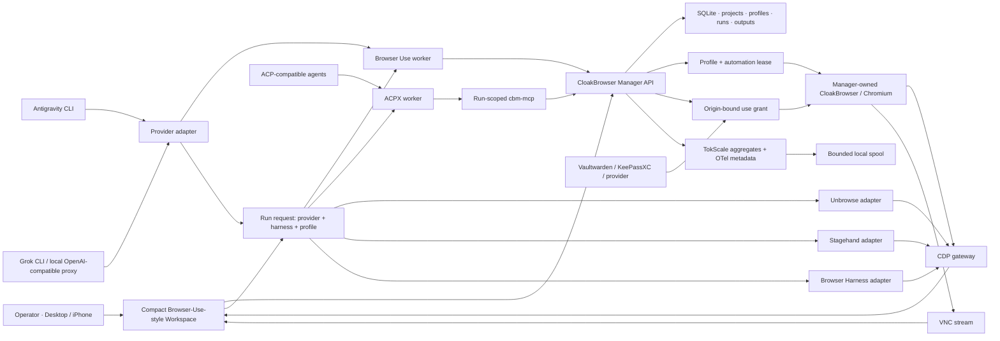

# Stable Browser-Use + Antigravity Control Plane Implementation Plan

> **For agentic workers:** REQUIRED SUB-SKILL: Use superpowers:subagent-driven-development (recommended) or superpowers:executing-plans to implement this plan task-by-task. Steps use checkbox (`- [ ]`) syntax for tracking.

**Goal:** Build a compact, Browser-Use-inspired CloakBrowser workspace in which an operator selects one Manager-owned browser profile, one browser harness, and one AI provider; Antigravity, Grok, Cursor, Codex, or another approved CLI can then control that same leased browser while the operator watches, pauses, takes over, changes the viewport, and receives typed evidence.

**Architecture:** CloakBrowser Manager remains the only product authority for profiles, proxies, sessions, projects, tasks, leases, outputs, approvals, and audit. Browser Use, Browser Harness, Stagehand, Unbrowse, ACPX, Antigravity, Grok, Cursor, Codex, and Orca are replaceable adapters behind versioned Manager contracts. Secrets remain inside a vault or browser profile and are consumed through origin-bound use grants; no model-facing API returns raw passwords, cookies, passkeys, OTPs, proxy credentials, or bearer tokens.

**Tech Stack:** Python 3.12/FastAPI, SQLite for the single-node MVP, React 19/Vite/TypeScript/Tailwind, Chromium/CloakBrowser, CDP, noVNC, Browser Use, Browser Harness, Stagehand, Unbrowse, ACP/ACPX, MCP Python SDK, Vaultwarden/KeePassXC/Bitwarden adapters, OpenTelemetry, TokScale, Docker Compose, systemd, Tailscale, GitHub Actions, Orca CLI, and optional NotebookLM research review.

---

## 0. Execution Audit Addendum — 2026-07-30 (authoritative vs §2 percentages)

> **Read this before treating §2 feature-matrix percentages or “Ready” labels as current truth.**

| Field | Value |
| --- | --- |
| **Final IDR / Tribunal report** | [`docs/reports/MASTERPLAN-EXECUTION-IDR-TRIBUNAL-2026-07-30.md`](../../reports/MASTERPLAN-EXECUTION-IDR-TRIBUNAL-2026-07-30.md) |
| **Audit HEAD (worktree)** | `c0d4f10139dab9d0eb4c76d73268375df88c98b3` on `Martin-Hausleitner/cbm-acpx-agent-family` |
| **This plan commit** | `1e1617e447f28887b6d2560614a5abb2e0ba52b8` |
| **Plan “verified head” (§2)** | `827c0f087a8d2e1228f29f0c4225bb539d7795af` — historical baseline when the plan was written; **not** proof that later HEADs or the public VCVM route match it |
| **Evidence-weighted plan-execution index** | **49.6%** unweighted (26 features × 0–10; sum **129/260**); value-weighted **≈45.9%** with \(\sum v=154\), \(\sum(v\cdot s)=707\) — see IDR §3 |
| **Production decision** | **HARD NO-GO** for full production of this plan’s goal until the IDR release tree is green |
| **Task checkboxes (Tasks 1–11 + DoD)** | **Exactly 66 open**, **0 checked** (line-start list markers only). Tracking tools only — **do not** mark them done from this addendum; reopen evidence must be fresh and commit-bound |
| **Requirements matrix (audit body SoT)** | **80** unique rows from `/tmp/cbm-plan-audit/01` **body** (header counts are contradictory and ignored): 69 must / 9 should / 2 research-only; 50 partial / 18 missing / 5 contradicted / 5 unknown / 2 research |
| **Worktree cleanliness** | Audit base HEAD may carry **dirty intentional pending deliverables** (e.g. uncommitted agent-family); that is **not** a clean release worktree and does **not** satisfy Task 11 |

**What §2 percentages are:** snapshot estimates at plan finalization (`827c0f0` era), useful for prioritization history.

**What §2 percentages are not:** a live scorecard for `c0d4f10`, remote CI, or `https://vcvm.tail6a40cd.ts.net/`. Deployed runtime was audited as an **older** release (manifest/source SHAs diverge from this plan’s HEADs); live browser processes were observed with **`--disable-extensions`**.

**Highest-leverage remaining work (Pareto):** Task 3 (provider ≠ harness) → Task 4 (Antigravity → Browser Use adapter) → Task 10 (same-profile E2E proof), then security E2E (Tasks 6–7) and ship (Task 1 residual + Task 11). Full ticket list: IDR §12 (TKT-01…TKT-20).

**Orthogonal side-lane (not Tasks 1–11):** uncommitted ACPX agent-family quality gate / Soniox adapter / skill under this worktree — see IDR §9. Treat as **pending intentional deliverables**, not masterplan DoD completion and not release readiness.

**NotebookLM:** optional secondary synthesis only (notebook `270598c3-713d-4188-81b8-0f0567c71572`, proof `/tmp/cbm-plan-audit/15-notebooklm-notebook-proof.json`, 98 sources at proof time). Reject catalog or risk claims that lack repo/runtime audit evidence — IDR §4.

---

## 1. Executive decision

The fastest stable path is not to make every tool a peer. The product needs one control plane and several adapters:

1. **CloakBrowser Manager owns state and policy.**
2. **A run owns exactly one profile lease.**
3. **The user chooses provider and browser harness independently.**
4. **Browser Use is the default browser harness.**
5. **Antigravity is a CLI/provider adapter, not a browser harness and not an ACP implementation unless an official ACP adapter exists.**
6. **ACPX is the persistent session transport for ACP-compatible coding agents.**
7. **The browser never changes when the operator switches CLI, ACP, ACPX, CDP, or VNC views.**
8. **Browser-Use Cloud is visual/interaction inspiration only; the VCVM runtime remains local-first and can operate without its SaaS API.**

The target is functional parity with the strongest Browser-Use interaction patterns, not a copy of proprietary source, text, logos, or assets.

## 2. Current verified state — 2026-07-30

Canonical implementation branch:

- Repository: [Martin-Hausleitner/CloakBrowser-Manager](https://github.com/Martin-Hausleitner/CloakBrowser-Manager)
- Branch: `feature/secure-action-recorder-vault`
- Verified head when this plan was finalized: `827c0f087a8d2e1228f29f0c4225bb539d7795af`
- VCVM worktree: `/home/coder/.config/superpowers/worktrees/CloakBrowser-Manager-browser-use/secure-action-recorder-vault`
- Public VCVM route: `https://vcvm.tail6a40cd.ts.net/`

### 2.1 Honest feature matrix

| Area | Status | Done | Stability | E2E | Evidence | Blocking next step |
| --- | --- | ---: | ---: | --- | --- | --- |
| Manager API, profiles, proxies, sessions | Done | 90% | 82% | Partial | `backend/main.py`, `backend/browser_manager.py`, `backend/session_views.py` | Run complete release suite on the integrated head |
| Browser Use worker | Ready | 82% | 72% | Partial | `scripts/browser_use_worker.py`; live VCVM worker exists | Prove CLI → run → worker → same-profile action → typed output |
| ACPX worker and runtime pin | Ready | 84% | 74% | Partial | `scripts/acpx_worker.py`, `scripts/acpx_runner.py`, `deploy/acpx-runtime/package-lock.json` | Add a real installed-runtime CI preflight and VCVM browser action proof |
| Antigravity CLI detection | Ready | 55% | 45% | Blocked | `scripts/provider_readiness.py`, `scripts/orca_agent_cli.sh` | Implement a Browser Use-compatible Antigravity model adapter or honest external proxy contract |
| Grok OpenAI-compatible route | Ready | 72% | 66% | Partial | `scripts/openai_compatible_toolloop.py`, `scripts/grok_cli_chat_model.py` | Prove bounded tool loop with one real Manager profile |
| Browser Harness router | Ready | 68% | 60% | Partial | `scripts/browser_harness_adapter.py`, `scripts/browser_tool_router.py` | Add real installed-binary and same-CDP-target E2E |
| Stagehand router | Ready | 68% | 62% | Partial | `scripts/stagehand_router_adapter.py`, `scripts/stagehand_runtime/` | Run local Stagehand on the Manager CDP gateway |
| Unbrowse router | Ready | 70% | 62% | Partial | `scripts/unbrowse_router_adapter.py`, `scripts/unbrowse_managed_helper.py` | Run installed Unbrowse against synthetic origin and same profile |
| Compact Settings-first UI | Ready | 78% | 65% | Partial | `frontend/src/components/HarnessSettingsWorkspace.tsx`, `WorkspaceRuntimeConfig.tsx` | Remove remaining duplicate controls and browser-verify desktop/mobile |
| Live CDP/VNC browser pane | Ready | 80% | 70% | Partial | `ProfileViewer.tsx`, `SessionStreamButtons.tsx`, `backend/vnc_manager.py` | Measure reconnect, FPS, RTT, keyboard, and mode switching |
| Secure MV3 recorder | Ready | 78% | 58% | Partial | `extensions/cloak-profile-sync/`, `scripts/cbm_extension_bridge.py` | Fix command-poll origin/session behavior and run real Chromium MV3 E2E |
| Profile sharing and loader | Done | 82% | 74% | Passed for synthetic scope | `backend/profile_share.py`, `scripts/e2e/profile_share_loader.py`; 21 focused tests passed | Add managed-profile runtime proof without real cookies |
| Vault connector discovery | Done | 75% | 76% | Passed for metadata scope | `backend/vault_connectors/`; 18 focused tests passed | Add explicit use-grant interface; never add reveal API |
| TokScale/OpenTelemetry tracing | Planned | 55% | 35% | Blocked | Worktree commit `ad331d1`; 35 tests passed before review | Fix spool permissions/retention, status redaction, and OTLP SSRF before merge |
| ACPX CI/release gates | Ready | 74% | 58% | Partial | `.github/workflows/ci.yml`; commit `827c0f0` | Fix the stale release-remote assertion and add a real CLI → ACPX → browser proof |
| Production release of this branch | Blocked | 35% | 30% | Blocked | Public route still represents an older deployed runtime | Complete gates, deploy transaction, rollback proof, browser screenshots |

### 2.2 Fresh test evidence incorporated into this plan

- Integrated profile-share/vault/extension slice: **52 passed**, one deprecation warning.
- Canonical ACPX worker/runner/runtime slice: **142 passed**, one warning.
- Backend recorder/security slice: **187 passed**, one warning.
- Browser Use smoke command originally failed without `PYTHONPATH=.`; commit `827c0f0` adds the repository path and the affected CI/security slice now reports **143 passed**.
- Frontend build: passes; current dependency audit reports **five findings: one low and four high**.
- Real disposable Chromium MV3 test worktree: helper/live suite **7 passed**, but the bridge command-poll blocker still prevents a release claim.
- Active VCVM profile can be inspected through Manager CDP, but the current running browser was launched with `--disable-extensions` and `extension_ids=[]`.
- Existing legacy Antigravity E2E contains stale Claude expectations and is not release proof.

## 3. System boundaries

### 3.1 System of record

| Domain | Authority | What adapters may store |
| --- | --- | --- |
| Users, groups, roles | Manager access-control layer | Short-lived session identity only |
| Projects, chats, tasks, runs | Manager database | Rebuildable adapter session IDs |
| Browser profiles and proxies | Manager + encrypted profile volume | Leased profile ID and redacted health receipt |
| Browser control | Manager-owned CDP gateway and lease | Bounded actions and typed outputs |
| Human credentials | Vaultwarden/Bitwarden or KeePassXC | Opaque item reference and use receipt |
| Machine credentials | Optional Infisical/OpenBao-compatible provider | Machine identity reference and TTL grant |
| Cookies/storage | Encrypted browser profile | Never exported to model context or logs |
| Passkeys | Original authenticator or password-manager extension | User-visible handoff; no private-key export |
| Agent sessions | ACPX or CLI process | Rebuildable session/cache only |
| Traces | Local bounded OTel spool | Metadata-only spans, no content capture |
| Research evidence | Git reports and optional NotebookLM | Public sources and redacted summaries only |

### 3.2 Target architecture



### 3.3 One canonical run contract

```ts
type RunRequestV1 = {
  profile_id: string;
  harness: "browser-use" | "acpx" | "unbrowse" | "stagehand" | "browser-harness";
  provider: {
    id: "antigravity" | "grok" | "cursor" | "codex" | "claude" | "opencode";
    transport: "cli" | "acp" | "openai-compatible";
    model_alias?: string;
  };
  browser_tools: Array<{
    id: "unbrowse" | "stagehand" | "browser-harness";
    enabled: boolean;
  }>;
  routing_policy: {
    mode: "ordered-fallback";
    max_tool_attempts: 1 | 2 | 3;
    allow_second_browser: false;
  };
  allowed_origins: string[];
  viewport_revision: number;
};
```

The Manager rejects a run unless provider readiness, harness presence, selected profile, origin policy, and lease availability all agree.

## 4. Browser-Use-inspired product UX

### 4.1 Desktop layout

```text
┌────────────────────┬──────────────────────────────┬──────────────────────────────┐
│ Projects / Chats   │ Conversation / Outputs       │ Live browser                  │
│ Profiles / Runs    │ compact timeline             │ CDP or VNC, same mounted view │
│ collapsible rail   │ fixed composer               │ compact overlay controls      │
└────────────────────┴──────────────────────────────┴──────────────────────────────┘
```

Rules:

- The live browser is the largest surface.
- Provider/model/harness matrices live only in **Settings → AI & Harnesses**.
- The chat header shows only active provider, harness, model, profile, run state, Pause/Stop, and Settings shortcut.
- Technical output is grouped by `action`, `observation`, `screenshot`, `metric`, `approval`, `error`, and `summary`; repetitive token/status events collapse automatically.
- Proxy, profile, account, and session tables fill available width and reveal row details inline or in a side sheet.
- CDP/VNC switches replace the renderer inside the same pane; no new browser tab opens.
- Fullscreen retains Fit, Zoom, Viewport, Phone Fit, Sessions/Grid, Screenshot, Copy/Paste, and Exit.
- Keyboard shortcuts: `⌘/Ctrl+B` toggles chat, `⌘/Ctrl+Shift+F` toggles browser full view, `Esc` exits overlays, `⌘/Ctrl+K` opens command search.

### 4.2 Mobile layout

```text
┌─────────────────────────────────────┐
│ Live browser · 55–70%               │
│ touch, zoom, Phone Fit, fullscreen  │
├─────────────────────────────────────┤
│ compact output / chat               │
│ keyboard-safe composer              │
└─────────────────────────────────────┘
```

Rules:

- Use `100dvh` and `visualViewport`; do not use fragile `100vh` keyboard math.
- Keep the browser mounted while chat/settings sheets open.
- Use one compact action strip; secondary controls live in sheets.
- Inputs remain at least 16px to avoid iOS auto-zoom; coarse-pointer targets remain at least 44px while desktop controls stay visually compact.
- Viewport changes show `pending → applied` revision and never imply success before the Manager confirms it.

### 4.3 UI technology decision

- Keep React/Vite/Tailwind and current components.
- Keep [AG Grid](https://github.com/ag-grid/ag-grid) for dense proxy/profile/session tables already present in the project.
- Keep [noVNC](https://github.com/novnc/noVNC) as baseline stream; evaluate alternatives only with measured evidence.
- Do not add a second design system in the MVP.
- Replace Lucide only if a dedicated visual refactor is approved; dependency churn does not improve runtime stability.

## 5. Technology catalog and decision

| Technology | Official source | Role | License / boundary | Decision |
| --- | --- | --- | --- | --- |
| CloakBrowser Manager fork | [Martin-Hausleitner/CloakBrowser-Manager](https://github.com/Martin-Hausleitner/CloakBrowser-Manager) | Product control plane | Project license | Adopt |
| Upstream Manager | [CloakHQ/CloakBrowser-Manager](https://github.com/CloakHQ/CloakBrowser-Manager) | Upstream reference | Never push user work upstream | Track only |
| Browser Use | [browser-use/browser-use](https://github.com/browser-use/browser-use) | Default browser agent/worker | MIT; cloud optional | Adopt locally |
| Browser Use Chat UI example | [browser-use/chat-ui-example](https://github.com/browser-use/chat-ui-example) | Official Home → Session, chat + live-browser UX reference | Source/reference only; do not copy branding/assets | Adopt interaction patterns |
| Browser Harness | [browser-use/browser-harness](https://github.com/browser-use/browser-harness) | Self-healing direct-CDP tool | MIT | Optional ordered tool |
| Browser Harness JS | [browser-use/browser-harness-js](https://github.com/browser-use/browser-harness-js) | JS alternative/reference | Verify exact license before bundling | Defer |
| Stagehand | [browserbase/stagehand](https://github.com/browserbase/stagehand) | Act/Observe/Extract browser adapter | MIT; Browserbase SaaS optional | Adopt local adapter |
| Unbrowse | [unbrowse-ai/unbrowse](https://github.com/unbrowse-ai/unbrowse) | API-first cached route execution | Verify installed package/repo license before redistribution | Optional adapter |
| ACPX | [openclaw/acpx](https://github.com/openclaw/acpx) | Persistent ACP client/session bridge | Pin `0.12.1` in this release | Adopt pinned |
| ACP registry | [agentclientprotocol/registry](https://github.com/agentclientprotocol/registry) | Discover authenticated ACP agents | Apache-2.0 registry; agents vary | Reference |
| OpenClaw ACP bridge | [openclaw/openclaw](https://github.com/openclaw/openclaw) | ACP bridge/reference implementation | Project license applies | Optional |
| MCP Python SDK | [modelcontextprotocol/python-sdk](https://github.com/modelcontextprotocol/python-sdk) | Run-scoped Manager tools | MIT | Adopt |
| Playwright Python | [microsoft/playwright-python](https://github.com/microsoft/playwright-python) | Browser automation dependency | Apache-2.0 | Adopt internally |
| noVNC | [novnc/noVNC](https://github.com/novnc/noVNC) | Full desktop fallback stream | MPL-2.0 | Adopt baseline |
| Tailscale | [tailscale/tailscale](https://github.com/tailscale/tailscale) | Private tailnet/HTTPS ingress | BSD-3-Clause client; service terms separate | Adopt transport |
| Vaultwarden | [dani-garcia/vaultwarden](https://github.com/dani-garcia/vaultwarden) | Lightweight shared human vault | AGPL-3.0 service; keep external | Optional external service |
| Bitwarden clients/CLI | [bitwarden/clients](https://github.com/bitwarden/clients) | Browser vault/passkey UX and CLI | GPL family; product terms apply | Connector/handoff only |
| KeePassXC | [keepassxreboot/keepassxc](https://github.com/keepassxreboot/keepassxc) | Local-first KDBX vault | GPL family | Preferred local vault |
| KeePassXC-Browser | [keepassxreboot/keepassxc-browser](https://github.com/keepassxreboot/keepassxc-browser) | Native-messaging autofill/passkeys | GPL family | Preferred local browser handoff |
| Infisical | [Infisical/infisical](https://github.com/Infisical/infisical) | Machine/agent secrets and identities | MIT core plus enterprise boundary | Optional machine provider |
| OpenBao | [openbao/openbao](https://github.com/openbao/openbao) | Advanced secret engine alternative | MPL-2.0 | Defer until needed |
| OpenTelemetry Collector | [open-telemetry/opentelemetry-collector](https://github.com/open-telemetry/opentelemetry-collector) | Vendor-neutral telemetry export | Apache-2.0 | Adopt metadata-only |
| TokScale | [junhoyeo/tokscale](https://github.com/junhoyeo/tokscale) | Aggregate local agent token accounting | MIT | Adopt aggregate importer |
| Helicone | [Helicone/helicone](https://github.com/Helicone/helicone) | Optional LLM observability | Apache-2.0; proxy/content risk | Optional external adapter |
| Langfuse | [langfuse/langfuse](https://github.com/langfuse/langfuse) | Optional traces/evaluation UI | MIT core with separate EE files | Optional external service |
| OpenLIT | [openlit/openlit](https://github.com/openlit/openlit) | OTel-native AI observability | Apache-2.0 | Optional evaluation |
| AG Grid | [ag-grid/ag-grid](https://github.com/ag-grid/ag-grid) | Responsive dense data tables | Community/enterprise split | Use Community features only unless licensed |
| xterm.js | [xtermjs/xterm.js](https://github.com/xtermjs/xterm.js) | Future real terminal renderer | MIT | Adopt only when PTY streaming is ready |
| NotebookLM MCP | [roomi-fields/notebooklm-mcp](https://github.com/roomi-fields/notebooklm-mcp) | Optional source-grounded research | Community/unofficial Google integration | Research only; no private data |

### 5.1 Antigravity and Orca source boundary

- The installed `agy`/Antigravity CLI is treated as a local executable capability. No verified official open-source Antigravity repository is assumed by this plan.
- Antigravity is not labeled ACP-compatible unless its installed runtime proves an official ACP handshake.
- Orca CLI is treated as a locally installed host/runtime. If a public official repository cannot be verified, documentation links to the local adapter contract instead of inventing a GitHub source.

## 6. Antigravity + Browser Use implementation

### 6.1 Required separation

The UI must expose independent selectors:

```text
AI provider: Antigravity
Browser harness: Browser Use
Browser tools: Unbrowse → Stagehand → Browser Harness
Profile: VCVM Mobile Demo
View: CDP | VNC
```

Antigravity produces model responses/tool decisions. Browser Use owns browser-agent execution. CloakBrowser Manager owns the profile, lease, CDP endpoint, origins, outputs, and cancellation.

### 6.2 Preferred provider path

1. Probe `agy --version`, non-interactive JSON support, and model listing.
2. If AGY exposes a stable non-interactive structured-output mode, implement `AntigravityCLIChatModel` with the same process, timeout, schema, and redaction rules as `CursorAgentChatModel` and `GrokCLIChatModel`.
3. If AGY lacks that mode, route it through an explicitly configured local OpenAI-compatible proxy and verify `/v1/models`, structured tool calls, cancellation, and no credential forwarding.
4. If neither path passes, expose `auth_required` or `protocol_unavailable`; do not silently substitute Grok.

### 6.3 Browser Use adapter contract

```python
class AntigravityCLIChatModel:
    provider = "antigravity-cli"

    async def ainvoke(self, messages, output_format):
        """Return schema-validated Browser Use output or fail closed."""
        ...
```

The implementation must:

- pass prompts through stdin, never shell interpolation;
- use an argv allowlist;
- require JSON/schema output;
- bound stdout/stderr and total process time;
- kill the process group on cancel/timeout;
- redact auth, token, cookie, proxy, OTP, payment, and credential-bearing URLs;
- never start a second browser;
- reuse the Manager-issued CDP capability for the selected profile.

## 7. Security invariants

1. Loopback is not an authentication boundary.
2. Browser-visible local HTTP accepts only the fixed extension origin and a short-lived scoped session capability.
3. The extension control token is separate from Manager admin, worker, run, and vault tokens.
4. Recorder commands are allowlisted: `status`, `start`, `stop`, `export`, `clear`, `compile`.
5. Recorder exports contain origins, bounded selectors, safe labels, lengths, and opaque references; never typed values.
6. Profile sharing is synthetic/opt-in and excludes real cookies, local storage, passwords, OTPs, passkeys, authorization headers, proxy credentials, and unrestricted launch flags.
7. Password-manager extensions fill directly into approved origins; the agent receives a use receipt, not the credential.
8. Device-bound passkeys and security-key touch remain operator handoff.
9. OTel `content_capture` defaults to false; status/error strings pass the same redaction gate as attributes.
10. Telemetry spool directories use `0700`; files and SQLite/WAL/SHM use `0600`; retention is bounded by age, rows, and bytes.
11. OTLP endpoints require an explicit allowlist and reject metadata/link-local/private targets unless a configured local collector policy permits exactly that endpoint.
12. CI never prints or uploads a matched secret candidate.

## 8. Delivery waves

| Wave | Outcome | Parallelism | Release condition |
| --- | --- | --- | --- |
| 0 | CI truth and clean canonical branch | CI/security lanes | No false-green jobs or secret artifacts |
| 1 | Compact Browser-Use-style UI | UI + accessibility + browser verification | Desktop/mobile visual gate passes |
| 2 | Antigravity provider for Browser Use | provider + Browser Use worker | Real same-profile synthetic E2E passes |
| 3 | ACPX and interchangeable harnesses | ACPX + router + installed tool probes | Every unavailable adapter fails honestly |
| 4 | Recorder, vault, profile continuity | extension + vault + E2E | Real MV3 synthetic run and non-reveal tests pass |
| 5 | Tracing and performance | telemetry + stream benchmark | Privacy review and latency budgets pass |
| 6 | VCVM release | deploy + rollback + browser QA | Clean transaction, screenshots, health, rollback receipt |

---

## Task 1: Repair CI truth and artifact safety

**Files:**

- Modify: `.github/workflows/ci.yml`
- Modify: `scripts/test_acpx_secure_recorder_ci.py`
- Modify: `scripts/test_vcvm_release_remote.py`
- Test: `scripts/test_acpx_secure_recorder_ci.py`
- Test: `scripts/test_vcvm_release_remote.py`

- [ ] **Step 1: Write failing structural workflow tests**

Parse the YAML and assert:

```python
assert "project-gates" in jobs["package-artifact"]["needs"]
assert "PYTHONPATH=." in browser_smoke_command
assert "cat secret-candidates.txt" not in workflow_text
assert "secret-candidates.txt" not in uploaded_artifact_paths
assert "|| true" not in required_gate_commands
```

- [ ] **Step 2: Run RED**

```bash
PYTHONPATH=. python3 -m pytest scripts/test_acpx_secure_recorder_ci.py -q
```

Expected: failure against the current workflow.

- [ ] **Step 3: Implement the minimal workflow fix**

- Add `PYTHONPATH=.` to Python jobs importing `scripts.*`.
- Secret scan emits only redacted file/line metadata or a digest and never uploads matched content.
- `package-artifact` depends on `project-gates` and repeats the tracked-path denylist before `git archive`.
- Rename dry-run deployment checks to `deploy-wrapper-dry-run`; do not call them rollback proof.
- Split legacy Antigravity/Claude compatibility tests from required release-provider gates.
- Narrow the stale `/tmp` assertion to the generated systemd `Environment=PATH=` value instead of rejecting the pytest fixture path.

- [ ] **Step 4: Run GREEN**

```bash
PYTHONPATH=. python3 -m pytest \
  scripts/test_acpx_secure_recorder_ci.py \
  scripts/test_vcvm_release_remote.py -q
python3 -c 'import yaml; yaml.safe_load(open(".github/workflows/ci.yml"))'
git diff --check
```

- [ ] **Step 5: Commit**

```bash
bash /home/coder/.agents/skills/git-pushing/scripts/smart_commit.sh \
  "fix(ci): make ACPX release gates fail closed"
```

## Task 2: Lock the Browser-Use-style UI information architecture

**Files:**

- Modify: `frontend/src/App.tsx`
- Modify: `frontend/src/components/BrowserUseHome.tsx`
- Modify: `frontend/src/components/workspace/AgentBrowserWorkspace.tsx`
- Modify: `frontend/src/components/HarnessSettingsWorkspace.tsx`
- Modify: `frontend/src/components/mobile/MobileSplitScreen.tsx`
- Modify: `frontend/src/components/ProfileViewer.tsx`
- Modify: the corresponding `*.test.tsx` files

- [ ] **Step 1: Write failing duplication and visibility tests**

Assert exactly one Settings navigation entry, no provider matrix inside chat/fullscreen, one mounted viewer across mode changes, and one compact runtime summary.

- [ ] **Step 2: Run RED**

```bash
npm --prefix frontend test -- --run \
  src/App.test.tsx \
  src/components/BrowserUseHome.test.tsx \
  src/components/HarnessSettingsWorkspace.test.tsx \
  src/components/workspace/AgentBrowserWorkspace.test.tsx \
  src/components/mobile/MobileSplitScreen.test.tsx
```

- [ ] **Step 3: Implement the compact layout**

- Keep projects/chats/profiles in a collapsible rail.
- Keep chat/output in one narrow center pane.
- Make the live browser dominant.
- Move provider, model, harness, ACP/ACPX, and tool routing only to Settings.
- Persist one small active-route summary in the chat header.
- Collapse repetitive metrics/tool events.
- Preserve all existing deep links.

- [ ] **Step 4: Verify desktop/mobile and build**

```bash
npm --prefix frontend test -- --run
npm --prefix frontend run build
python3 scripts/mobile_ui_gate.py
python3 scripts/mobile_webkit_gate.py
```

- [ ] **Step 5: Commit**

```bash
bash /home/coder/.agents/skills/git-pushing/scripts/smart_commit.sh \
  "refactor(ui): converge on a compact browser-first workspace"
```

## Task 3: Separate provider, harness, and browser tools in the UI/API

**Files:**

- Modify: `backend/models.py`
- Modify: `backend/main.py`
- Modify: `backend/worker_runtime.py`
- Modify: `frontend/src/lib/api.ts`
- Modify: `frontend/src/lib/harnessOptions.ts`
- Modify: `frontend/src/components/workspace/WorkspaceRuntimeConfig.tsx`
- Modify: `frontend/src/components/HarnessSettingsWorkspace.tsx`
- Test: `backend/tests/test_models.py`
- Test: `backend/tests/test_task_runs_api.py`
- Test: `frontend/src/lib/harnessOptions.test.ts`

- [ ] **Step 1: Write contract tests**

Prove `provider=antigravity` plus `harness=browser-use` is representable without storing `harness=antigravity`, and prove `allow_second_browser` must be false.

- [ ] **Step 2: Run RED**

```bash
PYTHONPATH=. python3 -m pytest \
  backend/tests/test_models.py \
  backend/tests/test_task_runs_api.py -q
npm --prefix frontend test -- --run src/lib/harnessOptions.test.ts
```

- [ ] **Step 3: Migrate legacy preset safely**

- Preserve reading legacy profile metadata `harness="antigravity"`.
- Normalize new writes to independent `preferred_provider` and `preferred_harness` fields.
- Exclude providers from `CALLABLE_BROWSER_HARNESSES`.
- Persist the normalized run snapshot so UI reload cannot silently change the selected route.

- [ ] **Step 4: Run GREEN and migration tests**

```bash
PYTHONPATH=. python3 -m pytest \
  backend/tests/test_database.py \
  backend/tests/test_models.py \
  backend/tests/test_task_runs_api.py \
  backend/tests/test_run_claims.py -q
npm --prefix frontend test -- --run src/lib/harnessOptions.test.ts src/lib/api.test.ts
```

- [ ] **Step 5: Commit**

```bash
bash /home/coder/.agents/skills/git-pushing/scripts/smart_commit.sh \
  "refactor(runs): separate providers from browser harnesses"
```

## Task 4: Implement Antigravity as a Browser Use provider

**Files:**

- Create: `scripts/antigravity_cli_chat_model.py`
- Create: `scripts/test_antigravity_cli_chat_model.py`
- Modify: `scripts/browser_use_worker.py`
- Modify: `scripts/provision_browser_use_worker.py`
- Modify: `scripts/provider_readiness.py`
- Modify: `scripts/test_browser_use_worker.py`
- Modify: `scripts/test_provision_browser_use_worker.py`
- Modify: `scripts/test_provider_readiness.py`

- [ ] **Step 1: Write failing adapter tests**

Cover exact argv construction, stdin prompt, schema output, malformed JSON, missing output, auth-required classification, timeout, cancellation/process-group kill, maximum bytes, and secret redaction.

- [ ] **Step 2: Run RED**

```bash
PYTHONPATH=. python3 -m pytest scripts/test_antigravity_cli_chat_model.py -q
```

- [ ] **Step 3: Implement the adapter only if readiness proves structured mode**

Use the existing `CursorAgentChatModel` process safety helpers. Do not invoke a shell. Do not parse terminal paint/control sequences as model output. If the installed AGY CLI does not provide a stable non-interactive structured contract, return `protocol_unavailable` and keep the alternative local proxy path explicit.

- [ ] **Step 4: Wire Browser Use without a second browser**

Add `antigravity-cli` to the worker provider allowlist only after Step 3 tests pass. Pass the Manager-issued browser endpoint/capability into the same Browser Use run.

- [ ] **Step 5: Run GREEN**

```bash
PYTHONPATH=. python3 -m pytest \
  scripts/test_antigravity_cli_chat_model.py \
  scripts/test_browser_use_worker.py \
  scripts/test_provider_readiness.py \
  scripts/test_provision_browser_use_worker.py -q
```

- [ ] **Step 6: Commit**

```bash
bash /home/coder/.agents/skills/git-pushing/scripts/smart_commit.sh \
  "feat(browser-use): add fail-closed Antigravity provider"
```

## Task 5: Prove ACPX and installed harness readiness honestly

**Files:**

- Modify: `scripts/acpx_runtime_lock.py`
- Modify: `scripts/acpx_runner.py`
- Modify: `scripts/acpx_worker.py`
- Modify: `scripts/browser_tool_router.py`
- Modify: `.github/workflows/ci.yml`
- Test: `scripts/test_acpx_runtime_lock.py`
- Test: `scripts/test_acpx_runner.py`
- Test: `scripts/test_acpx_worker.py`
- Test: `scripts/test_browser_tool_router.py`

- [ ] **Step 1: Add failing installed-runtime tests**

Require Node `>=22.13.0`, ACPX `0.12.1`, SDK `1.2.1`, lockfile integrity, private MCP config, and cleanup of doctor/preflight sessions.

- [ ] **Step 2: Add a bounded real preflight**

The preflight invokes the installed runtime only when present. Missing binary, model, auth, or MCP returns a typed unavailable state and cannot satisfy the E2E gate.

- [ ] **Step 3: Prove ordered tools**

Use exactly `unbrowse → stagehand → browser-harness`, respect `max_tool_attempts`, stop on terminal policy/auth/secret errors, and reject a second browser.

- [ ] **Step 4: Verify**

```bash
PYTHONPATH=. python3 -m pytest \
  scripts/test_acpx_runtime_lock.py \
  scripts/test_acpx_runner.py \
  scripts/test_acpx_worker.py \
  scripts/test_browser_tool_router.py -q
node --version
python3 scripts/acpx_runtime_lock.py
git diff --check
```

- [ ] **Step 5: Commit**

```bash
bash /home/coder/.agents/skills/git-pushing/scripts/smart_commit.sh \
  "test(acpx): gate the installed browser workflow"
```

## Task 6: Complete real MV3 recorder and local control E2E

**Files:**

- Modify: `scripts/cbm_extension_bridge.py`
- Modify: `extensions/cloak-profile-sync/lib/local-control.js`
- Modify: `extensions/cloak-profile-sync/background/service-worker.js`
- Create or integrate: `scripts/e2e/mv3_devtools/`
- Test: `scripts/test_cbm_extension_bridge.py`
- Test: `extensions/cloak-profile-sync/test/local-control.test.js`
- Test: `scripts/e2e/tests/test_mv3_devtools_e2e.py`

- [ ] **Step 1: Write failing session-poll tests**

Prove session creation requires the fixed extension origin and local token, while subsequent command polling can use the short-lived extension session bearer without weakening CORS or accepting a foreign origin.

- [ ] **Step 2: Implement session-bound polling**

Bind the session to extension ID, issued-at, expiry, nonce/command ID, allowed operation, and maximum response size. Reject missing, expired, replayed, or wrong-extension sessions.

- [ ] **Step 3: Run real disposable Chromium E2E**

```bash
PYTHONPATH=. python3 -m pytest \
  scripts/e2e/tests/test_mv3_devtools_helpers.py \
  scripts/e2e/tests/test_mv3_devtools_e2e.py -q
```

The run must verify service-worker discovery, `status/start/stop/export/compile`, token-file `0600`, redacted artifacts, and cleanup.

- [ ] **Step 4: Commit**

```bash
bash /home/coder/.agents/skills/git-pushing/scripts/smart_commit.sh \
  "test(extension): prove real MV3 local control"
```

## Task 7: Finish vault use grants and safe profile continuity

**Files:**

- Modify: `backend/vault_connectors/contract.py`
- Modify: `backend/vault_connectors/service.py`
- Modify: `backend/profile_share.py`
- Modify: `backend/main.py`
- Test: `backend/tests/test_vault_connectors.py`
- Test: `backend/tests/test_profile_share.py`
- Test: `scripts/e2e/test_profile_share_e2e.py`

- [ ] **Step 1: Add non-reveal contract tests**

Assert metadata listing and `prepare_use/fill_receipt/revoke` exist while `get_secret/reveal/export_password` do not. Reject arbitrary executables, caller-controlled vault commands, raw cookies, unrestricted launch flags, and secret-like notes.

- [ ] **Step 2: Add password-manager handoff**

- KeePassXC/Bitwarden extensions remain responsible for autofill and passkeys.
- Manager stores item/origin metadata and operator approval receipts only.
- TOTP/passkey/payment events require explicit operator handoff.

- [ ] **Step 3: Re-run synthetic continuity proof**

```bash
PYTHONPATH=. python3 -m pytest \
  backend/tests/test_vault_connectors.py \
  backend/tests/test_profile_share.py \
  scripts/e2e/test_profile_share_e2e.py -q
```

- [ ] **Step 4: Commit**

```bash
bash /home/coder/.agents/skills/git-pushing/scripts/smart_commit.sh \
  "feat(vault): add origin-bound non-reveal use grants"
```

## Task 8: Add commercially safer local tracing

**Files:**

- Integrate after remediation: `backend/observability/`
- Integrate after remediation: `scripts/cbm_trace_ctl.py`
- Test: `backend/tests/test_observability_*.py`
- Document: `docs/OBSERVABILITY-TRACE-PIPELINE.md`

- [ ] **Step 1: Fix privacy review blockers**

Validate `finish()` status text, secure spool permissions, bound retention, and allowlist OTLP endpoints. Keep `content_capture=false`.

- [ ] **Step 2: Import TokScale aggregate JSON only**

Use totals grouped by client/model. Reject message arrays, prompts, responses, session paths, environment dumps, and unknown raw records.

- [ ] **Step 3: Verify**

```bash
PYTHONPATH=. python3 -m pytest backend/tests/test_observability_*.py -q
python3 -m ruff check backend/observability scripts/cbm_trace_ctl.py
python3 -m compileall -q backend/observability scripts/cbm_trace_ctl.py
git diff --check
```

- [ ] **Step 4: Commit**

```bash
bash /home/coder/.agents/skills/git-pushing/scripts/smart_commit.sh \
  "feat(observability): add bounded metadata-only tracing"
```

## Task 9: Benchmark CDP, VNC, harnesses, and mobile behavior

**Files:**

- Modify: `scripts/streaming_benchmark_runner.py`
- Modify: `scripts/selkies_benchmark_config.json`
- Modify: `docs/streaming-benchmark-latest.md`
- Test: `scripts/test_streaming_benchmark_runner.py`
- Test: frontend viewport/mobile tests

- [ ] **Step 1: Define comparable metrics**

Capture connect time, first frame, median/p95 input-to-paint, reconnect, FPS, bandwidth, CPU, RAM, keyboard-open behavior, viewport apply time, and mode-switch time.

- [ ] **Step 2: Compare harnesses on one synthetic task**

Run Browser Use, Browser Harness, Stagehand, and Unbrowse against the same Manager profile, origin, viewport, and action sequence. Record unavailable adapters as unavailable, not slow success.

- [ ] **Step 3: Compare CDP and VNC in the same UI pane**

Test 1440×900, 390×844, and iPhone landscape. Do not expose benchmark panels in the normal operator UI.

- [ ] **Step 4: Verify and commit**

```bash
PYTHONPATH=. python3 -m pytest scripts/test_streaming_benchmark_runner.py -q
python3 scripts/streaming_benchmark_runner.py --help
git diff --check
bash /home/coder/.agents/skills/git-pushing/scripts/smart_commit.sh \
  "perf(streaming): publish reproducible browser latency evidence"
```

## Task 10: Run the real same-profile Browser Use + Antigravity E2E

**Files:**

- Create: `e2e/tests/test_browser_use_antigravity_manager_e2e.py`
- Create: `scripts/run_browser_use_antigravity_e2e.py`
- Modify: `.github/workflows/ci.yml` only after the VCVM test is stable

- [ ] **Step 1: Start a disposable Manager-owned profile**

Use a synthetic allowed origin, disposable profile state, no real account, no real password, and no proxy credential.

- [ ] **Step 2: Queue through the real CLI**

```bash
python3 scripts/cbm_agent_ctl.py tasks run \
  --profile-id "$PROFILE_ID" \
  --harness browser-use \
  --provider antigravity \
  --task "Open the allowed test page and return its title"
```

- [ ] **Step 3: Prove one browser**

Correlate Manager run ID, worker ID, profile ID, lease ID, CDP target ID, first action, output sequence, screenshot hash, final URL, cancel/revoke cleanup, and browser process identity. Assert no second browser process or profile directory appears.

- [ ] **Step 4: Prove honest failures**

Test missing AGY binary, expired auth, malformed structured output, model unavailable, browser lease conflict, cancellation, and forbidden origin.

- [ ] **Step 5: Commit**

```bash
bash /home/coder/.agents/skills/git-pushing/scripts/smart_commit.sh \
  "test(e2e): prove Antigravity drives Browser Use on one profile"
```

## Task 11: Release transaction, rollback, and browser verification

**Files:**

- Modify only if failures require it: `scripts/vcvm_release_transaction.py`
- Modify only if failures require it: `scripts/vcvm_release_remote.py`
- Document: `docs/reports/VCVM-STABLE-BROWSER-USE-ANTIGRAVITY-RELEASE-2026-07-30.md`
- Evidence: `docs/evidence/`

- [ ] **Step 1: Run complete affected suites**

```bash
PYTHONPATH=. python3 -m pytest backend/tests scripts -q
npm --prefix extensions/cloak-profile-sync test
npm --prefix frontend test -- --run
npm --prefix frontend run build
python3 -m ruff check backend scripts
git diff --check
gitleaks detect --source . --redact --no-banner --exit-code 1
```

- [ ] **Step 2: Run independent code/security/UX reviews**

No P0/P1 finding may remain. P2 findings need an explicit owner and non-release justification.

- [ ] **Step 3: Deploy from a clean release worktree**

Use the transactional VCVM release script, record previous and candidate commits, validate health, and retain a verified rollback target.

- [ ] **Step 4: Browser-verify before sharing the URL**

At desktop and mobile sizes verify:

- one Settings entry;
- compact chat;
- dominant live browser;
- Antigravity provider + Browser Use harness selection;
- same-pane CDP/VNC switching;
- fullscreen viewport and Phone Fit;
- proxy/profile/session detail expansion;
- pause/takeover/cancel;
- no console errors;
- successful API requests;
- screenshots with commit and timestamp.

- [ ] **Step 5: Publish only to Martin's fork**

Never push to `CloakHQ/CloakBrowser-Manager`. Merge to `main` only after remote CI, VCVM E2E, rollback proof, and browser verification are all green.

## 9. Definition of done

The project is ready for `main` only when all of the following are true:

- [ ] Provider and harness are independent throughout API, DB, worker, CLI, and UI.
- [ ] Antigravity genuinely powers Browser Use or is visibly marked unavailable; it is never silently replaced by Grok.
- [ ] One run uses one Manager-owned profile and one browser process.
- [ ] CLI, ACP, and ACPX views can switch without remounting the browser.
- [ ] CDP and VNC switch inside the same UI pane.
- [ ] Desktop and mobile layouts pass browser verification and keyboard/fullscreen tests.
- [ ] Recorder real-Chromium E2E passes with redacted artifacts.
- [ ] Vault interfaces have no reveal operation.
- [ ] Profile sharing proves synthetic state only and never copies real cookies or passkeys.
- [ ] Traces contain metadata only and respect bounded secure storage.
- [ ] CI does not mask failures or publish secret candidates.
- [ ] Remote CI is green for the exact release commit.
- [ ] VCVM deploy and rollback transaction both have machine-readable receipts.
- [ ] Fresh screenshots prove the deployed commit at `https://vcvm.tail6a40cd.ts.net/`.

## 10. Recommended execution order

1. Task 1 — CI truth.
2. Tasks 2 and 3 — compact UX and clean provider/harness contract.
3. Task 4 — Antigravity provider.
4. Task 5 — ACPX/harness readiness.
5. Tasks 6 and 7 — recorder/vault/profile safety.
6. Tasks 8 and 9 — tracing and measured performance.
7. Task 10 — real same-profile E2E.
8. Task 11 — transactional VCVM release and final browser proof.

Tasks may run in parallel only when their file ownership does not overlap. `.github/workflows/ci.yml`, `backend/main.py`, `backend/models.py`, `frontend/src/components/workspace/AgentBrowserWorkspace.tsx`, and release scripts are integration-owner files and must not be edited concurrently without explicit handoff.
