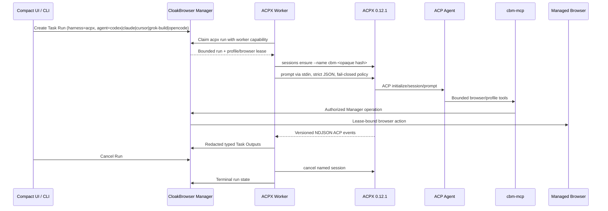

# ACPX-backed ACP Harness Design

**Status:** accepted technology direction; adapter foundation implemented; host worker and browser MCP E2E pending  
**Pinned runtime:** `acpx@0.12.1`  
**Reviewed ACP SDK baseline:** `@agentclientprotocol/sdk@1.2.1` (ACPX declares `^1.2.1`; exact resolved-version lock is pending provisioning)

## Decision

ACP is CloakBrowser Manager's canonical coding-agent protocol. [openclaw/acpx](https://github.com/openclaw/acpx) is the pinned runtime used to create, resume, queue, cancel, and close ACP sessions for Codex, Claude, Cursor, Grok Build, and OpenCode.

ACPX is not a second control plane. CloakBrowser Manager remains authoritative for users, groups, agents, profiles, projects, tasks, runs, approvals, browser leases, typed outputs, retention, and audit. ACPX's local session database is an execution cache that can be rebuilt; it never becomes the product database.

## Runtime flow



## Command contract

Session ensure:

```text
acpx --cwd <absolute-worktree> --format json --json-strict \
  <agent> sessions ensure --name cbm-<sha256-prefix>
```

Prompt:

```text
acpx --cwd <absolute-worktree> --format json --json-strict \
  --suppress-reads --non-interactive-permissions fail \
  --permission-policy <private-0600-policy> \
  --mcp-config <private-0600-mcp-config> \
  <agent> -s cbm-<sha256-prefix> --file -
```

The prompt is written to stdin. It must not appear in process arguments, service files, shell history, or audit metadata.

The only accepted MCP file shape matches ACPX `0.12.1`'s array schema:

```json
{
  "mcpServers": [
    {
      "name": "cloakbrowser",
      "command": "cbm-mcp",
      "args": []
    }
  ]
}
```

No second server, `env`, header, URL, bearer value, credential argument, or arbitrary executable is accepted.

## Supported agents

| Manager selector | ACPX adapter | Initial role |
| --- | --- | --- |
| `codex` | `codex` | Codex ACP adapter |
| `claude` | `claude` | Claude Agent ACP adapter |
| `cursor` | `cursor` | native `cursor-agent acp` |
| `grok-build` | `grok-build` | native `grok agent stdio` |
| `opencode` | `opencode` | native `opencode acp` |

Additional adapters require an explicit descriptor, executable allowlist, version pin, security review, and the same contract suite. Arbitrary commands are forbidden.

## Identity and persistence mapping

`task_session_id` is hashed to `cbm-<32 lowercase hex characters>`. Human names, project names, account names, profile names, and secret references never enter the ACPX session name.

The Manager persists the conversation and outputs. ACPX session history may help resume an in-flight agent, but normal backup, export, audit, and UI history always read from the Manager.

## Event mapping

| ACPX event family | Manager output kind |
| --- | --- |
| assistant/final/result | `summary` |
| thinking/tool result/observation | `observation` |
| tool start/completion | `action` |
| permission request | `approval` |
| diff/artifact | `extracted_data` |
| usage/latency | `metric` |
| error/failure | `error` |
| unknown additive event | `status` |

Every event requires `eventVersion: 1`, a non-negative sequence number, a bounded size, and redaction before it reaches the Manager API. Unsupported envelope versions are rejected instead of guessed.

## Security invariants

1. Never use `--approve-all` as a product default.
2. Noninteractive permissions fail closed.
3. Provider authentication stays in the host credential store or a secret reference; never in project `.acpxrc.json`.
4. MCP configuration contains only `mcpServers`, uses mode `0600`, and contains no bearer token.
5. ACP agents call bounded `cbm-mcp` tools; raw shell, raw CDP, secret reveal, and direct vault access are not baseline capabilities.
6. Worker output is size-bounded, version-checked, allowlisted, and redacted.
7. Cancellation, timeout, process crash, and unknown event types must produce an honest terminal Manager state.
8. ACPX is alpha; exact-version drift blocks startup until contract tests pass.

## Implementation state

Implemented:

- `acpx` Manager harness value
- exact ACPX pin and recorded ACP SDK contract baseline
- opaque session-name derivation
- strict ensure/prompt command builders
- prompt-via-stdin contract
- private permission/MCP config checks
- NDJSON envelope parser and size/version gates
- typed Manager output mapping and basic secret redaction
- focused unit tests

Fresh local runtime validation on 2026-07-26 established:

- `npx -y acpx@0.12.1 --version` returned exactly `0.12.1`
- the pinned CLI exposed the required strict JSON, permission-policy, MCP-config, stdin-file, named-session, cancellation, and supported-agent commands
- a real `acpx → @agentclientprotocol/codex-acp` initialization negotiated ACP protocol version `1` and returned the Codex agent capabilities
- the prompt was then honestly blocked with `AUTH_REQUIRED` because no ACPX authentication method was configured; no credential was copied, printed, or silently imported

Pending before claiming live availability:

- host worker claim/heartbeat/complete/fail/cancel loop
- bounded `cbm-mcp` server
- agent selector in Task Run API/UI
- systemd provisioning on VCVM
- live capability doctor for every adapter
- real browser E2E through MCP and a managed CloakBrowser profile
- host credential-reference configuration for each ACP adapter (never raw secrets in project config)
- production lock/doctor check for the exact resolved ACP SDK dependency
- cancellation/resume/crash/reconnect tests
- mobile and desktop visual output/approval flows

The UI must label ACPX unavailable until the host worker heartbeat and an adapter-specific E2E probe are fresh.
