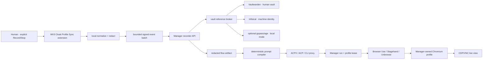

# Secure Action Recorder, Vault References, and ACPX Delivery Design

**Status:** approved implementation design  
**Date:** 2026-07-30  
**Owner:** Martin Hausleitner  
**Target:** CloakBrowser Manager on VCVM  
**Parent plan:** `docs/superpowers/plans/2026-07-27-universal-agent-browser-control-plane-masterplan.md`  
**Tickets:** CBM-008, CBM-014, CBM-016, CBM-021, CBM-022

## Outcome

An operator can explicitly start a visible recording in the CloakBrowser profile-sync extension, demonstrate a bounded browser task inside a Manager-owned Browser Use session, stop recording, and export a deterministic reusable flow or agent prompt. The flow contains safe browser intent and selectors, but never raw credentials, cookies, tokens, OTPs, passkeys, payment data, proxy passwords, or session material.

The same flow can be executed through Browser Use, Stagehand, Unbrowse, or another approved harness behind the existing Manager lease and capability boundary. ACP/ACPX providers and OpenAI-compatible CLI proxies are execution adapters, not product authorities.

## Chosen Architecture



### Product authority

- CloakBrowser Manager owns projects, profiles, tasks, runs, leases, outputs, approvals, recorder artifacts, provider metadata, and audit receipts.
- Vaultwarden supplies human credential UX, organizations, collections, groups, and vault events.
- Infisical supplies machine identities, short-lived authentication, agent/API secrets, and PKI-capable automation.
- gopass with Git and age is an optional sovereign local/distributed mode, not the default multi-tenant control plane.
- Browser Use, Stagehand, Unbrowse, ACP, ACPX, Grok, Cursor, Codex, and other CLIs remain replaceable adapters.

## Recorder Contract

Recording is off by default. Starting it requires an explicit click and produces a persistent, high-contrast recording indicator in the extension UI. It stops on operator action, extension suspension/reload, TTL expiry, Manager lease loss, browser/profile mismatch, or policy rejection.

Allowed normalized event classes:

- `navigate`: scheme, normalized origin/path, title metadata;
- `click`: stable selector candidates and safe accessible label;
- `input`: selector, input purpose, value classification, and either safe text or an opaque secret reference;
- `select`: selector and safe option label/value classification;
- `submit`: selector/form intent, never serialized form payload;
- `viewport`: width, height, device scale, mobile/touch flags;
- `checkpoint`: operator label and current safe page metadata.

Every event contains a schema version, monotonic sequence, session ID, profile ID, origin, timestamp, source frame, and redaction decision. Batches are size-bounded, time-bounded, ordered, nonce-protected, and correlated to a valid Manager run/profile lease.

## Non-Negotiable Redaction

An event must never contain or derive:

- passwords or current-password/new-password values;
- cookies, local/session storage dumps, bearer headers, API keys, JWTs, or CSRF/session tokens;
- OTP/TOTP/SMS codes, recovery codes, passkey/WebAuthn payloads, private keys, or authenticator exports;
- credit-card/PAN/CVC/IBAN/payment values;
- raw proxy credentials or full authenticated proxy URLs;
- hidden inputs, autocomplete credential values, clipboard contents, file contents, or arbitrary DOM snapshots.

Sensitive fields become a stable opaque reference such as `secretref-<uuid>` plus non-secret metadata (`kind`, `provider`, `scope`, `origin_policy`). The extension does not resolve the reference. The model never receives the secret. Runtime use is origin-bound through the Manager broker and is recorded only as a non-reveal receipt.

Defense in depth:

1. content-script classification before capture;
2. service-worker schema validator and deny-list scan;
3. Manager request model rejects unknown keys and secret-like material;
4. persistence-layer redaction scan;
5. CI secret fixtures and artifact scan;
6. provider/broker returns use receipts, never values.

## Vault Provider Interface

The Manager stores provider configuration metadata and opaque references only.

```text
provider_id
provider_kind: vaultwarden | infisical | gopass
display_name
capabilities: human_vault | machine_identity | groups | audit | pki | local_sync
status: ready | degraded | unavailable | misconfigured
reference_prefix
last_checked_at
redacted_reason_code
```

Required operations are `health`, `metadata`, `authorize_use`, `revoke_use`, and `receipt`. `reveal` is deliberately absent from the agent-facing contract.

## Prompt and Flow Compiler

Compilation is deterministic: the same ordered normalized events produce the same canonical JSON and prompt hash. The compiler emits:

- goal and allowed origins;
- viewport/profile requirements;
- ordered browser actions;
- assertions/checkpoints;
- opaque secret-use requirements;
- cancellation and human-handoff points;
- expected typed outputs.

The compiler never embeds secret values. A provider-specific adapter may translate the canonical flow to Browser Use, Stagehand, Unbrowse, or an ACPX session, but must preserve origins, lease, cancellation, and secret-reference semantics.

## ACPX CI/CD Workflow

The release workflow is fail-closed and produces redacted receipts:

1. static extension manifest and permission audit;
2. recorder normalization/redaction unit tests;
3. backend recorder/vault-reference contract tests;
4. forbidden-value/secret fixture scan;
5. prompt determinism tests;
6. ACPX workflow schema and adapter preflight;
7. Browser Use managed-profile smoke on an allowed local test origin;
8. package unpacked extension artifact with checksums;
9. VCVM staging deploy and watchdog health proof;
10. live UI/browser verification, screenshot, rollback receipt, and release gate.

No workflow may deploy when the exact commit, schema version, extension checksum, worker version, Manager health, profile lease, or rollback target is unknown.

## Watchdog

The watchdog observes only the recorder bridge/worker health endpoint and bounded service state. It records timestamp, build revision, schema version, queue depth, last successful heartbeat, restart count, and redacted reason code. It never logs requests, headers, form values, vault references beyond hashed IDs, or environment contents.

Restart policy is capped and backoff-based. Repeated failure transitions to `blocked` and requires operator action; it does not create an infinite restart loop or restart unrelated browser/profile services.

## Cross-Platform Proof Matrix

| Target | Required proof |
| --- | --- |
| VCVM | extension loaded into Manager-owned Chromium; explicit record/stop; safe demo action; flow export; Browser Use replay; watchdog crash/recovery receipt |
| second VM | package/install verification, static tests, bridge health or an honest unsupported-runtime blocker |
| macOS | dedicated safe browser profile; Codex/Orca Computer Use visibly starts/stops recorder and validates export; no use of the user's regular Chrome profile |
| CI | deterministic unit/integration/security gates and artifact checksums |

## Acceptance Criteria

- Recorder is opt-in, visibly active, TTL-bound, and stops on lease/profile loss.
- Password, token, cookie, OTP, passkey, payment, hidden, clipboard, and proxy-secret fixtures cannot appear in events, prompts, logs, screenshots, or artifacts.
- Sensitive actions compile to opaque references only.
- A canonical flow can be replayed through a Manager-approved Browser Use adapter on VCVM.
- ACPX CI/CD rejects missing adapters, version drift, failed secret scan, unhealthy bridge, wrong profile, or absent rollback target.
- Watchdog recovery is bounded and produces a redacted receipt.
- Tests and screenshots identify exact commit, environment, profile, viewport, route, and evidence label.
- No success is claimed for macOS Computer Use or the second VM without fresh direct proof.

## Stop Conditions

Stop and label `blocked` when a test requires unavailable computer-use runtime, missing authorized credentials, inaccessible VM, incompatible browser runtime, or a policy-unsafe secret path. Do not substitute an unmanaged local browser, raw credential injection, fake event fixture, historical screenshot, or health override for the missing proof.

